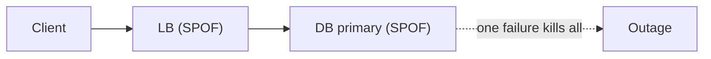
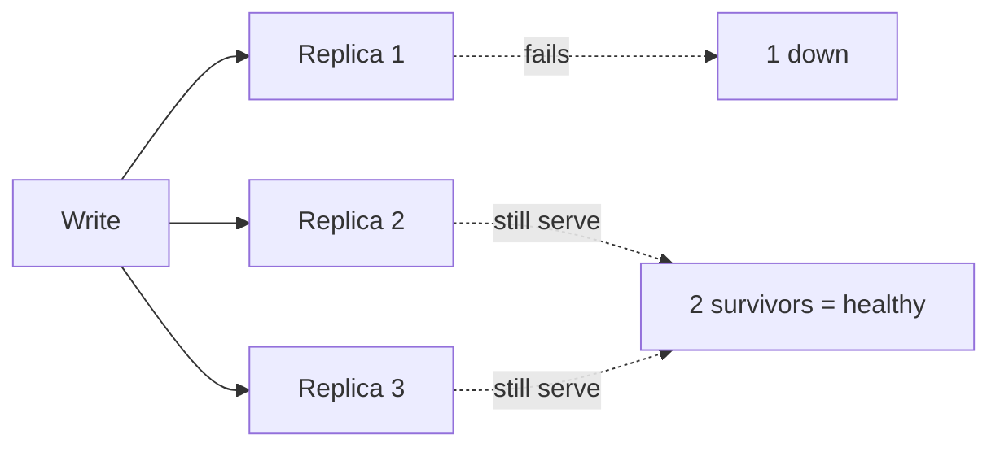
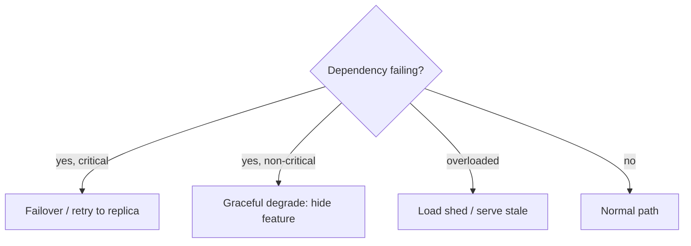

# Redundancy, Fault Tolerance & Graceful Degradation

> **Level:** 1 (Foundations) · **Prerequisites:** [Scalability](02-scalability.md)
> **Navigation:** [← Previous: Scalability](02-scalability.md) · [Next → Level 2: Core Components](../02-core-components/README.md)

## Learning objectives

After this chapter you can:

- Identify single points of failure and eliminate them with redundancy.
- Choose replication factors and failover models with a reason.
- Describe graceful degradation as a deliberate design, not an accident.

## Single points of failure (SPOF)

A **single point of failure** is any component whose failure stops the system: one load
balancer, one database primary, one cache node holding irreplaceable data, one DNS record,
one availability zone. The design discipline is to enumerate the data path and ask, for each
box, ""what happens if this dies right now?"" If the answer is ""the system is down,"" you
have a SPOF to address.

## Redundancy

**Redundancy** means running more than one copy of a component so a failure does not stop
service. The **replication factor (RF)** is how many copies you keep:

- RF=1: no redundancy (one failure = data loss or outage).
- RF=2: tolerates one failure *for availability* if failover is automatic, but rebuilding a
  failed copy leaves no further redundancy.
- RF=3: tolerates one failure with two survivors; the standard for systems that need to
  rebuild a failed replica while still tolerating another. This is why ""three"" recurs
  across distributed systems (Raft quorums, Kafka RF=3 defaults, object storage erasure
  coding).

The catch: redundancy only helps if **failover actually happens** — a tested health check,
promotion of a standby, and traffic rerouting. Replicas that exist but were never failed over
to are theatre.

## Fault tolerance vs graceful degradation

- **Fault tolerance**: the system keeps providing full service despite component failures
  (via redundancy and failover).
- **Graceful degradation**: the system *deliberately reduces* functionality under stress
  instead of failing hard. Examples: hide a recommendation panel when its service is slow
  but still render the page; serve stale cached results when the backend is down; disable
  comments during an upload surge while keeping reads working.

Graceful degradation is a design choice: you must decide *in advance* which features are
critical and which are optional, and wire fallbacks for the optional ones. Deciding during
the outage is too late.

## Active vs standby

- **Active-passive**: one replica serves, others wait. Simpler consistency but the standby
  must be promoted (failover takes time) and is idle capacity.
- **Active-active**: all replicas serve. Better utilization and no failover delay, but you
  must handle concurrent writes and consistency (Level 4).

## Examples

- A service behind one load balancer is a SPOF; run a pair with a VIP that fails over.
- A database with RF=3 and automatic promotion survives a node loss with one survivor-pair.
- A product page with a slow reviews widget degrades to ""reviews temporarily unavailable""
  instead of timing out the whole page.

## Trade-offs

- **More redundancy** = higher availability but higher cost and consistency complexity.
- **Active-active** maximizes utilization but risks write conflicts and split-brain.
- **Graceful degradation** improves perceived availability but can hide a failing dependency
  (set alerts so degraded mode doesn't become the silent new normal).

## When NOT to apply a concept here

- Don't replicate a component whose failure is acceptable and cheap to recover; not every
  box needs RF=3.
- Don't add active-active for a workload that needs strong write consistency; the conflict
  resolution cost may exceed the benefit.
- Don't degrade silently without alerting; silent degradation turns into ""nobody noticed
  it's been broken for a week.""

## Common mistakes

- Assuming replicas = high availability without a *tested* failover.
- Forgetting the load balancer/DNS layer is itself a SPOF.
- Letting graceful degradation become permanent without alerts and a recovery path.

## Failure modes and operational concerns

- **Split-brain**: two primaries both accept writes after a partition (Level 4 covers
  prevention via quorums/leases).
- **Failover storms**: repeated failovers flap and cause more disruption than the original
  failure.
- **Stale standbys**: a passive replica that was never exercised fails on promotion.

## Review questions

1. Why is RF=3 the common default rather than RF=2?
2. Give an example of graceful degradation you would design into a product page.
3. What is the operational risk of active-active for a strongly-consistent write path?
4. Why does ""replicas exist"" not equal ""highly available""?
5. Name one SPOF you might *accept* and justify it.

## Further reading

- Failover, split-brain, and chaos testing in Level 6; consensus/quorums in Level 4.

---
[← Previous: Scalability](02-scalability.md) · [Next → Level 2: Core Components](../02-core-components/README.md)
