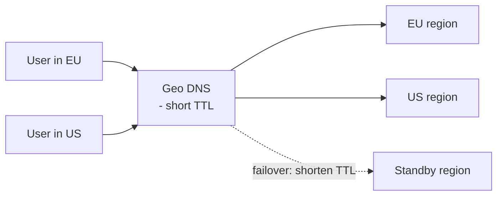
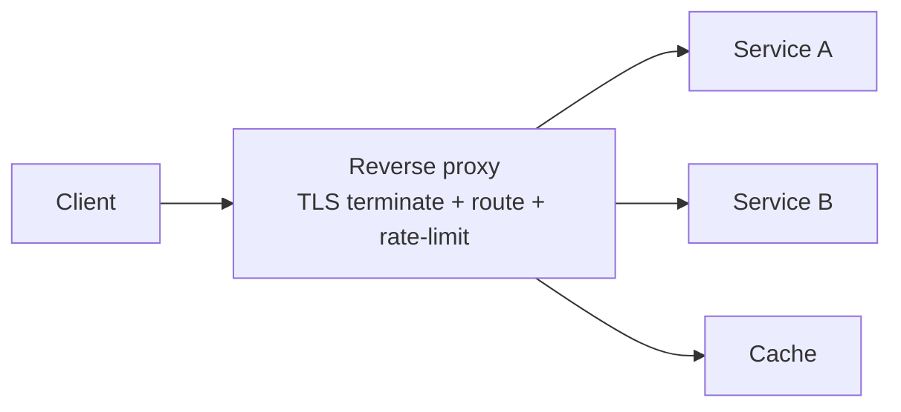

# DNS, Forward & Reverse Proxies

> **Level:** 2 (Core Components) · **Prerequisites:** [Level 1](../01-foundations/README.md)
> **Navigation:** ← Start of Level 2 · [Next → Load Balancers](01-load-balancers.md)

## Learning objectives
- Use DNS as a routing, load-balancing, and failover primitive, aware of TTL trade-offs.
- Distinguish forward from reverse proxies and where each belongs in a request path.
- Reason about proxies as policy enforcement points (TLS, auth, caching, shaping).

## DNS as more than name resolution
DNS resolves names to IPs but, at scale, it is also a **global traffic-steering** layer:
round-robin, weighted, latency-based, and geo-based records send users to nearby regions.
The key knob is the **TTL**: it bounds how long clients/resolvers cache a record.

**TTL trade-off**: long TTL reduces resolver load and is fast on repeat lookups but slows
failover (clients keep hitting a dead IP until the cache expires). Short TTL enables rapid
traffic shifting but raises query volume and depends on resolvers honoring it (some cap
minimums). For failover-critical records, pre-plan a low TTL *before* you need it.

## Forward proxies
A **forward proxy** sits in front of *clients*. Clients explicitly route through it; it
appears to the server as the proxy's IP. Uses: egress control/filtering for an enterprise,
anonymity, caching for outbound traffic. In system design, forward proxies appear mostly as
egress gateways enforcing policy on outbound calls.

## Reverse proxies
A **reverse proxy** sits in front of *servers*. Clients address the proxy; it forwards to
backends. Uses: TLS termination, load balancing, caching, auth, rate limiting, routing,
canonicalization of request/response shape. Reverse proxies (NGINX, Envoy, HAProxy, cloud
load balancers) are the standard edge of a service tier.

## Why this matters
DNS and proxies are where you implement global routing, TLS policy, and edge caching
*centrally* rather than scattering it across services. They are also dependencies: a DNS
outage is global, and a reverse proxy is a SPOF unless redundantly deployed.

## Examples
- Geo DNS + short TTL lets a multi-region service evacuate a region in minutes.
- A reverse proxy terminates TLS once, so backend services receive plaintext on a trusted
  network (or mTLS internally).
- A forward egress proxy lets an org block and audit outbound API calls from a VPC.

## Trade-offs
- **Long vs short TTL**: stability/load vs failover agility.
- **Proxy centralizes policy** but becomes a shared dependency and a potential bottleneck.
- **TLS at the edge** simplifies backends but means the edge-to-backend hop is unencrypted
  unless you also use mTLS.

## When NOT to apply
- Don't put a reverse proxy in front of a single static site just because; a CDN or static
  host may suffice.
- Don't rely on DNS TTL for sub-second failover; it is too coarse — use health-checked LB.

## Common mistakes
- Setting a long TTL on a record you later need to fail over.
- Forgetting DNS is cached at multiple layers (browser, OS, resolver) — changes lag.
- Terminating TLS at the edge and assuming the internal network is ""trusted"" without
  zero-trust controls.

## Failure modes and operational concerns
- DNS provider outage → global partial outage; consider multi-provider DNS.
- Proxy misconfiguration (one bad config push) affects every request it fronts.
- TTLs ignored or capped by resolvers break failover math.

## Review questions
1. Why is a short DNS TTL a failover aid but a load cost?
2. Distinguish forward and reverse proxy with one example each.
3. What centralized policies does a reverse proxy let you enforce?
4. Name two DNS-layer failure modes and a mitigation for each.
5. When is edge TLS termination *not* enough?

## Further reading
DNS: S-DNS · HTTP/TLS: S-RFC9110, S-RFC8446 · service mesh/ingress in Level 9.

---
← Start of Level 2 · [Next → Load Balancers](01-load-balancers.md)
