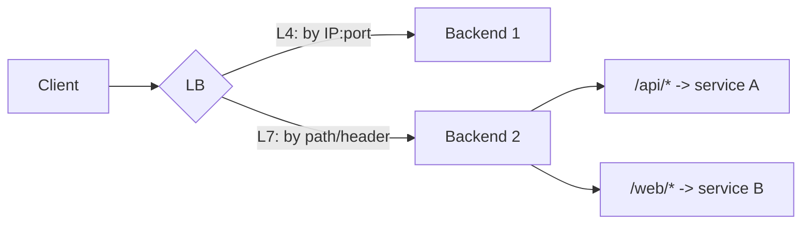

# Load Balancers: Layer 4 vs Layer 7

> **Level:** 2 (Core Components) · **Prerequisites:** [DNS & Proxies](00-dns-proxies.md)
> **Navigation:** [← Previous: DNS & Proxies](00-dns-proxies.md) · [Next → API Gateway & Service Discovery](02-api-gateway-service-discovery.md)

## Learning objectives
- Explain what a load balancer does and the algorithms it uses to distribute traffic.
- Distinguish Layer 4 from Layer 7 load balancing and choose between them with reasons.
- Reason about health checks, session affinity, and connection reuse.

## What a load balancer does
A **load balancer** distributes incoming requests across multiple backend instances so no
single instance is overwhelmed and so traffic can be redirected away from failed instances.
It also provides a single virtual endpoint so clients are insulated from backend churn.

## Layer 4 vs Layer 7
- **Layer 4 (transport)**: balances on TCP/UDP ports and addresses, without inspecting
  application content. Fast, opaque to the protocol, cheap. Cannot route by path or headers.
- **Layer 7 (application)**: inspects HTTP/gRPC requests (path, headers, cookies) and routes
  by content. Can do path-based routing, content-based sharding, and L7 features (rewrites,
  rate limiting per route).

## Algorithms
| Algorithm | Behavior |
|-----------|----------|
| Round-robin | cycle through backends evenly |
| Least connections | send to the backend with fewest active conns (good for varied request cost) |
| Weighted | respect per-backend weights (bigger machines get more) |
| Consistent hashing | route a key to a backend; minimizes movement on membership change (cache affinity) |
| Random | simple, statistically even |

## Health checks & affinity
- **Health checks** poll backends; unhealthy ones are removed from the pool so traffic only
  goes to live instances.
- **Session affinity (sticky)** routes a given client to the same backend — needed when a
  stateful backend holds per-client data, but it undercuts even distribution and complicates
  failover. Prefer externalizing state to avoid affinity.
- **Connection reuse / keep-alive** at L7 avoids per-request TCP+TLS setup, a major latency
  win.

## Why this matters
Load balancers turn a fleet of instances into one logical service, enabling horizontal
scaling, rolling deploys (drain one, deploy, repeat), and failover. They are also where L7
policy (routing, rate limits) often lives before a dedicated API gateway.

## Examples
- L4 NLB in front of a TCP database proxy; L7 ALB routing `/api/*` to services and `/assets/*`
  to a cache.
- Least-connections for a workload where some requests are 10× longer than others.
- Consistent hashing to keep cache hits local to one backend per key.

## Trade-offs
- **L4 vs L7**: L4 is faster and protocol-agnostic but content-blind; L7 enables smart
  routing at parsing cost.
- **Affinity**: helps stateful backends but harms evenness and failover.
- **LB itself is a SPOF** unless redundantly deployed (active-passive or active-active pair).

## When NOT to apply
- Don't use L7 features you don't need; L4 is cheaper and sufficient for opaque TCP.
- Don't enable affinity to paper over a stateful service; externalize the state instead.
- Don't put a single LB with no redundancy in front of a critical tier.

## Common mistakes
- Round-robin on backends with very different request costs (some overloaded, some idle).
- Sticky sessions that pin traffic to a node that then dies.
- Forgetting the LB is a shared dependency and a SPOF.

## Failure modes and operational concerns
- Health-check misconfiguration marks healthy backends unhealthy (or vice versa).
- Connection exhaustion on the LB under high fan-in.
- Uneven load due to hot keys under consistent hashing without vnodes.

## Review questions
1. When is L4 preferable to L7, and vice versa?
2. Why is least-connections often better than round-robin for mixed-cost requests?
3. What problem does session affinity solve, and what does it create?
4. How does an LB enable rolling deploys?
5. Why must the LB itself be redundant?

## Further reading
Health/readyiness probes in Level 6; ingress/service mesh in Level 9.

---
[← Previous: DNS & Proxies](00-dns-proxies.md) · [Next → API Gateway & Service Discovery](02-api-gateway-service-discovery.md)
