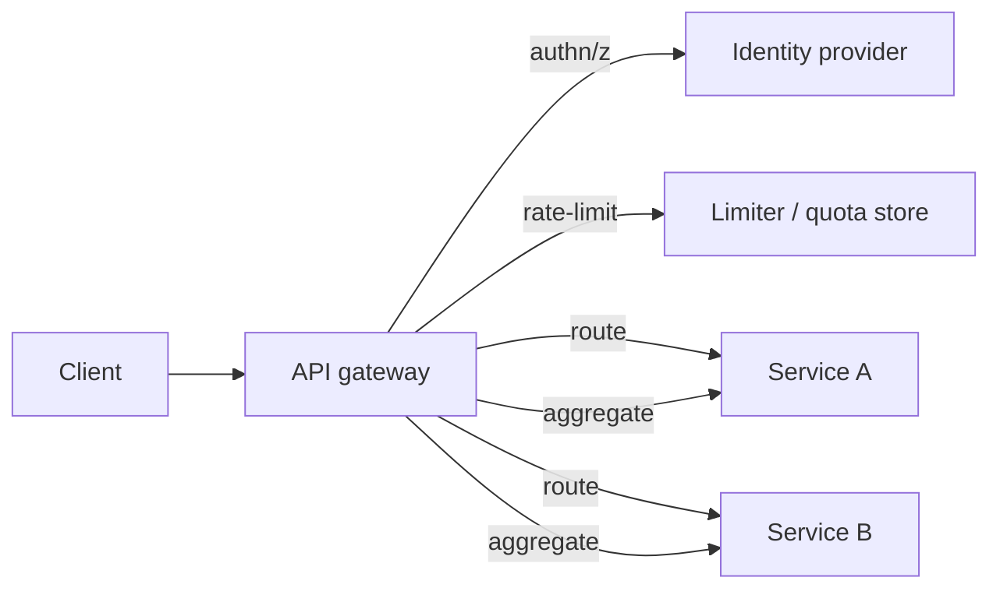
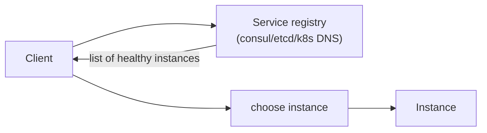

# API Gateway & Service Discovery

> **Level:** 2 (Core Components) · **Prerequisites:** [Load Balancers](01-load-balancers.md)
> **Navigation:** [← Previous: Load Balancers](01-load-balancers.md) · [Next → CDN & Caching](03-cdn-caching.md)

## Learning objectives
- Describe an API gateway's responsibilities and how it differs from a plain load balancer.
- Explain service discovery (client-side vs server-side) and why dynamic environments need it.
- Reason about when an API gateway adds value vs adds latency and a SPOF.

## API gateway
An **API gateway** is an L7 reverse proxy with extra cross-cutting duties: authentication,
authorization, rate limiting, request/response transformation, routing to many backends,
aggregation, and observability. It is the single external entry point for a microservice
fleet; clients talk to one API, the gateway fans out to internal services.

A gateway centralizes policy so individual services don't each reimplement auth, quotas, and
TLS. The cost: it is a shared dependency and a potential SPOF, and it adds a hop. Gateways
should be horizontally scalable and redundantly deployed, and kept thin (push business logic
into services, not the gateway).

## Service discovery
In dynamic environments (containers, autoscaling), backend instances appear and disappear
constantly; hardcoded addresses don't work. **Service discovery** maps a service name to a
current set of healthy instances.

- **Server-side discovery**: the client asks a registry (or a proxy/mesh sidecar) which
  resolves the name and forwards. The client is unaware of instances.
- **Client-side discovery**: the client queries a registry and picks an instance itself.

Health checks feed the registry; unhealthy instances are evicted. Caching the registry
client-side reduces lookups but risks using a stale list — refresh on a short interval and
fall back on connection failure.

## Why this matters
Gateways and discovery are the glue of a microservice architecture: gateways provide the
external contract and policy; discovery provides the internal wiring that survives churn.
Without discovery, every deploy and autoscale event requires config changes everywhere.

## Examples
- A gateway authenticates, applies per-tenant quotas, then routes `/billing/*` to the billing
  service and `/search/*` to the search service.
- Kubernetes DNS provides server-side discovery: `billing.svc.cluster.local` resolves to
  the service's current endpoints.
- A service mesh sidecar performs discovery and mTLS transparently so the app code is unaware.

## Trade-offs
- **Gateway centralizes policy** but adds a hop, a dependency, and a SPOF risk.
- **Client-side discovery** avoids a proxy hop but couples clients to the registry and
  load-balancing logic.
- **Registry caching** reduces load but risks staleness.

## When NOT to apply
- Don't route everything through one gateway if it must be ultralow-latency; a specialized
  path may bypass it.
- Don't put business logic in the gateway; it becomes an unmanageable monolith of policy.
- Don't add a discovery layer if your backends are static and few; DNS + an LB suffices.

## Common mistakes
- A gateway that becomes a fat monolith of business rules.
- Forgetting the gateway/registry are SPOFs and dependencies to SLO.
- Stale discovery caches causing traffic to dead instances.

## Failure modes and operational concerns
- Gateway misconfig affects every external request.
- Registry outage breaks new connections across services.
- Cascading failure if the gateway fans out to many services synchronously without timeouts.

## Review questions
1. How is an API gateway more than a load balancer?
2. Compare client-side vs server-side discovery trade-offs.
3. Why should business logic stay out of the gateway?
4. What staleness risk does registry caching introduce?
5. Name two SPOFs introduced by a gateway/registry and how to mitigate them.

## Further reading
Service mesh/ingress in Level 9; rate limiting detail in Level 5; auth in Level 7.

---
[← Previous: Load Balancers](01-load-balancers.md) · [Next → CDN & Caching](03-cdn-caching.md)
