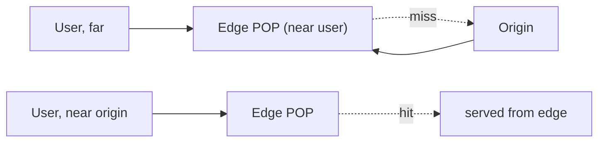
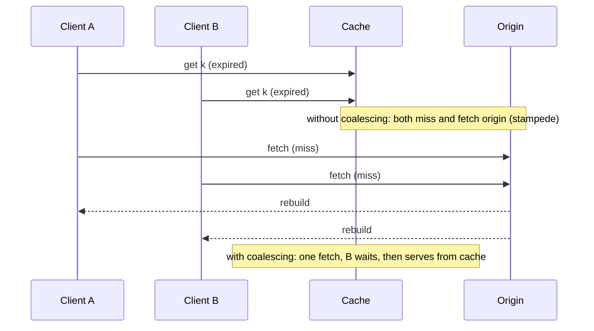

# CDN & Caching

> **Level:** 2 (Core Components) · **Prerequisites:** [API Gateway & Service Discovery](02-api-gateway-service-discovery.md)
> **Navigation:** [← Previous: API Gateway & Service Discovery](02-api-gateway-service-discovery.md) · [Next → Storage Classes](04-storage-classes.md)

## Learning objectives
- Explain a CDN and when it transforms a read-heavy system.
- Choose a cache location (edge / distributed / in-process) and a strategy.
- Reason about cache invalidation, staleness, and the stampede problem.

## Content delivery networks
A **CDN** is a globally distributed set of edge caches that serves content close to users,
reducing latency and offloading origin traffic. Static assets are obvious CDN candidates,
but CDNs also cache dynamic, cacheable responses and provide edge compute. For a read-heavy
global system, a CDN is often the highest-leverage single decision.

## Caching layers
| Layer | Speed | Scope | Cost |
|------|:-----:|-------|------|
| In-process | fastest | one instance | small, not shared, needs coherence |
| Distributed cache (Redis/Memcached) | fast | shared fleet | network hop, memory cost |
| Edge / CDN | near user | global | egress savings, staleness |

Caches exploit the latency gap (memory vs disk/network) from [Computing Fundamentals].
The read-through model: on a hit, return; on a miss, fetch from the store, populate, return.

## Strategies (preview; deep dive in Level 5)
- **Cache-aside**: app reads cache, on miss reads store and fills cache. Simple, most common.
- **Read-through**: cache fetches from store on miss transparently.
- **Write-through**: writes go to store and cache together (stronger consistency, slower write).
- **Write-behind**: writes go to cache first, async to store (fast writes, durability risk).

## Invalidation and staleness
Caches are fast *because* they may serve stale data. The design question is **how stale is
acceptable** and how staleness is bounded:

- **TTL**: a maximum staleness window; simple, eventually consistent.
- **Event-based invalidation**: a write publishes an invalidation; tighter but adds coupling
  and a failure mode (missed invalidations).
- **Versioned keys**: include a version in the key so writes create new keys; old keys age out.

## The cache stampede
When a hot key expires, many concurrent misses all fetch the origin and rebuild the cache
simultaneously — a thundering herd that can take down the origin. Mitigations: **request
coalescing** (one fetch, others wait), **stale-while-revalidate** (serve stale while one
fetch refreshes), **early refresh with jitter**, and **locking**. This is one of the most
common real-world cache failure modes.

## Examples
- A news site: pages cached at the CDN edge for 60s; a breaking story propagates within a
  minute — acceptable staleness for huge egress savings.
- A product catalog: cache-aside in Redis with a 5-min TTL; writes invalidate by event.
- A viral paste: single hot key guarded by request coalescing to prevent origin collapse.

## Trade-offs
- **Edge caching** maximizes egress savings but enlarges the staleness window.
- **Write-through** is consistent but adds write latency; **write-behind** is fast but risks
  data loss on crash.
- **TTL** is simple; **event invalidation** is tighter but more fragile.

## When NOT to apply
- Don't cache data with strict read-after-write requirements without invalidation or a short
  enough TTL.
- Don't cache cold, rarely-accessed data; it wastes the cache's scarce memory.
- Don't put a CDN in front of content that cannot be cached (personalized, non-cacheable).

## Common mistakes
- Forgetting stampede protection on hot keys.
- Caching personalized responses by a shared key (cross-user leakage).
- TTLs chosen without considering the consistency the user expects.

## Failure modes and operational concerns
- A missed invalidation causes stale data to persist for a TTL.
- Cache failures cascade to the origin if not designed to fall back.
- Memory pressure: an unbounded cache evicts useful data; size and evict deliberately.

## Review questions
1. When does a CDN transform a system, and when is it irrelevant?
2. Compare cache-aside and write-through on consistency vs write latency.
3. What is a cache stampede and three ways to prevent it?
4. Why is ""how stale is acceptable"" the central cache design question?
5. Give a failure mode of event-based invalidation.

## Further reading
Cache strategies deep dive: Level 5 (`docs/05-architecture-patterns/05-cache-strategies.md`).

---
[← Previous: API Gateway & Service Discovery](02-api-gateway-service-discovery.md) · [Next → Storage Classes](04-storage-classes.md)
