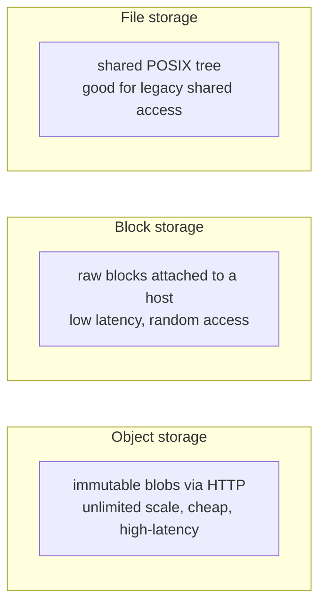

# Storage Classes: Object, Block, File

> **Level:** 2 (Core Components) · **Prerequisites:** [CDN & Caching](03-cdn-caching.md)
> **Navigation:** [← Previous: CDN & Caching](03-cdn-caching.md) · [Next → Queues, Streams & Search](05-queues-streams-search.md)

## Learning objectives
- Distinguish object, block, and file storage and choose between them with reasons.
- Map workload characteristics (size, access pattern, durability) to a storage class.
- Reason about durability vs availability (they are different) and cost tiers.

## The three classes
- **Object storage** (S3/GCS/Azure Blob): flat namespace of immutable objects keyed by ID;
  HTTP access; effectively unlimited scale; cheap, high durability; high latency, no random
  byte access. Best for blobs: images, videos, backups, logs, model artifacts.
- **Block storage** (EBS/disk): raw block devices attached to one host; low latency, random
  access; the substrate for a filesystem or a database. Best for databases and boot volumes.
- **File storage** (NFS/SMB, shared filesystems): a POSIX-like tree shared across hosts; good
  for legacy apps needing a shared filesystem, worse for massive scale.

## Choosing a class
| Workload | Class | Why |
|----------|-------|-----|
| User photos/videos | object | large, write-once read-many, cheap, durable |
| Database data files | block | low-latency random read/write |
| Database backups | object | durable, cheap, rarely accessed |
| Logs, raw events | object (partitioned) | append, cheap, partitioned for analytics |
| Legacy shared home dirs | file | needs POSIX shared access |

## Durability vs availability (recap)
Object storage advertises durability like ""11 nines"" (see [Requirements]) — once written,
your data almost certainly survives. But the object may be temporarily unreadable (lower
availability) during an incident. Don't conflate the two; a backup in object storage is
durable even if the live database is down.

## Storage tiers and lifecycle
Within object storage, tiers trade cost for retrieval speed: standard (hot), infrequent
access, archive/cold. Lifecycle rules move objects to colder tiers as they age, cutting
cost dramatically for data with declining access (see [Capacity Planning]). The trade:
colder tiers have retrieval latency and sometimes retrieval fees.

## Why this matters
Storage choice is often the largest cost and durability decision in a system. Putting the
right data in the right class — hot data on block/fast tiers, cold data on object/archive —
is the difference between an affordable and an unsustainable design at scale.

## Examples
- A photo service: object storage for images, block storage for the metadata DB, object
  (archive tier) for old originals.
- A logging platform: hot logs in a fast store/search index for 7 days, then object storage
  partitioned by date for long-term retention and analytics.
- A database: data on block storage (low latency); nightly snapshots to object storage
  (durable, cheap, cross-region).

## Trade-offs
- **Object**: cheap and durable but high-latency, no random access, eventual consistency for
  some operations.
- **Block**: fast random access but attached to one host (a locality/availability constraint)
  and costlier per GB.
- **File**: easy shared access but weaker at massive scale and a potential consistency/SPOF.

## When NOT to apply
- Don't put a database on object storage; it needs block-level random access.
- Don't use block storage for cold archives; object/archive is far cheaper.
- Don't use a shared filesystem for new high-scale designs unless a legacy app demands it.

## Common mistakes
- Storing hot, frequently accessed large data in a database instead of object storage.
- Keeping years of cold logs on hot block storage (expensive).
- Assuming object storage is strongly consistent for every operation (check the model).

## Failure modes and operational concerns
- Object storage throttling/rate limits on extremely high request rates (use multipart,
  batching, and request scaling).
- Block volume failure tied to one AZ (replicate or snapshot cross-region).
- Lifecycle misconfiguration leaving cold data on hot tiers (cost overrun).

## Review questions
1. Why is a database on object storage a bad idea?
2. Map a photo's lifecycle across storage tiers as it ages.
3. Restate the durability-vs-availability distinction with a backup example.
4. Which class suits a shared legacy home-directory service, and what is its limit?
5. Name a cost failure from bad tiering.

## Further reading
Data lifecycle and tiers in Level 3; backup/PITR also in Level 3.

---
[← Previous: CDN & Caching](03-cdn-caching.md) · [Next → Queues, Streams & Search](05-queues-streams-search.md)
