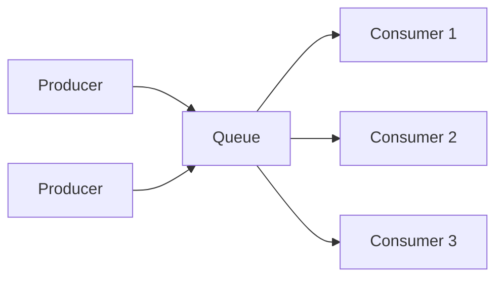
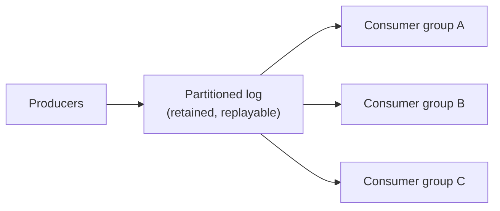

# Message Queues, Event Streams & Search Engines

> **Level:** 2 (Core Components) · **Prerequisites:** [Storage Classes](04-storage-classes.md)
> **Navigation:** [← Previous: Storage Classes](04-storage-classes.md) · [Next → Workers, Schedulers & Notifications](06-workers-schedulers-notifications.md)

## Learning objectives
- Distinguish a message queue from an event stream/log and choose between them.
- Reason about delivery semantics (at-most/least/exactly-once) at a first-pass level.
- Explain what a search engine adds over a database for text/structured queries.

## Message queues
A **message queue** decouples producers from consumers: producers enqueue work; consumers
pull and process, often with acknowledgement. This absorbs bursts (queue-based load
leveling), lets producers and consumers scale independently, and lets a slow consumer not
to block a fast producer. Classic use: a worker pool processing jobs.

Each message is typically delivered to **one** consumer (competing consumers). On failure,
unacknowledged messages are redelivered. This is where **at-least-once** delivery and
**idempotency** enter (covered deeply in Level 4).

## Event streams / logs
A **stream** (Kafka, Kinesis, Pulsar) is an append-only, durably stored, replayable log of
events partitioned by key. Unlike a queue, events are **not deleted on read**; multiple
consumers can read independently at their own offset, and the log can be replayed. Streams
suit event-driven architectures, analytics, and CDC pipelines where multiple downstreams
need the same events.

| Property | Queue (e.g., RabbitMQ/SQS) | Stream (e.g., Kafka) |
|----------|---------------------------|----------------------|
| Consumption | one consumer per message | many groups, replayable |
| Retention | until acked | by time/size, replayable |
| Ordering | per queue (often) | per partition |
| Typical use | task dispatch, RPC-style work | eventing, analytics, CDC |

## Search engines
A **search engine** (Elasticsearch/OpenSearch, and inverted-index stores) indexes text and
structured fields to answer queries a database handles poorly: full-text search, ranking,
facets, prefix/autocomplete. The engine builds an **inverted index** mapping tokens to
documents for sub-linear lookup (see [Complexity & Data Structures]).

A search engine is usually a *secondary* store populated from the primary (via CDC or
batch), so it can lag and must be reindexed on schema change. Its failure mode is divergence
from the source of truth.

## Why this matters
Queues and streams are the backbone of decoupled, resilient, asynchronous systems; they
turn synchronous, fragile call chains into elastic pipelines. Search engines are what make
text and faceted queries fast at scale. Together they appear in nearly every non-trivial
design.

## Examples
- An order service enqueues ""send confirmation email"" so the user-facing path isn't slowed
  by email latency; workers retry with backoff and a DLQ for poison messages.
- A stream carries all ""user action"" events; analytics, recommendation, and audit consumers
  each read independently and replay on bug fixes.
- A product catalog is mirrored into a search engine for full-text and faceted search,
  updated via CDC with a small lag.

## Trade-offs
- **Queue vs stream**: queue = simple dispatch with deletion; stream = replayable, multi-
  consumer, more infrastructure and retention cost.
- **Async** improves resilience and decoupling but adds latency and operational complexity
  (DLQs, ordering, exactly-once reasoning).
- **Search engine** adds query power but is a divergent secondary store to keep in sync.

## When NOT to apply
- Don't add a queue for purely synchronous, low-latency, must-succeed calls; it adds failure
  modes without benefit.
- Don't use a stream when a single-consumer queue suffices; streams cost more to operate.
- Don't stand up a search engine for a few hundred records; a DB index is enough.

## Common mistakes
- Treating ""exactly-once"" as free; it usually requires idempotency + transactional output.
- Forgetting ordering is per-partition, not global, in a sharded stream.
- Letting the search index silently diverge from the source of truth without monitoring.

## Failure modes and operational concerns
- Poison messages redelivered forever (use a DLQ + max attempts).
- Consumer lag grows unbounded under sustained high write rate (scale partitions/consumers).
- Backlog during a consumer outage causes a thundering herd on recovery (gradual ramp-up).

## Review questions
1. When is a stream preferable to a queue?
2. Why is a stream's per-partition ordering a design constraint?
3. What does a search engine provide that a database index does not?
4. Give the classic reason ""exactly-once"" isn't free.
5. Name a failure mode of a search index kept in sync via CDC.

## Further reading
Delivery semantics, DLQs, idempotency: Level 4; CDC/materialized views: Level 3.

---
[← Previous: Storage Classes](04-storage-classes.md) · [Next → Workers, Schedulers & Notifications](06-workers-schedulers-notifications.md)
