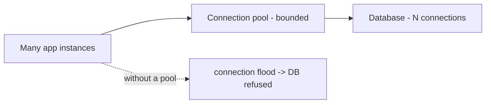
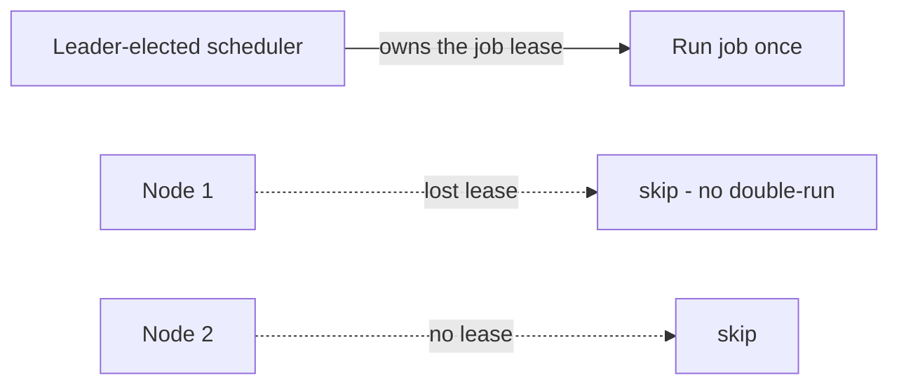
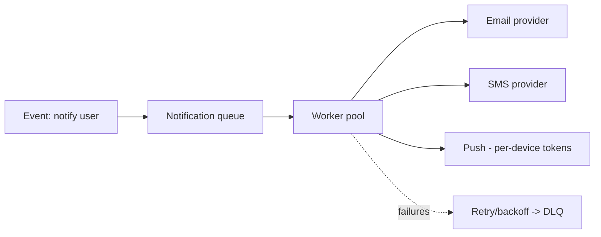

# Workers, Schedulers, Cron & Notifications

> **Level:** 2 (Core Components) · **Prerequisites:** [Queues, Streams & Search](05-queues-streams-search.md)
> **Navigation:** [← Previous: Queues, Streams & Search](05-queues-streams-search.md) · [Next → Level 3: Data & Storage](../03-data-storage/README.md)

## Learning objectives
- Explain connection pools and why they matter under load.
- Describe background workers and the difference between a worker pool and a scheduler/cron.
- Reason about notification delivery as a fan-out problem with delivery semantics.

## Database connection pools
Opening a database connection is expensive (handshake, auth, setup). A **connection pool**
keeps a set of open connections reused across requests, amortizing setup and bounding the
number of concurrent connections to the database (which itself has limits). Without a pool,
spikes open thousands of connections and exhaust the database.

Pool sizing is a knob: too small starves the app; too large overwhelms the DB. A common
mistake is one pool per instance times many instances, summing past the DB's max connections.

## Background workers
A **background worker** processes work off the user's request path: sending emails,
generating reports, transcoding media, calling third-party APIs. Workers consume a queue
(see [Queues]) so the user-facing path stays fast and resilient to downstream slowness.
Workers should be idempotent (redelivery is normal) and bounded (concurrency caps, timeouts).

## Schedulers and cron
- A **scheduler** runs jobs at a time or on an interval (e.g., daily report at 02:00, every
  5-minute health rollup). Distributed schedulers must handle **single-execution** semantics
  so the same job doesn't run on every node (a lock/lease or a leader-elected runner).
- **Cron** is the classic Unix interval scheduler; in distributed systems it's replaced by
  leader-elected or managed schedulers to avoid duplicate execution and to survive node loss.

## Notification services
A **notification platform** fans out messages across channels (email, SMS, push, in-app) to
many recipients, with delivery semantics, retry/backoff, and per-channel rate limits (SMTP,
SMS providers, push token limits). It is a fan-out + delivery-guarantee problem:

Design points: per-recipient dedup, templating, channel preference, throttling (don't spam),
and tracking delivery/open for analytics and feedback loops.

## Why this matters
Most production systems do far more off the request path than on it. Connection pools,
workers, schedulers, and notification pipelines are the ""invisible plumbing"" whose
misdesign produces the most operational pain (connection exhaustion, duplicate jobs, spam,
lost notifications).

## Examples
- An e-commerce order triggers async workers for email, inventory, and analytics so the
  checkout endpoint returns in <300ms regardless of their latency.
- A daily report scheduler uses a lease so only one node runs the 02:00 job.
- A notification service dedups by event ID and applies per-channel rate limits so a bug
  never sends 1000 SMS to one user.

## Trade-offs
- **Async workers** improve user-path latency and resilience but add operational complexity
  and eventual delivery.
- **Pooling** amortizes connection cost but the pool size must match DB capacity.
- **Leader-elected scheduling** prevents double-runs but adds a coordination dependency.

## When NOT to apply
- Don't async-ify a simple, fast, must-succeed call that benefits from immediate feedback.
- Don't run cron on every node and assume ""it'll be fine""; you will double-execute.
- Don't send notifications synchronously in the user path; failures there stall the user.

## Common mistakes
- Summing per-instance pools past the DB's max connections.
- Workers that aren't idempotent, breaking under redelivery.
- Cron on every container causing duplicate jobs and double charges/emails.

## Failure modes and operational concerns
- Connection pool exhaustion under a slow-DB spike cascades to app timeouts.
- Worker backlogs growing unbounded (scale workers; alert on lag).
- Notification storms from a buggy fan-out (dedup + rate limits + kill switches).

## Review questions
1. Why does a connection pool both help the app and protect the DB?
2. Why must workers be idempotent and bounded?
3. What does leader election solve for a scheduler?
4. Give three design points for a safe notification fan-out.
5. Name the failure mode of cron on every node.

## Further reading
Queues/delivery semantics: Level 4; leader election/leases: Level 4; autoscaling workers: L9.

---
[← Previous: Queues, Streams & Search](05-queues-streams-search.md) · [Next → Level 3: Data & Storage](../03-data-storage/README.md)
