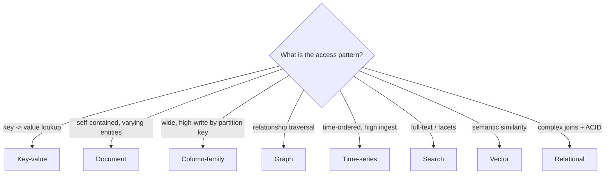

# RDBMS and the NoSQL Families

> **Level:** 3 (Data & Storage) · **Prerequisites:** [Level 2](../02-core-components/README.md)
> **Navigation:** ← Start of Level 3 · [Next → Normalization & Indexing](01-normalization-indexing.md)

## Learning objectives
- Name the storage families and the access pattern each is optimized for.
- Choose SQL vs NoSQL with reasons grounded in workload, not fashion.
- Avoid the two reflex errors: assuming SQL is the default, and assuming NoSQL is a silver bullet.

## The families

### Relational (RDBMS)
Strict schema, tables/rows, joins, ACID transactions, and SQL. Strong for complex
relationships, ad-hoc queries, and consistency. Cost: schema rigidity and the difficulty of
horizontal scaling once a single node is exhausted (sharding SQL is hard because joins
become cross-shard).

### Key-value
A map from a key to an opaque blob. Single-key operations are O(1)-ish; there are no joins or
cross-key transactions. Best for session stores, profile lookups, the URL-shortener mapping
(see the case study). Cheap to shard by key. Examples: Redis, DynamoDB.

### Document
Stores semi-structured documents (JSON/BSON). Schema-flexible within a collection; good
when entities are self-contained and vary in shape (catalog items, content). Trade: joins
are weak, so denormalize or model aggregates as single documents. Examples: MongoDB, Couchbase.

### Column-family
Stores data by columns and partitions wide, sparse rows. Optimized for very high write
throughput and scans over a partition key (time-series by row key, wide-event tables).
Examples: Cassandra, HBase. Trade: query patterns must be known up front (you design for
specific access paths).

### Graph
Stores nodes and edges; first-class relationship traversal. Best for social, fraud, and
recommendation graphs where joins of depth ≥2 are the workload. Examples: Neo4j. Trade:
hard to shard (graph locality conflicts with partitioning).

### Time-series
Optimized for append-only, time-ordered, high-ingest data with downsampling/retention.
Best for metrics, IoT, trading ticks. Examples: InfluxDB, TimescaleDB. Trade: not general
purpose; ad-hoc relational queries are awkward.

### Search
Inverted-index stores for full-text and faceted queries (see [Queues, Streams & Search]).
Examples: Elasticsearch/OpenSearch.

### Vector
Stores embeddings for similarity (nearest-neighbor) search. Best for semantic search,
dedup, and retrieval-augmented generation (Level 10). Trade: approximate results, indexing
cost. Examples: Pinecone, Milvus, pgvector.

## SQL vs NoSQL (the real decision)
It is not "SQL vs NoSQL"; it is "what access pattern, what consistency, what scale." The
questions:
1. Do you need joins/transactions across many entities? → RDBMS shines.
2. Is the access pattern a single key or a fixed partition key? → KV/column-family scales
   further and cheaper.
3. Must you scale horizontally beyond one node with predictable latency? → NoSQL families
   are designed for this; sharding SQL is doable but harder.
4. Do you need ad-hoc queries? → RDBMS; NoSQL families require modeling known access paths.

A common real architecture uses **several** stores: a relational DB for the transactional
core, a KV store for hot lookups, a search engine for text, a stream for events.

## Polyglot persistence
Using the right store per workload is called **polyglot persistence**. The cost is
operational complexity and keeping data in sync across stores (CDC, dual-writes, the
transactional outbox — see Level 4). Don't adopt it prematurely; one well-chosen store beats
five badly-integrated ones.

## Examples
- URL shortener: KV keyed by short code (see case study).
- Product catalog: document store for varying product shapes; a search engine for queries.
- Metrics platform: time-series store for ingest + downsampling; long-term to object storage.
- Social graph: graph store for friend/recommendation traversal; a KV for profile data.

## Trade-offs
- **Schema rigidity** (SQL) vs **schema chaos** (NoSQL without discipline). Schema-on-read
  is flexible but lets bad data accumulate.
- **Joins/ACID** (SQL) vs **horizontal scale** (NoSQL). You often trade one for the other.
- **Consistency** (SQL) vs **availability/throughput** (many NoSQL). CAP/PACELC lives here
  (Level 4).

## When NOT to apply
- Don't choose a NoSQL family because it's "modern"; choose it because the access pattern fits.
- Don't use a graph DB for a workload that's just key lookups.
- Don't use a vector DB as your primary store; it's a secondary similarity index.

## Common mistakes
- Modeling a NoSQL schema as if it were relational (ignoring access paths → slow queries).
- Assuming NoSQL is automatically horizontally scalable without designing the partition key.
- Over-using polyglot persistence before one store is exhausted.

## Failure modes and operational concerns
- Hot partitions from a poor partition key (a single key dominates traffic).
- Cross-store divergence when syncing via dual-writes (use CDC/outbox).
- Schema drift in document stores producing unqueryable data.

## Review questions
1. Match each family to one access pattern.
2. Why is sharding SQL harder than sharding a KV store?
3. When does a column-family store beat a document store?
4. Give one case where polyglot persistence is justified and one where it isn't.
5. Why is "NoSQL = horizontally scalable" an oversimplification?

## Further reading
Dynamo: S-DYNAMO · Bigtable: S-BIGTABLE · Spanner: S-SPANNER · Cassandra: S-CASSANDRA.

---
← Start of Level 3 · [Next → Normalization & Indexing](01-normalization-indexing.md)
