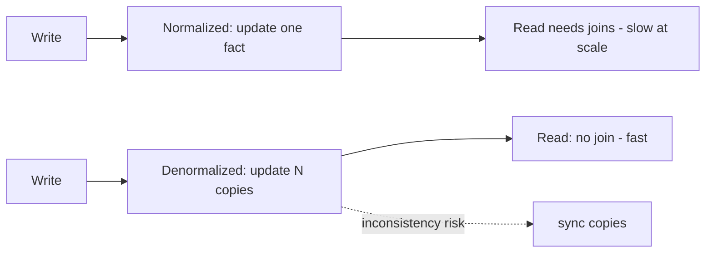
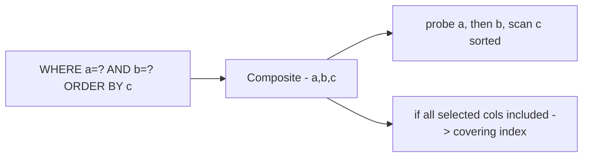

# Normalization, Denormalization & Indexing

> **Level:** 3 (Data & Storage) · **Prerequisites:** [RDBMS vs NoSQL](00-rdbms-vs-nosql.md)
> **Navigation:** [← Previous: RDBMS vs NoSQL](00-rdbms-vs-nosql.md) · [Next → Replication](02-replication.md)

## Learning objectives
- Choose normalization vs denormalization based on read vs write trade-offs.
- Pick index types (single, composite, covering) for a query with reasons.
- Reason about index cost on writes and the read/write dial.

## Normalization vs denormalization
**Normalization** splits data into many tables to remove duplication and guarantee a single
source of truth for each fact (e.g., an author's name stored once). It optimizes for writes
and consistency. The cost: reads need **joins**, which get expensive at scale and across
shards.

**Denormalization** duplicates data where it's read, eliminating joins for the hot read
path. It optimizes for read latency and scale. The cost: writes must update multiple copies
(consistency maintenance), so writes become slower and more failure-prone.

The rule: normalize the source of truth, denormalize *derived read models* (often kept in
separate stores via CDC/materialized views). Keep the normalized DB as the authority and the
denormalized views as a cache-like, eventually-consistent read projection.

## Indexing
An index is an auxiliary structure that lets the DB find rows for a predicate without a full
scan (O(n) → O(log n); see [Complexity & Data Structures]). The fundamental trade: every index
speeds reads but slows writes and uses storage.

### Index types
- **Single-column index**: speeds `WHERE col = ?`.
- **Composite index**: on `(a, b)` speeds `WHERE a = ? AND b = ?` and `WHERE a = ?` (leftmost
  prefix), but **not** `WHERE b = ?` alone. Order columns by selectivity and equality-vs-range.
- **Covering index**: contains all columns a query needs, so the DB never touches the table
  ("index-only scan"). Very fast but larger.
- **Unique index**: enforces uniqueness and serves lookups.
- **Partial/filtered index**: indexes only a subset, saving space for sparse predicates.

### The query plan
Use `EXPLAIN` to see whether a query uses an index or scans. Common bugs: a predicate the
index can't serve (e.g., `WHERE LOWER(name)=?` won't use a plain index on `name`), or a
missing leftmost prefix.

## Why this matters
At scale, schema and index design *is* the design. A missing index turns a fast endpoint
into a slow one as data grows; over-indexing turns a fast write into a slow one. This is the
same read/write trade-off that pervades the whole curriculum.

## Examples
- A paste service: index `short_code` (unique) for resolution; a composite `(author_id,
  created_at)` for "my pastes, newest first."
- A leaderboard: don't index for top-k in SQL; use a sorted-set structure (denormalize the
  read model into Redis).
- An orders table: a covering index `(user_id, status, total)` lets "open orders for a user
  with totals" run index-only.

## Trade-offs
- **More indexes** = faster reads, slower writes, more storage.
- **Denormalization** = faster reads, slower/complex writes, consistency risk.
- **Covering indexes** = fastest reads but the largest indexes.

## When NOT to apply
- Don't index every column; write cost and storage add up.
- Don't denormalize before you've measured the join cost; premature denormalization creates
  consistency bugs for little gain.
- Don't add a covering index for a rare query; storage isn't free.

## Common mistakes
- A composite index in the wrong column order (leftmost prefix unused).
- Denormalizing without a sync mechanism (silent divergence).
- Filtering on a function of a column, bypassing the index.

## Failure modes and operational concerns
- Index bloat slows writes and wastes space; reindex/rebuild periodically.
- A schema change that drops a hot index causes a sudden scan storm.
- Denormalized copies drift when the sync (CDC/outbox) falls behind.

## Review questions
1. When does a composite index `(a,b)` not help `WHERE b=?`?
2. What does a covering index avoid, and at what cost?
3. Give one reason to keep a normalized source of truth plus a denormalized read model.
4. Why does indexing speed reads and slow writes?
5. Name a query-shape bug that defeats an index.

## Further reading
PostgreSQL indexes: S-PG-INDEX · CDC/materialized views: next chapter.

---
[← Previous: RDBMS vs NoSQL](00-rdbms-vs-nosql.md) · [Next → Replication](02-replication.md)
