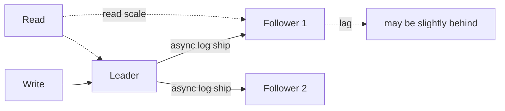
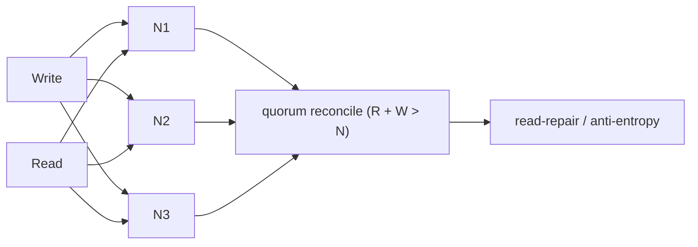

# Replication Topologies

> **Level:** 3 (Data & Storage) · **Prerequisites:** [Normalization & Indexing](01-normalization-indexing.md)
> **Navigation:** [← Previous: Normalization & Indexing](01-normalization-indexing.md) · [Next → Partitioning & Sharding](03-partitioning-sharding.md)

## Learning objectives
- Compare leader-follower, multi-leader, and leaderless replication.
- Choose sync vs async replication with latency/durability trade-offs.
- Reason about replication lag, split-brain, and conflict handling.

## Why replicate
Replication copies data across nodes for **durability** (survive disk/node loss),
**availability** (survive node failure), and **read scale** (serve reads from replicas). It
introduces the central tension of distributed storage: copies must be kept consistent, and
that costs latency, throughput, or availability (Level 4 formalizes this).

## Leader-follower (single-leader)
One node is the **leader** (all writes go there); **followers** replicate the log. Reads can
go to followers (read scale) or the leader (stronger consistency). Writes are serialized at
the leader, so no write conflicts.

- **Sync vs async**: synchronous replication waits for a follower ack before acknowledging
  the write (durable but higher latency); async acknowledges immediately (fast but a leader
  crash can lose unreplicated writes). Many systems use **semi-sync** (wait for ≥1 follower).
- **Replication lag**: async followers fall behind; reads from them are stale (eventual
  consistency). Bound lag with monitoring and read-your-writes routing.

## Multi-leader
Multiple leaders accept writes (often one per region). Great for write availability across
regions and surviving a partition. The cost: **write conflicts** when two leaders update the
same row; conflict resolution (last-write-wins, custom merge, CRDTs) is required. This is the
source of most multi-leader pain.

## Leaderless
No leader; any node can accept a write and the system uses **quorum** reads/writes to
reconcile (Dynamo-style: S-DYNAMO). Tolerates node failures and partitions well; conflicts
resolved with read-repair and anti-entropy. Cost: weaker consistency guarantees and the
complexity of quorum arithmetic and conflict resolution.

## Choosing a topology
| Topology | Best for | Main cost |
|----------|----------|-----------|
| Leader-follower | strong write order; simple | leader is a write bottleneck & failover needed |
| Multi-leader | multi-region write availability | write conflicts, complex resolution |
| Leaderless | high availability + partition tolerance | quorum/conflict complexity; weaker guarantees |

## Sync vs async (the core dial)
- **Synchronous** → stronger durability, higher write latency, lower throughput.
- **Asynchronous** → low latency writes, but lag and potential data loss on leader crash.
The dial maps directly to the durability-vs-latency trade-off from [Requirements].

## Why this matters
Replication is how you make a stateful system both durable and available. Getting it wrong
produces data loss (async + leader crash) or split-brain (multi-leader without conflict
handling) or unbounded lag (async without backpressure).

## Examples
- A banking ledger: synchronous leader-follower; writes wait for a follower ack to avoid
  data loss.
- A global CMS: multi-leader per region so authors aren't blocked by a remote leader; last-
  write-wins with timestamps.
- A shopping cart: leaderless/CRDT so a user can write while offline and converge later.

## Trade-offs
- Strong order (leader-follower) vs write availability (multi-leader/leaderless).
- Sync durability vs async latency.
- Read scale from replicas vs stale reads (lag).

## When NOT to apply
- Don't use multi-leader if you can't tolerate conflict resolution; pick a single leader.
- Don't read from async followers for read-after-write needs without read-your-writes logic.
- Don't replicate synchronously to a far region for a latency-sensitive write.

## Common mistakes
- Assuming async replicas are current (unbounded staleness for users).
- Multi-leader without a conflict policy (silent last-write-wins data loss).
- Forgetting replication lag monitoring until a user sees stale data.

## Failure modes and operational concerns
- **Split-brain**: a partition makes two nodes both think they're the leader. Prevent with
  quorums/leases (Level 4).
- **Lag storms**: a fallen-behind replica, once reconnected, hammers the leader.
- **Lag during failover**: an unreplicated write is lost when promoting a lagging follower.

## Review questions
1. When is synchronous replication worth its latency cost?
2. Compare the failure mode of multi-leader vs leader-follower on a partition.
3. What does read-repair do in a leaderless system?
4. Why does reading from async followers break read-after-write?
5. Give one way to prevent split-brain (preview; Level 4 deep dive).

## Further reading
Dynamo: S-DYNAMO · Spanner: S-SPANNER · MySQL replication: S-MYSQL-REPL · consensus: Level 4.

---
[← Previous: Normalization & Indexing](01-normalization-indexing.md) · [Next → Partitioning & Sharding](03-partitioning-sharding.md)
