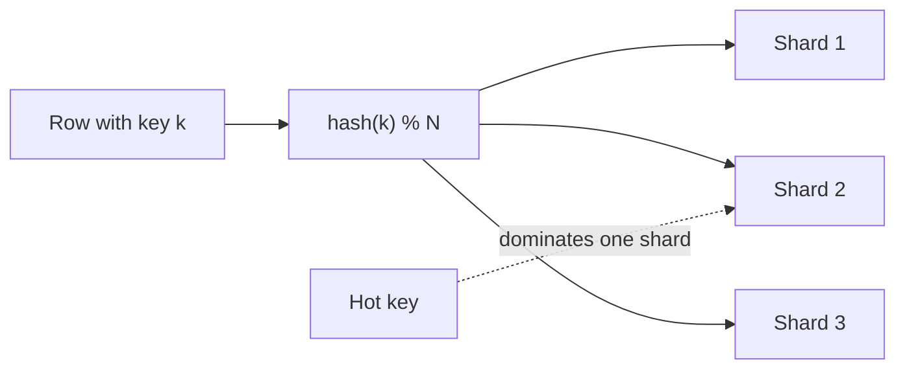
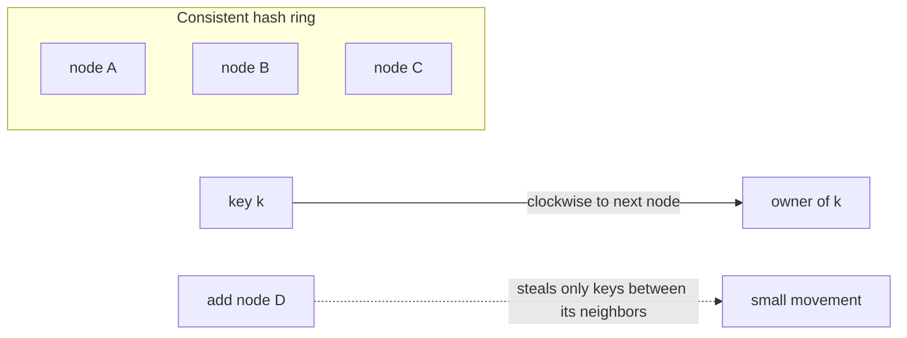

# Partitioning, Sharding & Consistent Hashing

> **Level:** 3 (Data & Storage) · **Prerequisites:** [Replication](02-replication.md)
> **Navigation:** [← Previous: Replication](02-replication.md) · [Next → CDC, Materialized Views & Lifecycle](04-cdc-materialized-views.md)

## Learning objectives
- Partition data across nodes by a shard key and reason about hot keys.
- Use consistent hashing to minimize data movement when membership changes.
- Reason about rebalancing and federation.

## Partitioning vs replication (recap)
Replication copies the same data; **partitioning** splits *different* data across nodes so
each node holds a subset. Most large systems do both: each partition is also replicated.

## The shard key
A **shard key** decides which node owns a row. A good key:
- **Distributes evenly** (no hot shard).
- **Co-locates related data** accessed together (e.g., all of a user's data on one shard so
  per-user queries don't fan out).
- **Is stable** (a row's shard doesn't change on every write).

The central failure: a **hot key** (a single user, a viral id) sends disproportionate
traffic to one shard. Adding shards does **not** fix a hot key — you must mitigate the key
itself (cache it, split it, or rate-limit it).

## Consistent hashing
Naive `hash(k) % N` reassigns ~all keys when `N` changes (see the `consistent_hashing.py`
example: ~80% move). **Consistent hashing** places both nodes and keys on a ring so adding
or removing a node moves only the keys near it (~keys/N), not the whole keyspace.

**Virtual nodes (vnodes)**: each real node maps to many positions on the ring so load is
spread evenly even if real nodes have unequal capacity, and a single node's failure spreads
its load across many survivors rather than onto one neighbor.

## Rebalancing
When you add/remove nodes or a shard fills, you must move data. Rebalancing concerns:
- **Minimize movement** (consistent hashing helps).
- **Don't overload the network** (throttle; move in the background; keep serving).
- **Don't double-direct** traffic mid-move (route by the new ring gradually).

## Federation (a different split)
**Federation** splits by *function* (the users DB vs the orders DB vs the logs DB) rather
than by shard key. Each function scales independently and a failure in one doesn't take down
the others. It is complementary to sharding within a function.

## Why this matters
Sharding is how you scale a stateful system past one node. It is also one of the hardest
things to undo: choosing the wrong shard key or too few shards forces a painful reshard.
Design the key and over-provision shard count early.

## Examples
- URL shortener: shard by `short_code` hash (see case study); viral codes handled by the
  edge, not by more shards.
- A multi-tenant SaaS: shard by `tenant_id` so all of a tenant's data co-locates — but watch
  for giant tenants (a "noisy whale") and split them onto dedicated shards.
- Metrics: shard by `(metric, time-bucket)` so a time range query hits one partition.

## Trade-offs
- **Co-location** (good key) vs **even distribution** — sometimes in tension.
- **More shards** = more headroom and smaller failover blast radius, but more coordination
  and cross-shard query fan-out.
- **Consistent hashing** minimizes movement but can skew without vnodes.

## When NOT to apply
- Don't shard before you need to; it's expensive to undo. Start with replication/read scale.
- Don't shard by a key that's hot (a single tenant/id will melt one shard).
- Don't shard to fix a hot key; mitigate the key first.

## Common mistakes
- A shard key that creates a hot shard (one big tenant, monotonic timestamps).
- Too few shards at launch, forcing a reshard under load.
- Forgetting that cross-shard queries/joins become fan-out with weaker guarantees.

## Failure modes and operational concerns
- Hot shard melts while others sit idle; autoscaling shards doesn't help (key is the issue).
- Rebalance saturates the network or stalls writes.
- A giant tenant forces an emergency "shard split" — plan for it.

## Review questions
1. Why does adding shards not fix a hot key?
2. Compare naive modulo hashing to consistent hashing on adding a node.
3. What do vnodes buy you, and what problem do they solve?
4. When is federation a better split than sharding?
5. Name a bad shard key and why.

## Further reading
Consistent hashing: S-CHASH · Cassandra: S-CASSANDRA · sharding calculator in `calculations/`.

---
[← Previous: Replication](02-replication.md) · [Next → CDC, Materialized Views & Lifecycle](04-cdc-materialized-views.md)
