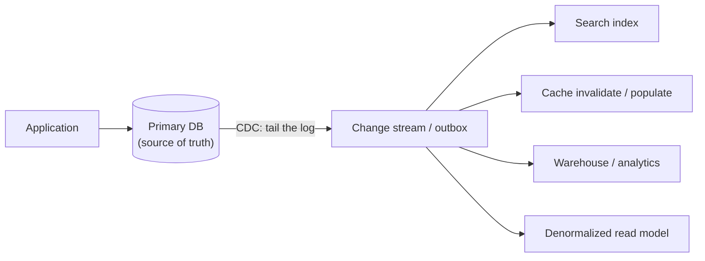
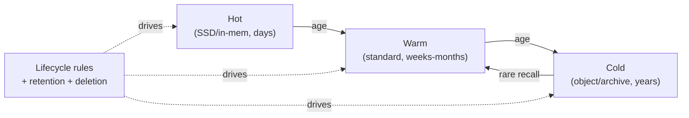

# CDC, Materialized Views & Data Lifecycle

> **Level:** 3 (Data & Storage) · **Prerequisites:** [Partitioning & Sharding](03-partitioning-sharding.md)
> **Navigation:** [← Previous: Partitioning & Sharding](03-partitioning-sharding.md) · [Next → ID Generation & Multi-tenancy](05-id-generation.md)

## Learning objectives
- Use Change Data Capture to keep secondary stores in sync reliably.
- Reason about materialized views as precomputed read models.
- Manage data lifecycle across hot/warm/cold tiers.

## Change Data Capture (CDC)
**CDC** streams changes from a database's transaction log to other systems, turning the DB
into the source of truth and downstream stores into derived projections. It is the robust
alternative to **dual-writes** (writing to two stores in application code), which are
not-atomic: one write can fail, leaving the stores diverged silently.

CDC gives at-least-once delivery of changes; downstreams must be **idempotent** (a replay
must not double-apply). The transactional **outbox** pattern (write to an outbox table in the
same transaction as the business write, then a relay publishes it) makes publication safe
even when the message broker could lose a message (Level 4).

## Materialized views
A **materialized view** is a precomputed, stored query result, refreshed from base data. It
trades write cost (keeping it fresh) for read speed. Modern systems refresh views
incrementally via CDC rather than recomputing. Materialized views are the relational cousin
of the denormalized read model: the normalized source stays authoritative; the view serves
the hot read.

## Hot, warm, cold storage and lifecycle
Not all data is equally accessed. Lifecycle management moves data to cheaper, slower tiers
as access decays:
- **Hot**: recent, frequently accessed — fast SSD / in-memory.
- **Warm**: occasionally accessed — standard storage.
- **Cold**: rarely accessed — object/archive storage, compressed.

Lifecycle rules automate tiering and **retention/deletion** (legal compliance, cost
control). Designing retention up front prevents the ""keep everything forever"" cost
explosion. Recall latency from cold tiers can be minutes-to-hours and may incur fees —
don't put data you need quickly in cold storage.

## Why this matters
CDC + materialized views + lifecycle are how you scale *reads* and *cost* without
sacrificing a clean normalized source of truth. They appear in nearly every real
architecture: search indexes, caches, analytics, denormalized views, and tiered storage are
all instances of this pattern.

## Examples
- A product catalog: DB → CDC → search index + cache; the index lags by seconds.
- A paste service: recent pastes hot in cache; old pastes tiered to object storage.
- A metrics platform: hot in a time-series store for 7 days, then cold object storage for
  years with downsampling.

## Trade-offs
- **CDC vs dual-writes**: CDC is safer (atomic-ish) but adds infrastructure and lag;
  dual-writes are simple but unsafe under failures.
- **Materialized views**: faster reads vs write amplification and freshness lag.
- **Tiering**: lower cost vs recall latency/fees and operational complexity.

## When NOT to apply
- Don't stand up CDC for a single small store; a dual-write or batch job may suffice.
- Don't materialize a view that's queried rarely; index the base table instead.
- Don't tier data you need in seconds; the recall cost and latency defeat the savings.

## Common mistakes
- Dual-writes causing silent divergence between two stores.
- Forgetting CDC downstreams must be idempotent (replays double-apply).
- "Keep everything forever" with no retention policy → cost explosion.

## Failure modes and operational concerns
- CDC lag grows; downstream stores serve stale data longer than users expect.
- A materialized view refresh job fails; the view serves increasingly stale results.
- Lifecycle misclassification moving hot data to cold (latency regressions) or leaving cold
  data hot (cost overrun).

## Review questions
1. Why is CDC safer than dual-writes?
2. What idempotency requirement does CDC place on downstreams?
3. When is a materialized view the wrong choice?
4. Give the trade-off of tiering data to cold storage.
5. Why must you design retention up front?

## Further reading
PostgreSQL logical replication: S-PG-CDC · Kafka: S-KAFKA · outbox/inbox: Level 4.

---
[← Previous: Partitioning & Sharding](03-partitioning-sharding.md) · [Next → ID Generation & Multi-tenancy](05-id-generation.md)
