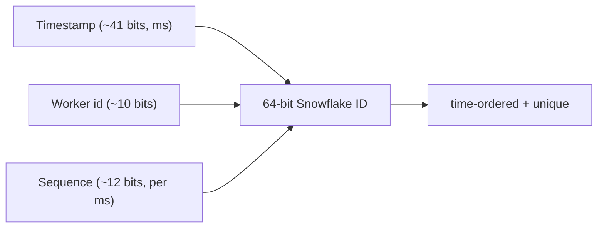
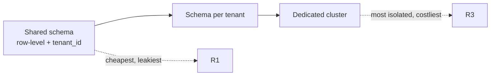

# ID Generation & Multi-tenancy

> **Level:** 3 (Data & Storage) · **Prerequisites:** [CDC & Materialized Views](04-cdc-materialized-views.md)
> **Navigation:** [← Previous: CDC & Materialized Views](04-cdc-materialized-views.md) · [Next → Migrations, Backup & PITR](06-migrations-backups.md)

## Learning objectives
- Choose an ID scheme (UUID, Snowflake, DB sequence) for your scale and ordering needs.
- Reason about monotonicity, sortability, and collision avoidance under concurrency.
- Design multi-tenant isolation and handle "noisy whale" tenants.

## Why ID generation matters
Every record needs a unique identifier. At scale, generation must be: **unique** without a
global lock, **fast** (not a single bottleneck), and often **time-ordered or sortable**
(indices and partitioning benefit from monotonic IDs). Bad ID choices create hot shards
(monotonic IDs all land on the last shard) or collisions.

## Schemes
### UUID (S-UUID)
Globally unique, generated independently anywhere, no coordination. Great for distributed
generation. Costs: random (not sortable; poor index locality — inserts scatter in a B-tree,
causing fragmentation), and large (128-bit). Variant UUIDv7 is time-ordered and fixes the
locality problem.

### DB auto-increment / sequence
Simple, monotonic, sortable. Cost: a single sequence is a bottleneck and a SPOF; even
"bulk" sequences centralize coordination. Monotonic IDs also hot-shard on a range-partition.

### Snowflake-style (S-SNOWFLAKE)
A 64-bit ID composed of `timestamp | worker_id | sequence`. Generated locally by each
worker (worker_id assigned once), so it's distributed, roughly time-ordered, sortable, and
collision-free as long as worker_ids are unique and sequence doesn't overflow per
millisecond. The default choice for large-scale systems needing sortable, sharded IDs.

## Choosing
| Need | Scheme |
|-----|--------|
| Distributed, no coordination, sortable | Snowflake |
| Purely unique, don't care about order | UUID (or UUIDv7 if you want order too) |
| Single small DB, want simple order | auto-increment |
| Want monotonic but shardable | Snowflake hashed to a shard |

Monotonic IDs plus range partitioning = hot last shard; mitigate with hash partitioning.

## Multi-tenancy
A **multi-tenant** system serves isolated tenants on shared infrastructure. Three isolation
models, increasing isolation and cost:
1. **Shared schema, row-level** — cheapest; enforce with a `tenant_id` column and row-level
   security. Riskiest: bugs leak across tenants; a giant tenant distorts shared capacity.
2. **Shared cluster, schema/DB per tenant** — moderate; stronger isolation, still shared
   infra.
3. **Dedicated cluster per tenant** — strongest; for "noisy whales" or regulated tenants.

Design points:
- **Noisy-whale handling**: monitor per-tenant load; move giant tenants to dedicated shards.
- **No tenant id from client input alone**: always derive it from authenticated identity.
- **Quotas/throttles per tenant** to protect the shared pool.

## Examples
- URL shortener: a Snowflake counter encodes to the 7-char base62 code (see case study).
- Multi-tenant SaaS: `tenant_id` as part of the shard key to co-locate a tenant's data, with
  per-tenant quotas and a path to dedicated shards for whales.
- Event log: Snowflake IDs so events are time-ordered and sortable across producers.

## Trade-offs
- **Snowflake vs UUID**: sortable/locality vs no-coordination and randomness.
- **Shared tenancy** = cost efficiency vs leak risk and noisy-neighbor blast radius.
- **Per-tenant isolation** = safety vs operational overhead and cost.

## When NOT to apply
- Don't use random UUIDs as a primary clustered key in a high-write B-tree (fragmentation);
  use UUIDv7 or Snowflake.
- Don't share a schema across tenants with strong regulatory isolation requirements.
- Don't put `tenant_id` in a query param and trust it; authenticate it.

## Common mistakes
- Auto-increment as a global bottleneck, then sharding by it (hot last shard).
- Trusting a client-supplied tenant id (cross-tenant access).
- Ignoring a giant tenant until it degrades everyone else.

## Failure modes and operational concerns
- Worker_id collision → duplicate Snowflake IDs; assign worker_ids via a unique lease/seed.
- Sequence overflow per ms under burst → clock-stall or duplicate; size the sequence bits
  to your peak per-worker rate.
- A noisy whale monopolizes a shared shard's capacity.

## Review questions
1. Why are random UUIDs a poor clustered key in a high-write B-tree?
2. What does a Snowflake ID guarantee, and what must you provision for it?
3. Compare the three multi-tenancy models on isolation vs cost.
4. Why must tenant identity come from auth, not a request parameter?
5. How do you handle a "noisy whale" tenant?

## Further reading
Snowflake: S-SNOWFLAKE · UUID: S-UUID · consistency of dedup: Level 4.

---
[← Previous: CDC & Materialized Views](04-cdc-materialized-views.md) · [Next → Migrations, Backup & PITR](06-migrations-backups.md)
