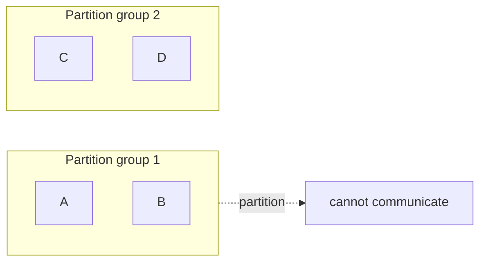
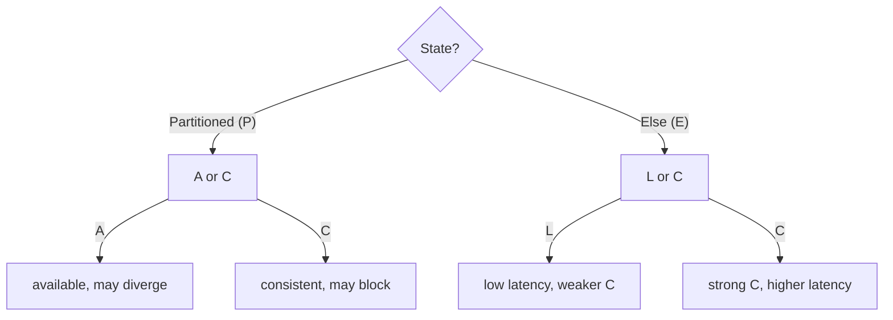

# CAP, PACELC, Partitions & Partial Failure

> **Level:** 4 (Distributed Systems) · **Prerequisites:** [Level 3](../03-data-storage/README.md)
> **Navigation:** ← Start of Level 4 · [Next → The Consistency Spectrum](01-consistency-spectrum.md)

## Learning objectives
- State CAP and, more usefully, PACELC, and avoid the ""pick two"" oversimplification.
- Distinguish network partitions and partial failures from total failures.
- Reason about the latency/consistency trade-off even when there is no partition.

## Distributed-system characteristics
A distributed system has multiple nodes that fail **independently** and communicate over an
**asynchronous, unreliable network**. The defining difficulties follow from three facts:
the network can delay or drop messages; nodes can crash and restart; and there is no global
clock. You cannot reliably tell a crashed node from a slow one (the ""network is reliable""
fallacy). This is why every distributed algorithm assumes partial failure.

## Partitions and partial failure
A **network partition** splits nodes into groups that can't reach each other. A **partial
failure** is when some components fail while others continue — far harder than a total
failure, because the system must keep serving with a subset of itself. Unlike a single
machine (which works or doesn't), a distributed system is always *partially* something.

## CAP theorem (S-CAP)
During a **partition**, a distributed system must choose between **Consistency** (every read
sees the latest write) and **Availability** (every request gets a non-error response). It
cannot give both. The common misreading is ""pick two of three always"" — but partitions are
rare; when there is no partition, you get both C and A. CAP is really *what do you do during
a partition*.

## PACELC (S-PACELC)
PACELC is the more useful framing: **if Partitioned, choose Availability or Consistency (PAC);
Else (no partition), choose Latency or Consistency (ELC).** It captures the everyday
trade-off you actually face: even with no partition, stronger consistency costs latency
(waiting on more replicas / coordination). For example:
- **PA/EL** (e.g., Dynamo): during a partition, prefer availability; otherwise prefer low
  latency. Eventually consistent.
- **PC/EC** (e.g., Spanner/Paxos-replicated): prefer consistency both during partitions and
  otherwise; pays higher latency.

## Why this matters
CAP/PACELC explain *why* every consistency/availability/latency decision is a trade-off and
*why there is no free lunch*. The right choice depends on the workload: a banking ledger
is PC/EC (consistency wins); a shopping cart or feed is PA/EL (availability/latency win).

## Examples
- A banking ledger: during a partition, refuse conflicting writes (consistency over
  availability) — you'd rather block than double-spend.
- A social feed: during a partition, keep serving (availability) and reconcile later;
  eventual consistency is acceptable for likes.
- A strongly-consistent replicated counter (Paxos/Raft): never diverges, but every write
  pays a cross-replica round trip (latency for consistency).

## Trade-offs
- **Consistency vs availability** during a partition.
- **Consistency vs latency** even without a partition (the ELC part — the one people forget).
- There is no system that is always strongly consistent, always available, and low-latency.

## When NOT to apply
- Don't invoke CAP to justify sloppy design; choose your consistency deliberately per
  workload.
- Don't treat ""eventual consistency"" as a free pass; name *what* eventually converges and
  *how* stale it can be.
- Don't pick PC/EC everywhere; the latency cost compounds across a call chain.

## Common mistakes
- ""CAP = pick two always"" (partitions are intermittent).
- Forgetting the ELC trade-off (consistency costs latency every day, not just during
  partitions).
- Assuming a partition is rare enough to ignore — when it happens, your choice defines the
  outage.

## Failure modes and operational concerns
- A split-brain under partition (two sides both accept writes) if you chose A without a
  reconciliation plan.
- Latency blowups from choosing strong consistency on a hot, cross-region path.
- Stale reads that users notice because the convergence bound was never specified.

## Review questions
1. Why is ""CAP = pick two"" an oversimplification?
2. What does the ELC part of PACELC capture that CAP does not?
3. Give a PA/EL and a PC/EC example workload.
4. Why is partial failure harder than total failure?
5. What does choosing consistency over availability cost during a partition?

## Further reading
CAP: S-CAP · PACELC: S-PACELC · Dynamo: S-DYNAMO · Spanner: S-SPANNER.

---
← Start of Level 4 · [Next → The Consistency Spectrum](01-consistency-spectrum.md)
