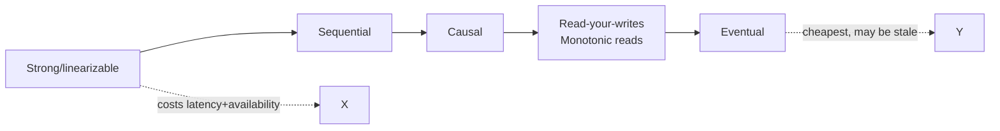
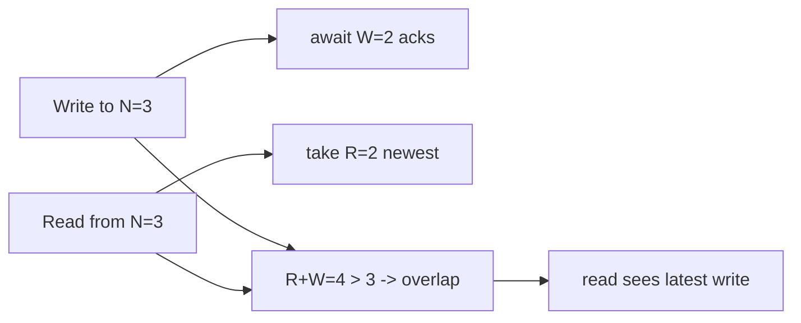

# The Consistency Spectrum & Quorums

> **Level:** 4 (Distributed Systems) · **Prerequisites:** [CAP & PACELC](00-cap-pacelc.md)
> **Navigation:** [← Previous: CAP & PACELC](00-cap-pacelc.md) · [Next → Consensus: Locks, Leases, Raft, Paxos](02-consensus.md)

## Learning objectives
- Order the consistency models from strongest to weakest and say what each guarantees.
- Explain read-after-write and read-your-writes consistency and how to provide them.
- Compute quorum read/write requirements and their trade-offs.

## The spectrum (strong → weak)
- **Strong / linearizable**: every read returns the latest write; an operation appears to
  happen at a single instant. Costs latency and availability (must coordinate).
- **Sequential**: sees a valid order of the data, but reads may lag behind the latest.
- **Causal**: preserves cause-and-effect (if A happened-before B, you can't see B without A);
  concurrent writes can appear in any order.
- **Read-your-writes (session)**: a client always sees its own writes.
- **Monotonic reads**: once a client sees a value, it never sees an older one.
- **Eventual**: given no new writes, replicas converge; but with no bound on staleness.

Stronger is not ""better"" — it's more expensive. Pick the *weakest* model your users can
tolerate; that buys the most availability and latency headroom.

## Read-after-write / read-your-writes
After a user writes, they expect to see it. With async replication, a read that lands on a
lagging replica returns stale data — a classic user-facing bug ("my post disappeared").
Fixes:
- **Route the user's reads to the leader** (or a sync replica) for a short window.
- **Sticky sessions / session pinning** to the replica that received the write.
- **Version/read-token** schemes that block a read until the replica has the write's version.

## Quorum reads and writes (leaderless)
For N replicas, a **write quorum** W and **read quorum** R satisfy `R + W > N` so any read
overlaps the latest write (a majority-ish intersection). With W = R = majority of N, you get
strong consistency at the cost of two round trips.

Tuning:
- `W=N, R=1`: writes wait for all (slow, durable); reads are fast (one replica). Good for
  read-heavy, write-rare.
- `W=1, R=N`: writes are fast; reads wait for all (slow). Good for write-heavy, read-rare.
- `W=R=majority`: balanced strong consistency.

Stale reads still happen if you use `R < N` with `W < N` and don't satisfy the overlap; some
systems offer **tunable consistency** per request.

## Why this matters
Consistency choice is the central distributed-systems dial. It directly trades latency,
availability, and correctness. Naming the model precisely ("eventual with read-your-writes
within 1 s") is what makes a system operable; ""eventually consistent"" alone is too vague.

## Examples
- A banking ledger: strong/linearizable (no double-spend).
- A social feed: eventual with monotonic reads (no ""my like disappeared"").
- A shopping cart: causal (preserve add/remove order for one user) but eventually consistent
  across users.
- Dynamo-style KV with `W=R=2, N=3`: strong-ish reads with one tolerated failure.

## Trade-offs
- Stronger consistency → more latency, less availability under partition.
- Quorum overlap → correctness but every op pays for replicas.
- Tunable consistency → flexibility but easy to misconfigure for a given query's needs.

## When NOT to apply
- Don't default to strong consistency; the latency/availability cost may be unnecessary.
- Don't promise ""read-your-writes"" and then round-robin reads to lagging replicas.
- Don't use `R=1, W=1` on `N=3` and call it consistent (no overlap; stale reads).

## Common mistakes
- Conflating ""eventually consistent"" with a bound (specify the staleness bound).
- Breaking read-your-writes by load-balancing reads across replicas blindly.
- Quorum arithmetic that doesn't actually intersect (`R+W <= N`).

## Failure modes and operational concerns
- Unbounded staleness surprising users under replica lag.
- A misconfigured tunable-consistency read serving stale data for a critical query.
- Quorum reads amplifying tail latency (they wait for the *slowest* of R).

## Review questions
1. Order the models strong→weak and name one cost of going stronger.
2. How do you provide read-your-writes with async replication?
3. Why does `R+W > N` give a read the latest write?
4. Give W/R settings for a read-heavy, write-rare N=3 system.
5. Why is ""eventually consistent"" insufficient as a user-facing guarantee?

## Further reading
Dynamo: S-DYNAMO · Spanner: S-SPANNER · CRDTs: next-but-one chapter.

---
[← Previous: CAP & PACELC](00-cap-pacelc.md) · [Next → Consensus](02-consensus.md)
