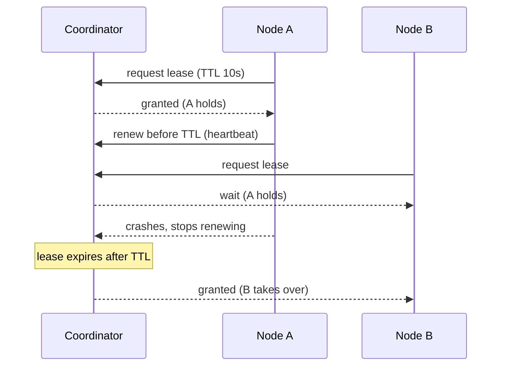
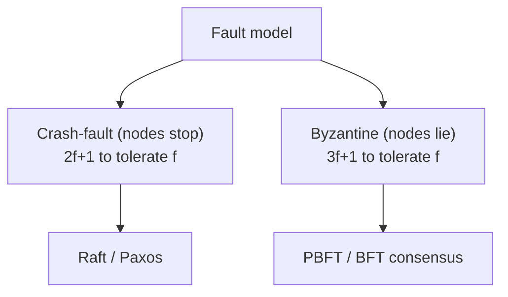

# Consensus: Locks, Leases, Leader Election, Raft, Paxos, BFT

> **Level:** 4 (Distributed Systems) · **Prerequisites:** [Consistency Spectrum](01-consistency-spectrum.md)
> **Navigation:** [← Previous: Consistency Spectrum](01-consistency-spectrum.md) · [Next → Clocks, Gossip & Anti-entropy](03-clocks-gossip.md)

## Learning objectives
- Distinguish a distributed lock from a lease and why leases avoid deadlock-on-crash.
- Explain leader election and consensus and why you need a majority.
- Compare Raft, Paxos, and Byzantine fault tolerance at a working level.

## Distributed locks and leases
A **distributed lock** ensures only one node holds a resource at a time. A naive lock fails
if the holder crashes while holding it (the lock is never released) or if the network
splits (two holders). The robust pattern is a **lease**: a time-bounded grant that
auto-expires, so a crashed holder's lease ends after its TTL and another can take over.

Lease rules: hold the resource only while you have a valid lease; renew before expiry; stop
using it the moment the lease lapses; use a **fencing token** (monotonic per-resource) so a
paused-then-resumed old holder can't write with a stale lease after a new holder took over.

## Leader election & consensus
**Leader election** chooses one coordinator (e.g., one scheduler runs the job, one shard is
the write leader). **Consensus** is the stronger problem: agreeing on a *value* (a log
entry, an order) despite failures. Both need a **majority** in the fault-tolerant case: with
`2f+1` nodes you tolerate `f` failures because a majority of `f+1` can always form.

## Raft (S-RAFT)
The practical consensus algorithm behind etcd, Consul, and others. A leader replicates a
log to followers; a write commits once a **majority** ack. Raft is understandable: leader
election via terms + randomized timeouts; log replication; safety via majority quorums.
Crash-fault tolerant (assumes nodes fail-stop, not lie).

## Paxos (S-PAXOS)
The classic consensus algorithm; harder to understand, very general. Multi-Paxos is the
basis of strongly-consistent replicated logs. Same majority-quorum idea; Raft is essentially
a more understandable Paxos for replicated logs.

## Byzantine fault tolerance (S-BYZANTINE)
Crash-fault tolerance assumes a failed node just stops. **Byzantine** failures assume nodes
can *lie* (bugs, corruption, or attackers). BFT needs `3f+1` nodes to tolerate `f`
Byzantine faults (more replicas than crash-only). Expensive; used where participants don't
trust each other (some blockchains, financial inter-org systems). For most internal
systems, crash-fault tolerance (Raft/Paxos) suffices.

## Why this matters
Consensus underlies leader election, strongly-consistent replication, distributed locks,
and coordinated actions. It is also the most expensive primitive: every consensus decision
costs a majority round trip, which is why you use it sparingly (elect a leader, replicate a
log) rather than per request.

## Examples
- A scheduler uses a lease so only one node runs the 02:00 job (see Level 2).
- A sharded DB's each shard uses Raft for leader election and log replication.
- A distributed lock service grants leases with fencing tokens for exclusive access.
- A cross-org settlement system might use BFT because participants don't trust each other.

## Trade-offs
- **Lease vs lock**: lease auto-recovers from crashes but needs TTL + fencing; lock is
  simpler but deadlock-prone on crash.
- **Raft/Paxos vs BFT**: crash-tolerance (2f+1) is cheaper; BFT (3f+1) handles lying but is
  much more expensive.
- **Consensus per request vs leader-replicated**: per-request consensus is slow; replicate a
  log and serve reads from it.

## When NOT to apply
- Don't use a distributed lock where a local lock or a single leader would do.
- Don't reach for BFT unless participants can't trust each other; crash-tolerance is far
  cheaper.
- Don't run consensus on the hot per-request path; elect a leader and replicate a log.

## Common mistakes
- A distributed lock without a lease/timeout (holder crash = permanent lock).
- No fencing token → a paused old holder writes after a new holder took over.
- Using BFT where crash-tolerance suffices (massive overhead).

## Failure modes and operational concerns
- Split-brain if a quorum can't be reached (two minorities both think they're leader) —
  require majority to act.
- Lease expiry too long extends failover; too short risks premature revocation under
  scheduling jitter (guard with a safety margin).
- Consensus unavailability under a partition (a PC/EC choice, see CAP/PACELC).

## Review questions
1. Why is a lease safer than an unbounded distributed lock?
2. What does a fencing token prevent, and how?
3. How many nodes tolerate f crash faults vs f Byzantine faults, and why the difference?
4. Why is consensus not usually run per request?
5. Why does Raft require a majority to commit?

## Further reading
Raft: S-RAFT · Paxos: S-PAXOS · BFT: S-BYZANTINE.

---
[← Previous: Consistency Spectrum](01-consistency-spectrum.md) · [Next → Clocks, Gossip & Anti-entropy](03-clocks-gossip.md)
