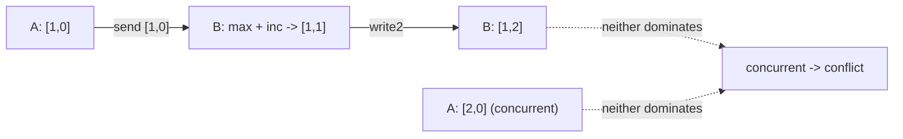
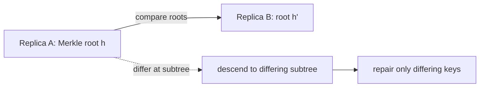

# Clocks, Gossip & Anti-entropy

> **Level:** 4 (Distributed Systems) · **Prerequisites:** [Consensus](02-consensus.md)
> **Navigation:** [← Previous: Consensus](02-consensus.md) · [Next → Distributed Transactions](04-distributed-transactions.md)

## Learning objectives
- Explain why physical clocks are insufficient for ordering events.
- Use Lamport and vector clocks to reason about happens-before and concurrency.
- Describe gossip and anti-entropy (Merkle trees) for eventual convergence.

## Why clocks are hard
There is no global clock; each node has its own, drifting and skewing. Physical timestamps
can't safely order events across nodes: a message can arrive "before" it was sent by the
receiver's clock. So distributed systems use **logical clocks** to reason about order
without wall time.

## Lamport clocks (S-LAMPORT)
A Lamport clock is a single monotonic counter per node. On an event, `L = L+1`; on sending a
  message, attach `L`; on receiving, `L = max(L, message_L)+1`. It gives a partial order: if
`A happened-before B`, then `L(A) < L(B)`. The reverse is not true (smaller L doesn't imply
happened-before). It orders causally-related events but cannot detect concurrency.

## Vector clocks (S-VECTORCLOCK)
A vector clock is an array of per-node counters. It detects both happens-before **and
concurrency**: two events are concurrent iff neither's vector dominates the other. This is
how systems detect conflicting writes for conflict resolution (e.g., Dynamo).

## Gossip protocols
**Gossip** spreads information epidemically: each node periodically tells a few random peers
what it knows; information propagates in `O(log n)` rounds with high probability. It's
simple, scalable, and resilient — used for membership, cluster state, and failure
detection (SWIM). Cost: eventual, probabilistic; not for low-latency critical paths.

## Anti-entropy and Merkle trees
**Anti-entropy** reconciles divergent replicas by comparing and repairing them. Comparing
whole datasets each round is expensive; a **Merkle tree** (a hash tree) lets two nodes
compare hashes at the root, descend only into subtrees that differ, and repair only those
keys. This makes reconciliation proportional to *differences*, not data size.

## Why this matters
Clocks let you reason about causality and conflicts without a global clock; gossip and
anti-entropy are how eventually-consistent systems converge without a central coordinator.
Together they are the machinery of Dynamo-style stores and large cluster managers.

## Examples
- A leaderless KV uses vector clocks to detect concurrent writes and apply a conflict
  policy (last-writer-wins or app-merge).
- A cluster manager gossips membership so every node learns about joins/departs in O(log n)
  rounds.
- A replicated store runs Merkle-tree anti-entropy each minute to repair divergence cheaply.

## Trade-offs
- **Lamport vs vector**: Lamport is cheap but can't detect concurrency; vector clocks can,
  but cost O(n) space per event.
- **Gossip** = scalable and simple but eventual and probabilistic (not for strong order).
- **Merkle anti-entropy** = cheap per difference but needs a hash tree to maintain.

## When NOT to apply
- Don't use physical timestamps to order cross-node events.
- Don't use gossip for data that needs strong consistency or low latency.
- Don't build vector-clock conflict resolution without an actual conflict policy (last-writer
  -wins silently loses data).

## Common mistakes
- Trusting wall-clock order across nodes.
- Last-writer-wins with skewed clocks silently dropping concurrent writes.
- Gossip on a critical control path that needs deterministic, bounded convergence.

## Failure modes and operational concerns
- Clock skew breaks last-writer-wins (use NTP / monotonic clocks; never trust wall time).
- Vector-clock bloat with many participants (use dotted/versioned variants).
- Gossip convergence slow under churn or a large cluster (tune fan-out/rate).

## Review questions
1. Why can't physical timestamps order events across nodes safely?
2. What can a vector clock detect that a Lamport clock cannot?
3. Why does gossip converge in ~O(log n) rounds?
4. How do Merkle trees make anti-entropy cheap?
5. Give a failure mode of last-writer-wins with skewed clocks.

## Further reading
Lamport: S-LAMPORT · Vector clocks: S-VECTORCLOCK · Dynamo: S-DYNAMO · gossip/SWIM: S-GOSSSIP.

---
[← Previous: Consensus](02-consensus.md) · [Next → Distributed Transactions](04-distributed-transactions.md)
