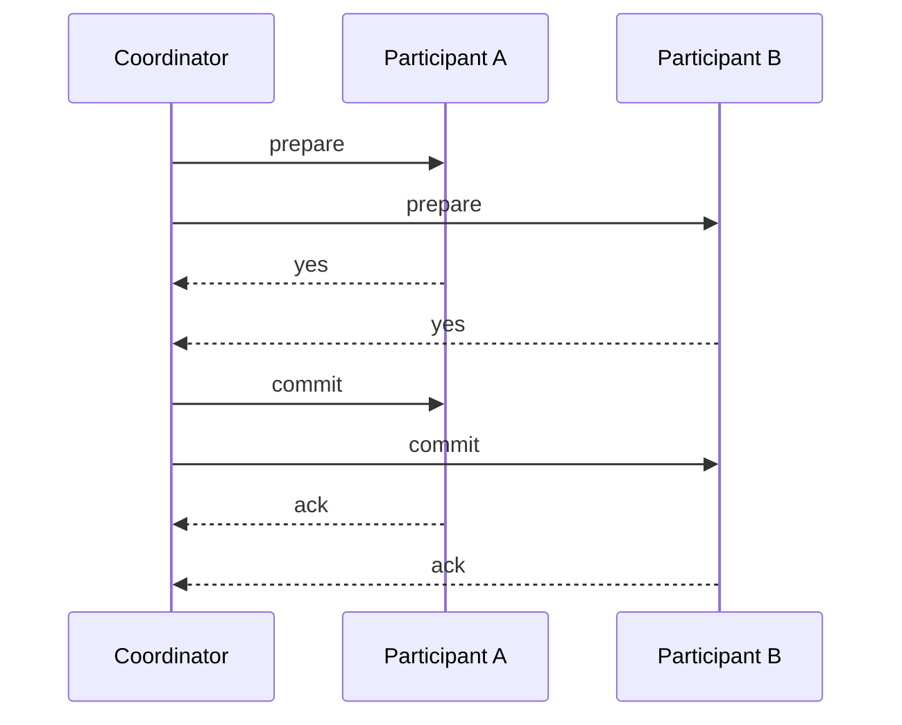
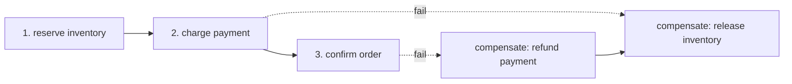
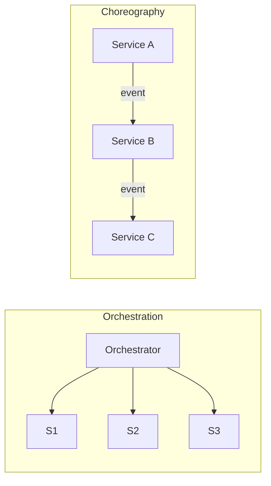

# Distributed Transactions: 2PC, 3PC, Saga, Orchestration vs Choreography

> **Level:** 4 (Distributed Systems) · **Prerequisites:** [Clocks & Gossip](03-clocks-gossip.md)
> **Navigation:** [← Previous: Clocks & Gossip](03-clocks-gossip.md) · [Next → Delivery Semantics](05-delivery-semantics.md)

## Learning objectives
- Explain two-phase and three-phase commit and their blocking failure modes.
- Choose a saga with compensations over a distributed transaction where appropriate.
- Compare orchestration and choreography for multi-step workflows.

## The problem
A single database gives you ACID transactions for free. Across services or shards, you
can't share a transaction, so a multi-step business operation must either hold locks across
nodes (hard and fragile) or abandon ACID for eventual consistency with compensations.

## Two-phase commit (2PC)
A **coordinator** asks all participants to *prepare* (phase 1); if all say yes, it tells
them to *commit* (phase 2). If any says no, all abort.

**Failure mode**: if the coordinator crashes after *prepare* and before *commit*, participants
**block** holding locks, waiting for a decision. 2PC is strong but blocking and adds a SPOF
(the coordinator) — historically the reason microservices avoid it.

## Three-phase commit (3PC)
Adds a *pre-commit* phase and timeouts so a crashed coordinator doesn't leave participants
blocked forever — they can decide based on timeouts. It is non-blocking *in theory* but
costs an extra round trip and still breaks under network partitions, so it's rarely used in
practice.

## The saga pattern
A **saga** is a sequence of **local transactions**, each on one service. If a step fails,
earlier steps are undone by **compensating transactions** (not a rollback — an explicit
undo action). This trades atomicity for availability: there is no global lock, but the
system ends in a consistent state eventually.

Sagas fit long-lived business flows (order processing, travel booking) where holding locks
across services for seconds is unacceptable. They require designing compensations for every
step, which is real work.

## Orchestration vs choreography
- **Orchestration**: a central **orchestrator** drives the saga, calling each step and its
  compensation in order. Easier to follow and monitor; the orchestrator is a component and a
  SPOF (make it durable/replayable).
- **Choreography**: each service reacts to **events** and emits the next event; no central
  driver. Loose coupling; harder to follow the overall flow and to debug, and the ""next
  step"" logic is spread across services.

## Why this matters
Cross-service consistency is one of the few genuinely hard distributed problems. The
pragmatic industry answer is: avoid distributed transactions; model flows as sagas with
compensations, and use the transactional **outbox** (next chapter, delivery semantics) to
publish events safely.

## Examples
- Order flow (reserve → charge → confirm) as a saga with release/refund compensations.
- Travel booking as a saga across flight, hotel, car services; compensations release each
  booking if a later step fails.
- A money transfer modeled as a saga (debit, credit) with a compensating refund.

## Trade-offs
- **2PC**: strong atomicity but blocking + coordinator SPOF + cross-node lock latency.
- **3PC**: non-blocking-ish but more round trips and partition-fragile.
- **Saga**: available and scalable but not instantaneous atomicity; needs compensations.
- **Orchestration**: clear and monitorable but a central component; **choreography**: loose
  but hard to trace.

## When NOT to apply
- Don't use 2PC across services that must stay available; prefer sagas.
- Don't choreograph a complex flow where orchestration's clarity is worth a central
  component.
- Don't model a saga without designing every compensation (incomplete compensation = stuck
  state).

## Common mistakes
- Holding cross-service locks ""to be safe,"" recreating 2PC's blocking problems by hand.
- A saga without idempotent compensations (a retried compensation double-applies).
- Choreography where no one can trace the end-to-end flow.

## Failure modes and operational concerns
- 2PC coordinator crash → participants blocked indefinitely.
- A compensation that fails leaves the system in a partial state (retry + manual recovery).
- Orchestration replaying a saga must be idempotent to avoid double side effects.

## Review questions
1. Why does 2PC block, and when?
2. What does a saga sacrifice, and what must you design for it?
3. Compare orchestration and choreography on clarity vs coupling.
4. Why must compensations be idempotent?
5. When is a distributed transaction the right (rare) choice?

## Further reading
Outbox/inbox and delivery semantics: next chapter; idempotency: next chapter.

---
[← Previous: Clocks & Gossip](03-clocks-gossip.md) · [Next → Delivery Semantics](05-delivery-semantics.md)
