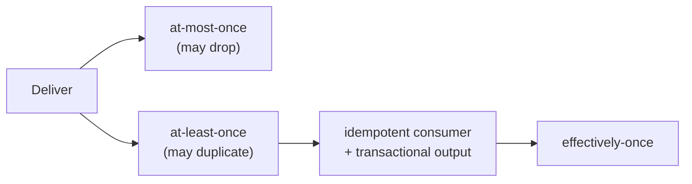

# Delivery Semantics: Idempotency, Retries, DLQs, At-most/least/Exactly-once

> **Level:** 4 (Distributed Systems) · **Prerequisites:** [Distributed Transactions](04-distributed-transactions.md)
> **Navigation:** [← Previous: Distributed Transactions](04-distributed-transactions.md) · [Next → CRDTs & Snapshots](06-crdts-snapshots.md)

## Learning objectives
- Distinguish at-most-once, at-least-once, and exactly-once, and why "exactly-once" is rarely free.
- Design idempotent consumers and idempotency keys.
- Tune retries (backoff, jitter, caps), poison messages, and dead-letter queues.

## Delivery semantics
- **At-most-once**: send and forget; a message may be lost. Cheap, lossy. Good for telemetry
  where dropping some is fine.
- **At-least-once**: redeliver until acked; a message may be delivered multiple times.
  Reliable but requires **idempotent** consumers (duplicate application = same effect).
- **Exactly-once**: effectively-once — exactly-once *application* effect, achieved via
  at-least-once delivery + idempotent consumer + transactional output. True
  network-level exactly-once is generally impossible; the achievable form is
  *effectively-once* (S-EXACTLYONCE).

## Idempotency
**Idempotency** means repeating an operation has the same effect as doing it once. Make
consumers idempotent by:
- An **idempotency key** (client-supplied) stored with the outcome; a retry returns the
  stored result instead of re-executing.
- **Unique constraints** that reject duplicate inserts (e.g., `(event_id)` unique index).
- **State machines** that ignore a duplicate transition (e.g., "already processed").

Idempotency is the foundation that makes at-least-once safe, and thus enables effectively-
once without true network exactly-once.

## Retries, backoff, jitter
Retries recover from transient failures but, unchecked, cause **retry storms** and
thundering herds that amplify an outage. Good retry design:
- **Exponential backoff**: wait longer each attempt.
- **Jitter**: randomize the delay so retrying clients don't synchronize and hammer the
  target together (see `queue_retry.py`).
- **Caps**: bound max attempts and max delay; route failures to a DLQ.
- **Retry only idempotent reads**; non-idempotent writes need an idempotency key to retry
  safely.

## Poison messages and DLQs
A **poison message** fails every retry (malformed payload, bad data). Redelivering it
forever blocks the consumer. The fix: after `max_attempts`, move it to a **dead-letter
queue (DLQ)** for inspection and manual handling, so the consumer keeps draining the main
queue. Always alert on DLQ depth.

## The transactional outbox
To publish an event *reliably* after a DB write, use the **transactional outbox**: write the
event to an outbox table **in the same transaction** as the business write, then a relay
publishes to the broker. This avoids the dual-write problem (DB commits, publish lost). The
**inbox** pattern on the consumer side records processed event IDs for idempotency.

## Why this matters
Most real outages in event-driven systems are delivery-semantics bugs: duplicate side
effects (non-idempotent consumer under redelivery), lost messages (publish not atomic with
the write), or retry storms. Getting these right is the difference between a reliable
pipeline and a flaky one.

## Examples
- A payment consumer uses an idempotency key per charge so a redelivered event never double
  -charges.
- A worker uses exponential backoff + jitter + a 3-attempt cap; failures go to a DLQ with an
  alert (see `queue_retry.py`).
- An order service writes an "order created" event to an outbox in the same transaction;
  a relay publishes to Kafka; the consumer dedups via an inbox.

## Trade-offs
- **At-most-once** = simplest, lossy. **At-least-once** = reliable, needs idempotency.
  **Effectively-once** = strongest, needs idempotency + transactional output (cost/complexity).
- **More retries** = more resilience but more retry-storm risk and downstream load.
- **DLQ** = keeps the pipeline flowing but requires monitoring and a repair path.

## When NOT to apply
- Don't claim "exactly-once" without idempotency + transactional output; it's marketing.
- Don't retry non-idempotent writes without an idempotency key.
- Don't retry forever (poison messages); cap and DLQ.

## Common mistakes
- A consumer that isn't idempotent under redelivery → duplicate side effects.
- Dual-writing to DB and broker → lost events on partial failure (use the outbox).
- Synchronized retries (no jitter) → thundering herd that re-breaks a recovering dependency.

## Failure modes and operational concerns
- Duplicate payments/charges from non-idempotent consumers.
- Retry storms cascading to a recovering dependency.
- DLQ backlog growing unbounded without alerting.

## Review questions
1. Why is "exactly-once" usually "effectively-once," and what makes it so?
2. What two things make a consumer idempotent?
3. Why add jitter to exponential backoff?
4. What problem does a DLQ solve, and what must you still do?
5. Why is dual-writing to DB and broker unsafe, and what's the fix?

## Further reading
Kafka exactly-once: S-EXACTLYONCE · outbox/inbox covered above; saga: previous chapter.

---
[← Previous: Distributed Transactions](04-distributed-transactions.md) · [Next → CRDTs & Snapshots](06-crdts-snapshots.md)
