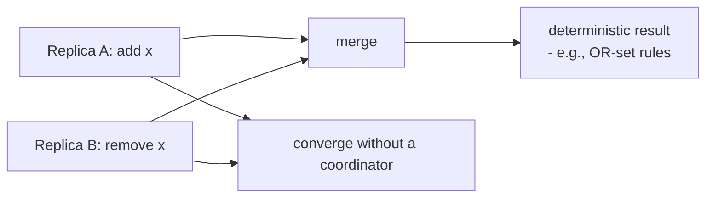
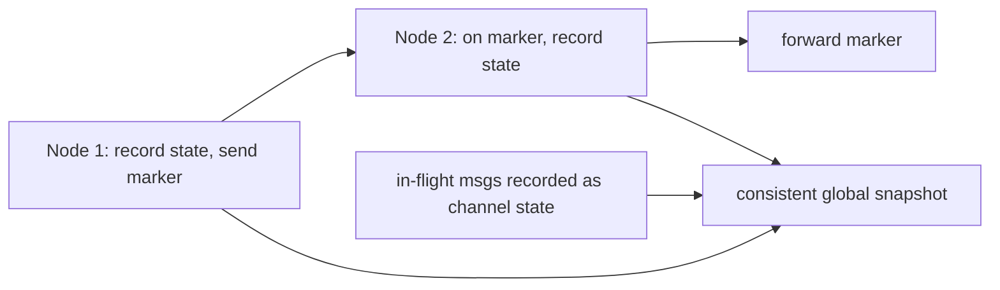

# CRDTs & Distributed Snapshots

> **Level:** 4 (Distributed Systems) · **Prerequisites:** [Delivery Semantics](05-delivery-semantics.md)
> **Navigation:** [← Previous: Delivery Semantics](05-delivery-semantics.md) · [Next → Level 5: Architecture Patterns](../05-architecture-patterns/README.md)

## Learning objectives
- Explain how CRDTs converge without coordination and where they fit.
- Describe distributed snapshots (consistent global states) and the snapshot/consistency
  relationship.
- Reason about when eventual consistency can be made conflict-free.

## CRDTs (S-CRDT)
A **Conflict-free Replicated Data Type** is a data structure whose concurrent updates can be
merged deterministically without coordination — replicas always converge. Examples:
counters (G-counter, PN-counter for increments and decrements), sets (OR-set), and
text-editing structures (RGA) behind collaborative editors. CRDTs trade strong consistency
for availability: any replica accepts writes, and merges converge.

CRDTs fit offline-capable, highly-available state (shopping carts, collaborative docs,
presence counters) where you'd rather always accept writes than block. Costs: state can grow
(metadata per operation), and they express only the operations their algebra supports.

## Distributed snapshots
A **snapshot** is a consistent point-in-time view of a distributed system's state. The
challenge: you can't freeze all nodes simultaneously, and in-flight messages create
inconsistencies (a snapshot that includes a message sent but not received is wrong).

The **Chandy-Lamport** algorithm records consistent global state: each node records its
state on receiving a **marker** and forwards markers, so the snapshot captures a cut
through spacetime where in-flight messages are consistently accounted for.

Snapshots underpin distributed checkpoint/restore, debugging, and exactly-once state
transfer (e.g., Flink/Spark checkpointing). They are the "consistent backup" analog for a
moving distributed system.

## Why this matters
CRDTs and snapshots are the two main tools for managing state without a global lock: CRDTs
make concurrent updates safe and convergent; snapshots make global states consistent for
recovery. Both appear in collaborative, offline-capable, and streaming systems.

## Examples
- A collaborative editor uses a CRDT so two offline users can both edit and merge later
  without conflict resolution UI.
- A shopping cart uses a PN-counter CRDT so a user can add/remove while offline and converge
  when reconnected.
- A stream processor takes periodic Chandy-Lamport snapshots for exactly-once fault
  recovery.

## Trade-offs
- **CRDTs**: available and convergent but only for supported operations; state can bloat.
- **Snapshots**: consistent global state but marker overhead and a moment of coordination.
- Both trade strong consistency for availability or recoverability.

## When NOT to apply
- Don't use a CRDT for data requiring strong linearizability (bank balances); use consensus.
- Don't take a naive snapshot of moving state in flight; use a marker algorithm.
- Don't choose CRDTs if the merge semantics don't match your domain (e.g., unique-name
  registration).

## Common mistakes
- A CRDT with unbounded metadata growth (compact/prune periodically).
- Snapshotting without markers → inconsistent (in-flight messages lost/duplicated).
- Treating CRDT merge as "free" when its semantics don't match the business rule.

## Failure modes and operational concerns
- CRDT state bloat degrading performance; need compaction.
- Snapshot cost under high throughput (marker storms); throttle snapshot frequency.
- A CRDT operation the data type doesn't support (force-fitting breaks convergence).

## Review questions
1. What do CRDTs trade for availability, and what limits their expressiveness?
2. Why can't you snapshot a distributed system by freezing all nodes at once?
3. What problem does the marker (Chandy-Lamport) solve?
4. Give a workload suited to a CRDT and one that isn't.
5. What operational cost do CRDTs carry?

## Further reading
CRDTs: S-CRDT · Lamport clocks (marker ordering): S-LAMPORT.

---
[← Previous: Delivery Semantics](05-delivery-semantics.md) · [Next → Level 5: Architecture Patterns](../05-architecture-patterns/README.md)
