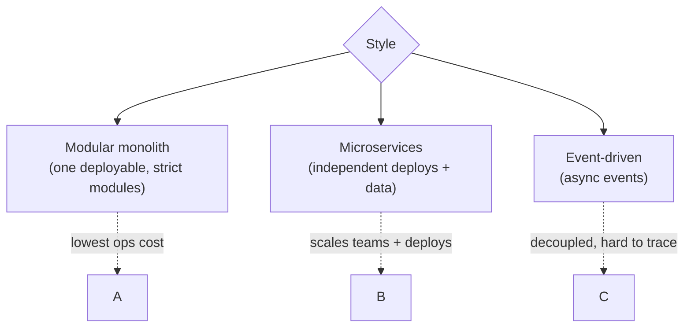

# Monolith, Modular Monolith, Microservices, SOA, Event-Driven

> **Level:** 5 (Architecture Patterns) · **Prerequisites:** [Level 4](../04-distributed-systems/README.md)
> **Navigation:** ← Start of Level 5 · [Next → Hexagonal, Clean, Onion, DDD](01-hexagonal-clean-onion-ddd.md)

## Learning objectives
- Compare layered, modular-monolith, microservices, SOA, and event-driven styles.
- Choose a style from *the workload and the team*, not from fashion.
- Articulate when each style *hurts* (the cost that's always there).

## The styles
- **Layered (n-tier)**: presentation → business → data. Simple, clear; cross-cutting concerns
  leak and layers can become tightly coupled. Fine for small systems.
- **Modular monolith**: a single deployable with strongly enforced internal module
  boundaries (each module owns its data). Gets you many microservice benefits (clear
  ownership, independent change) without distributed-systems cost. Often the best starting
  point.
- **Microservices**: independently deployable services, each owning its data, communicating
  over the network. Scales orgs and deployment, but pays the full distributed-systems tax
  (network failures, consistency, observability, operational complexity).
- **SOA**: the predecessor with heavyweight enterprise service buses; coarser-grained and
  more integration-focused than microservices.
- **Event-driven (EDA)**: services communicate via events on a broker/stream; decoupled,
  elastic, but harder to trace and reason about flow and ordering.

## The decision factors
Don't ask "microservices or not"; ask:
1. **Team topology**: can independent teams own independent services? Conway's law — your
   architecture mirrors your org. No team boundaries, no microservice boundaries.
2. **Deployment independence**: do parts need to deploy at different cadences?
3. **Scale diversity**: do parts need radically different scaling/resources?
4. **Tolerance for distributed complexity**: can the org operate observability, releases,
   and on-call for a fleet?

## When each hurts
- **Monolith**: one slow part blocks all deploys; everyone steps on each other.
- **Microservices**: network failures, cross-service consistency, hard debugging, and
  operational overhead — the "distributed monolith" if boundaries are wrong (services
  coupled, but now also over a network).
- **EDA**: hard to follow end-to-end flow, ordering across services, and debugging
  "where did this event come from."

## The modular monolith sweet spot
For most systems that aren't yet huge, a **modular monolith** with strict module boundaries
and per-module data ownership delivers most of microservices' benefits at a fraction of the
cost. Extract a service only when a module genuinely needs independent deployment or scale.

## Why this matters
Architecture style is the highest-leverage structural decision and the easiest to get wrong
by cargo-culting microservices. The right answer is almost always *the simplest style that
satisfies your real constraints*, with a clear path to extract services later.

## Examples
- A startup: modular monolith; extract billing as a service once it has its own team and
  release cadence.
- A large e-commerce: microservices for catalog, cart, checkout, each owned by a team,
  each scaling differently.
- A real-time pipeline: EDA for ingestion/processing where elasticity and decoupling beat
  request/response.

## Trade-offs
- **Modular monolith**: simple ops, shared deploy; boundaries must be enforced (not just
  conventions).
- **Microservices**: independent deploy/scale + team autonomy vs distributed-systems tax.
- **EDA**: decoupling and elasticity vs traceability and ordering complexity.

## When NOT to apply
- Don't split into microservices before you have teams to own them (you get a distributed
  monolith).
- Don't go EDA for a fundamentally synchronous, must-succeed flow.
- Don't pick a style because it's popular; pick it from constraints.

## Common mistakes
- Microservices with shared databases (couples them and removes the main benefit).
- EDA without correlation IDs and tracing (un-debuggable).
- No module enforcement in a "modular monolith" (it becomes a big ball of mud).

## Failure modes and operational concerns
- Distributed monolith: coupled services over the network — worst of both worlds.
- Cascade failures across services without bulkheads/circuit breakers (Level 6).
- EDA event schemas that evolve incompatibly across services.

## Review questions
1. What does a modular monolith give you that microservices would, more cheaply?
2. Name two conditions under which microservices are justified.
3. Why is "microservices with a shared database" usually an anti-pattern?
4. What does EDA make harder, despite its decoupling?
5. How does Conway's law constrain the choice?

## Further reading
Resilience patterns: next chapters; domain-driven design: next chapter.

---
← Start of Level 5 · [Next → Hexagonal, Clean, Onion, DDD](01-hexagonal-clean-onion-ddd.md)
