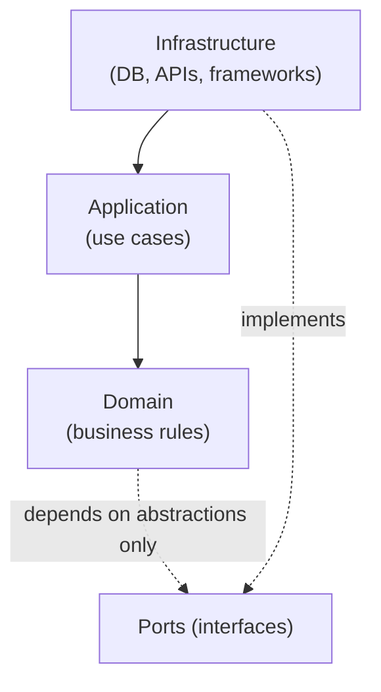
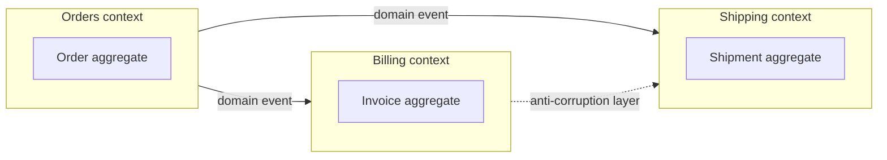

# Hexagonal, Clean, Onion Architecture & DDD

> **Level:** 5 (Architecture Patterns) · **Prerequisites:** [Monolith→Microservices](00-monolith-modular-microservices.md)
> **Navigation:** [← Previous: Monolith→Microservices](00-monolith-modular-microservices.md) · [Next → CQRS, Event Sourcing, Outbox, Inbox](02-cqrs-es-outbox.md)

## Learning objectives
- Explain the dependency-inversion core shared by hexagonal, clean, and onion architecture.
- Use DDD bounded contexts to draw service/module boundaries aligned to the domain.
- Reason about *ports and adapters* and keeping the domain framework-agnostic.

## The shared idea: dependency inversion
Hexagonal (ports & adapters), Clean, and Onion are three presentations of one principle:
**the domain/business logic depends on nothing inward-facing**; frameworks, databases, and
delivery mechanisms depend on *it* (defined through interfaces/ports). This keeps the core
testable and swappable and lets you change the DB or the API without touching the business
rules.

## Hexagonal (ports and adapters)
The application exposes **ports** (interfaces); **adapters** (HTTP, DB, queue) plug into
  them. Swap an adapter without touching the core. The point: the domain doesn't know
  whether it's serving HTTP or gRPC or reading from Postgres or a file.

## Clean / Onion
Clean arranges dependencies from outer (frameworks/UI/DB) to inner (entities/use-cases);
Onion layers them as concentric rings with the same dependency-direction rule. Both enforce
that dependencies point *inward* toward the stable domain.

## Domain-Driven Design (S-DDD)
DDD gives you the *vocabulary* and *boundaries* for the inside:
- **Ubiquitous language**: the code uses the domain experts' terms exactly.
- **Bounded contexts**: draw a boundary around a coherent subdomain (orders, billing,
  shipping) with its own model and language. Bounded contexts are the natural unit of a
  microservice or module.
- **Aggregates**: consistency boundaries — a cluster of objects changed together under
  invariants, modified through one root.
- **Context mapping**: how contexts relate (upstream/downstream, anti-corruption layers).

## Why this matters
These patterns keep a system's hardest part — the business logic — protected from
infrastructure churn and aligned to how the business actually thinks. DDD's bounded
contexts are the principled way to decide *where service/module boundaries go* (rather than
arbitrary "split by noun" microservices).

## Examples
- An orders module: a hexagonal core where the order aggregate is framework-agnostic; the
  HTTP adapter and a DB adapter both implement ports. Swap DB without touching order rules.
- A platform with orders, billing, shipping as separate bounded contexts, each a service;
  they communicate via domain events.
- An anti-corruption layer translating a legacy billing model into a new clean model so the
  legacy doesn't pollute the new domain.

## Trade-offs
- **Indirection**: ports/adapters add interfaces and mapping; worth it for non-trivial logic,
  overkill for a thin CRUD service.
- **DDD investment**: learning the domain and drawing contexts is real work; pays off for
  complex domains, wastes time on simple ones.
- **Aggregate sizing**: too-large aggregates serialize too much; too-small ones lose
  consistency guarantees.

## When NOT to apply
- Don't apply full hexagonal/clean to a pure CRUD service with no real business rules — the
  layers are empty ceremony.
- Don't over-invest in DDD for a simple subdomain (use a "supportive" or "generic"
  subdomain treatment).
- Don't make aggregates span what should be separate contexts (false consistency boundary).

## Common mistakes
- Leaking framework types into the domain (a "domain" that depends on the ORM).
- Aggregates that are too big (transactional contention) or reference each other directly
  (coupling contexts).
- Bounded contexts drawn along technical lines (a "DB service") instead of domain lines.

## Failure modes and operational concerns
- An anemic domain model (data bags with no behavior) defeats the point.
- Cross-context references creating hidden coupling that breaks independent change.
- Schema/contract drift between contexts with no anti-corruption layer.

## Review questions
1. What single dependency rule do hexagonal, clean, and onion share?
2. What is a bounded context and why is it the natural service boundary?
3. Why shouldn't aggregates reference each other directly?
4. When is full hexagonal architecture overkill?
5. What does an anti-corruption layer protect against?

## Further reading
DDD: S-DDD · CQRS/ES/outbox: next chapter.

---
[← Previous: Monolith→Microservices](00-monolith-modular-microservices.md) · [Next → CQRS, Event Sourcing, Outbox, Inbox](02-cqrs-es-outbox.md)
