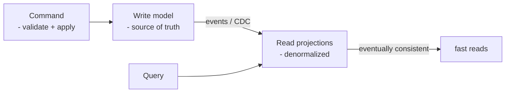
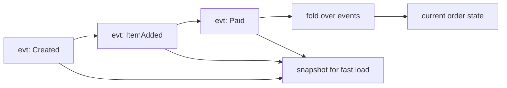

# CQRS, Event Sourcing, Outbox, Inbox

> **Level:** 5 (Architecture Patterns) · **Prerequisites:** [Hexagonal/Clean/DDD](01-hexagonal-clean-onion-ddd.md)
> **Navigation:** [← Previous: Hexagonal/Clean/DDD](01-hexagonal-clean-onion-ddd.md) · [Next → Strangler, Sidecar, BFF](03-strangler-sidecar-bff.md)

## Learning objectives
- Explain CQRS and when separating read/write models pays off.
- Reason about event sourcing's benefits (audit, replay) and costs (complexity, evolution).
- Use the transactional outbox and inbox for reliable event publication and idempotency.

## CQRS (S-CQRS)
**Command Query Responsibility Segregation** splits the write model (commands, optimized for
validating and applying changes) from the read model (queries, optimized for the read
shape). When reads and writes differ a lot (different shapes, vastly more reads), one model
can't be optimal for both. CQRS lets each be tuned — often the read model is a denormalized,
eventually-consistent projection.

## Event sourcing
**Event sourcing** stores the *sequence of events* as the source of truth; the current state
is a **fold** over those events. Benefits: a full audit log by construction, temporal
queries ("state at time t"), and replay to rebuild any projection. Costs: complexity
(versioning events, snapshots, schema evolution), eventual projection lag, and harder
ad-hoc queries.

## Transactional outbox (review)
To publish a domain event *reliably* after a DB write, write the event to an **outbox table
in the same transaction**; a relay publishes to the broker. This avoids the dual-write
problem (commit succeeds, publish lost) and gives at-least-once publication. (See Level 4
delivery semantics.)

## Inbox pattern
On the consumer side, an **inbox** table records processed event IDs so a redelivered
event is recognized and skipped — the idempotency foundation for effectively-once
processing.

## Why this matters
CQRS + ES + outbox/inbox is the canonical toolkit for complex, write-vs-read-divergent,
auditable domains (orders, payments, ledgers). It is also easy to over-apply; reach for it
only when the read/write divergence or audit need is real.

## Examples
- An orders service: event-sourced orders; projections for "open orders for a user" and
  "daily revenue" rebuilt from events.
- A banking ledger: event-sourced entries give a complete audit and allow replay/repair.
- A notification service: outbox publishes "order placed"; the consumer's inbox dedups so
  no double notification on redelivery.

## Trade-offs
- **CQRS**: read scale + tailored models vs added complexity and eventual consistency.
- **Event sourcing**: audit + replay + temporal queries vs schema-evolution and query
  complexity.
- **Outbox/inbox**: reliability vs a relay component and idempotency discipline.

## When NOT to apply
- Don't use CQRS when reads and writes are similar and simple — it's pure overhead.
- Don't event-source a CRUD entity with no audit/ replay need.
- Don't add an outbox for a trivial publish that tolerates rare loss (over-engineering).

## Common mistakes
- CQRS without an eventual-consistency story (users see stale reads they didn't expect).
- Event-sourcing without snapshots (replaying years of events to load one entity).
- Incompatible event version changes that break replays (version from day one).

## Failure modes and operational concerns
- Projection lag causing stale reads; monitor and bound it.
- Event schema drift breaking old consumers (use versioning + upcasters).
- Outbox relay failure causing published events to lag the DB.

## Review questions
1. When does CQRS genuinely pay off vs add overhead?
2. What does event sourcing give you that a mutable-state store doesn't?
3. Why does the outbox exist, and what problem does it solve?
4. What idempotency role does the inbox play on the consumer?
5. Name a cost of event sourcing you'd push back on for a simple domain.

## Further reading
CQRS: S-CQRS · delivery semantics/outbox: Level 4.

---
[← Previous: Hexagonal/Clean/DDD](01-hexagonal-clean-onion-ddd.md) · [Next → Strangler, Sidecar, BFF](03-strangler-sidecar-bff.md)
