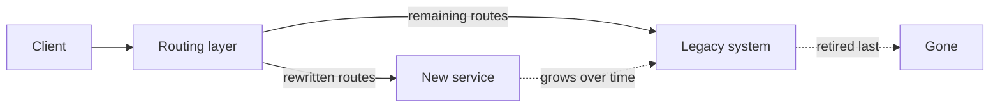
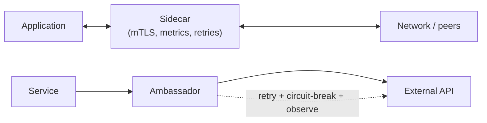
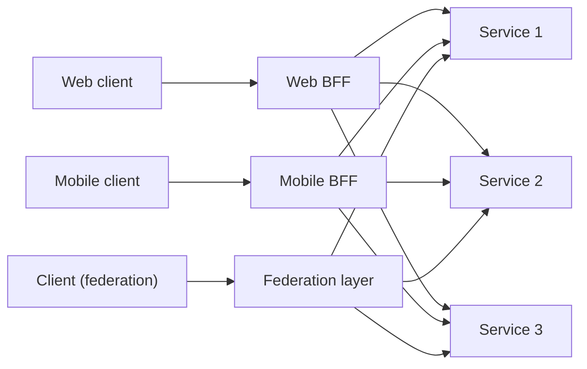

# Strangler, Sidecar, Ambassador, BFF, API Composition & Federation

> **Level:** 5 (Architecture Patterns) · **Prerequisites:** [CQRS/ES/Outbox](02-cqrs-es-outbox.md)
> **Navigation:** [← Previous: CQRS/ES/Outbox](02-cqrs-es-outbox.md) · [Next → Resilience Patterns](04-resilience-patterns.md)

## Learning objectives
- Use the strangler pattern to replace legacy systems incrementally.
- Use sidecar/ambassador to externalize cross-cutting concerns from the application.
- Choose a Backend-for-Frontend vs API composition/aggregation vs federation.

## Strangler fig (S-STRANGLER)
Replace a legacy system gradually by routing **selected** requests to new code, while the
rest still go to the legacy system. Over time the new system "strangles" the old until the
old can be retired. Avoids a risky big-bang rewrite; each step is deployable and reversible.

## Sidecar & ambassador
- **Sidecar**: a helper process/container running alongside the app, handling
  cross-cutting concerns (mTLS, retries, metrics, logging, service discovery) so the app
  code doesn't. The service mesh model (Level 9) is built on sidecars.
- **Ambassador**: a proxy between a service and an external dependency that adds
  monitoring, retry, circuit breaking, or connection management without changing the
  service.

## Backend for Frontend (BFF)
A **BFF** is a small service tailored to one client (web, mobile, partner) that aggregates
the backend services into exactly the shape that client needs. It avoids forcing a generic
  API to serve all clients (which leads to bloated responses and client-side stitching).

## API composition, aggregation, federation
- **Composition/aggregation**: a façade calls multiple services and merges results (often a
  BFF). Simple; the façade is a dependency and can be a bottleneck.
- **Federation (GraphQL-style)**: a single query endpoint fans out to underlying services
  that each resolve their fields. Flexible for clients; pushes complexity to the
  federation layer and to N+1/caching concerns.

## Why this matters
These patterns are about *boundaries and concern placement*: strangler manages legacy
migration, sidecar/ambassador pull cross-cutting concerns out of apps, and BFF/composition
shape the API to the consumer. They appear in nearly every modernization and platform
effort.

## Examples
- Strangler: rewrite the checkout of an old e-commerce platform first; route just `/checkout/*`
  to the new service; everything else stays on legacy until migrated.
- Sidecar: a mesh sidecar handles mTLS and retries so a polyglot fleet shares one policy.
- BFF: a mobile BFF calls catalog, cart, and pricing and returns the compact payload the
  app needs in one round trip.

## Trade-offs
- **Strangler**: low-risk migration vs a period of dual-running and a routing layer to
  maintain.
- **Sidecar**: polyglot, centralized policy vs per-pod resource overhead and an extra hop.
- **BFF/composition**: client-tailored payloads vs a façade that can become a coupling
  point/bottleneck.

## When NOT to apply
- Don't strangler if you can rewrite cleanly in one step with low risk.
- Don't add sidecars if your platform already provides these concerns or if the overhead
  matters for small services.
- Don't build a BFF per client until clients genuinely diverge; one API may suffice.

## Common mistakes
- A strangler project that never finishes (the last routes are never migrated).
- A BFF that becomes a god service aggregating everything (re-coupling).
- Federation without caching → N+1 fan-out storms.

## Failure modes and operational concerns
- Routing layer misconfig in strangler sending the wrong traffic.
- Sidecar version skew breaking the fleet (roll sidecars carefully).
- BFF outages taking down a whole client.

## Review questions
1. Why is the strangler safer than a big-bang rewrite?
2. What does a sidecar let you centralize without changing apps?
3. When is a BFF worth a whole service vs a generic API?
4. Compare composition and federation on where complexity lives.
5. Give a failure mode of a BFF and a mitigation.

## Further reading
Strangler: S-STRANGLER · service mesh: Level 9 · circuit breaker: next chapter.

---
[← Previous: CQRS/ES/Outbox](02-cqrs-es-outbox.md) · [Next → Resilience Patterns](04-resilience-patterns.md)
