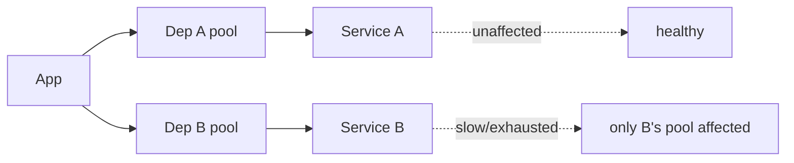
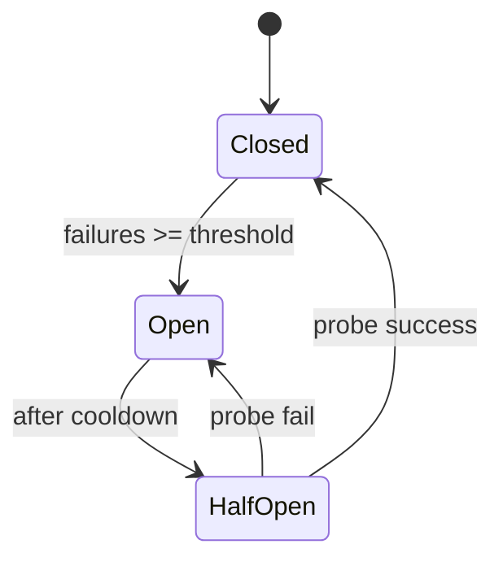
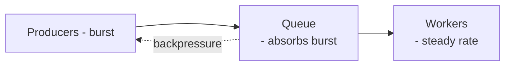

# Resilience Patterns: Bulkhead, Circuit Breaker, Retry, Timeout, Load Shedding

> **Level:** 5 (Architecture Patterns) · **Prerequisites:** [Strangler/Sidecar/BFF](03-strangler-sidecar-bff.md)
> **Navigation:** [← Previous: Strangler/Sidecar/BFF](03-strangler-sidecar-bff.md) · [Next → Cache Strategies](05-cache-strategies.md)

## Learning objectives
- Apply bulkheads, circuit breakers, retries, and timeouts to contain failures.
- Distinguish rate limiting, throttling, and load shedding.
- Reason about queue-based load leveling and why these compose, not substitute.

## Bulkhead (S-BULKHEAD)
Isolate resources (thread pools, connections, instances) per dependency or tenant so a
failure in one cannot exhaust resources shared with others. Without bulkheads, one slow
dependency consumes all threads and takes down unrelated traffic. The failure-injection
example models this containment.

## Circuit breaker (S-CIRCUIT)
Stop calling a failing dependency for a cooldown to prevent cascading failure and to give it
  time to recover. After N consecutive failures, **open** (fail fast); after a cooldown,
  **half-open** (probe one call); if it succeeds, **close** again. The failure-injection
  example demonstrates tripping.

## Retry, backoff, jitter (S-RETRY)
Retry transient failures with exponential backoff and jitter (Level 4). Retries must be
bounded (max attempts, caps) and only applied to **idempotent** operations; a non-idempotent
write retried without an idempotency key can double-apply. Unbounded retries cause retry
storms.

## Timeout
Set a timeout on **every** outbound call; without one, a slow dependency holds a resource
forever (a thread, a connection) until the whole tier starves. Timeouts should sum below
the end-to-end latency budget (see the latency-budget calculation).

## Rate limiting, throttling, load shedding
- **Rate limiting**: cap request rate per client/tenant (protects capacity; the token-bucket
  example models this).
- **Throttling**: slow down or queue work rather than reject (often server-side, gentler).
- **Load shedding**: when near capacity, deliberately reject low-priority work to keep
  critical work fast — better to drop some traffic than collapse all of it.

## Queue-based load leveling
For bursty writes, put a queue between producers and workers so a burst is absorbed by the
  queue rather than overwhelming workers. Workers drain at their own rate; producers aren't
  blocked. Trade: added latency and operational complexity (DLQs, ordering).

## Why this matters
These patterns are how a system stays up when its dependencies don't. They compose: timeouts
bound waits, retries recover transient faults, circuit breakers stop cascades, bulkheads
isolate them, and load shedding keeps the critical path alive under overload. Skipping any
one reopens its failure mode.

## Examples
- One slow payment provider: a bulkhead caps its threads; a circuit breaker opens after
  failures so checkout degrades (show "pay later") instead of hanging.
- A bursty upload service: a queue levels the load; workers process at a steady rate.
- Under a traffic spike, the gateway sheds low-priority traffic to keep checkout fast.

## Trade-offs
- **Bulkheads**: isolation vs resource overhead (idle pools).
- **Circuit breaker**: containment vs rejecting traffic that might have succeeded.
- **Retries**: recovery vs retry storms and extra downstream load.
- **Load shedding**: protects the core vs dropping legitimate traffic.

## When NOT to apply
- Don't retry non-idempotent writes without an idempotency key.
- Don't set a circuit breaker threshold so low it flaps, or so high it never trips.
- Don't shed traffic you can't afford to drop (make priority explicit first).

## Common mistakes
- No timeout on outbound calls (the silent killer).
- Retries without jitter (synchronized thundering herds).
- Bulkheads with one shared pool (no isolation at all).

## Failure modes and operational concerns
- Circuit breaker flapping causing oscillating availability.
- Retries amplifying a partial outage into a full one (cap and jitter).
- Load shedding that drops the wrong (high-value) traffic due to bad priority logic.

## Review questions
1. Why must every outbound call have a timeout?
2. What does a bulkhead prevent that a circuit breaker alone doesn't?
3. Why add jitter to retries, and what fails if you don't?
4. Distinguish rate limiting, throttling, and load shedding.
5. Give a case where retrying is unsafe and how to make it safe.

## Further reading
Circuit breaker: S-CIRCUIT · bulkhead: S-BULKHEAD · retry: S-RETRY · failure_injection.py.

---
[← Previous: Strangler/Sidecar/BFF](03-strangler-sidecar-bff.md) · [Next → Cache Strategies](05-cache-strategies.md)
