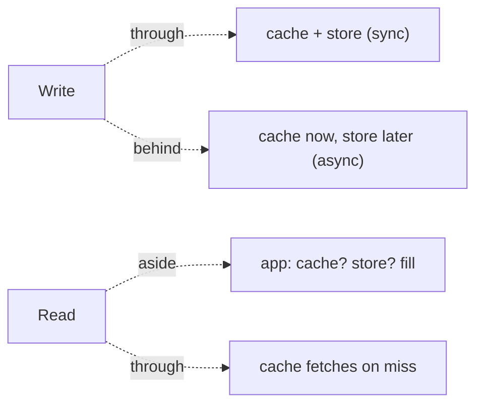
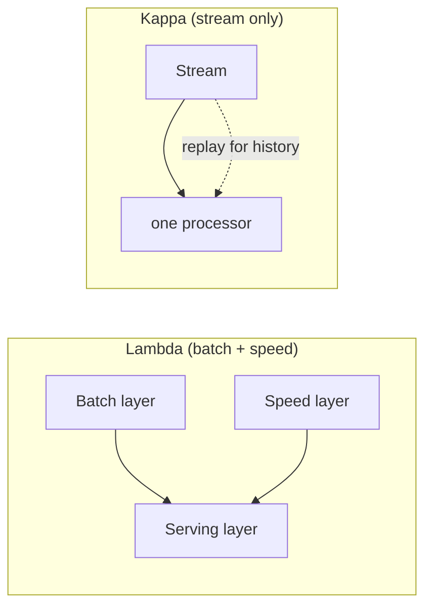

# Cache Strategies, Shared-Nothing, Actor, Pipeline, MapReduce/Lambda/Kappa

> **Level:** 5 (Architecture Patterns) · **Prerequisites:** [Resilience Patterns](04-resilience-patterns.md)
> **Navigation:** [← Previous: Resilience Patterns](04-resilience-patterns.md) · [Next → Level 6: Reliability](../06-reliability/README.md)

## Learning objectives
- Compare cache-aside, read-through, write-through, and write-behind and their trade-offs.
- Reason about shared-nothing, the actor model, and pipeline architectures.
- Distinguish MapReduce, Lambda, and Kappa for analytics.

## Cache strategies (deep dive)
| Strategy | Read behavior | Write behavior | Trade |
|----------|---------------|----------------|-------|
| **Cache-aside** | app reads cache; on miss reads store + fills | app writes store, invalidates/lets TTL expire | simple, most common; lazy |
| **Read-through** | cache fetches from store on miss transparently | — | clean app code; cache is a proxy |
| **Write-through** | — | write to cache + store together | strong consistency; slower write |
| **Write-behind** | — | write cache first, async to store | fast writes; durability risk |

Key design questions (from Level 2): how stale is acceptable (TTL), how to invalidate
(events), and how to avoid stampedes (coalescing, stale-while-revalidate).

## Shared-nothing architecture
Each node owns its own CPU, memory, and disk and shares **nothing** with peers; horizontal
scale comes from adding independent nodes (with sharding/replication for coordination).
Most scalable databases and caches are shared-nothing. Contrast with shared-disk (one
storage shared by compute nodes), which simplifies consistency but caps scale at the
storage.

## Actor model
An **actor** is a single-threaded unit with private state and a mailbox; it processes one
message at a time and communicates by messages. Concurrency is message passing, not locks,
which removes data races. Good for stateful, event-driven systems (Erlang/Akka). Trade:
location transparency and backpressure; debugging distributed actors is hard.

## Pipeline architecture
Data flows through a series of **stages**, each transforming and forwarding. Stages can run
concurrently and scale independently; backpressure flows upstream. Good for streaming
ETL, media processing, request pipelines. Trade: ordering, buffering, and failure
propagation between stages.

## MapReduce, Lambda, Kappa
- **MapReduce (S-MAPREDUCE)**: batch processing — map tasks partition work, shuffle, reduce
  tasks aggregate. Co-locates compute with data; batch latency. Foundation of large-scale
  batch.
- **Lambda (S-LAMBDA)**: a **batch** layer (historical, accurate) + a **speed** layer
  (real-time, approximate) + a serving layer merging both. Two code paths to maintain.
- **Kappa**: only **one** stream processing path; reprocess history by replaying the
  stream. Simpler than Lambda (one code path) but requires replayable, retained streams.

## Why this matters
Cache strategies, shared-nothing, actors, pipelines, and Lambda/Kappa are the structural
choices for performance and analytics. The recurring lesson: each trades something
(consistency, simplicity, latency) for something else; pick from your workload, not from
habit.

## Examples
- A product page: write-through for inventory (strong) + cache-aside for reviews (TTL).
- A metrics platform: stream for real-time dashboards (Kappa) + batch for historical
  accuracy; or Lambda if you can't replay.
- A media transcode: a pipeline of stages (download → decode → encode → upload) with
  backpressure.

## Trade-offs
- **Cache strategies**: consistency vs write latency vs simplicity.
- **Shared-nothing**: scale vs coordination cost (sharding/replication).
- **Actor**: no data races vs hard debugging and backpressure complexity.
- **Lambda vs Kappa**: two code paths (accurate) vs one (simple, needs replay).

## When NOT to apply
- Don't write-through a write-heavy, consistency-insensitive path (latency cost).
- Don't choose Lambda if you can replay the stream (Kappa is simpler).
- Don't use actors for a request/response API where a plain stateless service suffices.

## Common mistakes
- Write-behind without durability handling (data loss on crash).
- Lambda with batch and speed layers that drift in semantics.
- Cache-aside without stampede protection on hot keys.

## Failure modes and operational concerns
- Write-behind cache crash before flush → lost writes.
- Pipeline backpressure not propagated → unbounded buffers → OOM.
- MapReduce shuffle skew (a hot key) → one reducer straggles.

## Review questions
1. Compare write-through and write-behind on durability vs write latency.
2. Why does shared-nothing scale better than shared-disk?
3. What does the actor model remove, and at what cost?
4. When is Kappa preferable to Lambda?
5. Give a failure mode of write-behind and a mitigation.

## Further reading
MapReduce: S-MAPREDUCE · Lambda: S-LAMBDA · caching: Level 2.

---
[← Previous: Resilience Patterns](04-resilience-patterns.md) · [Next → Level 6: Reliability](../06-reliability/README.md)
