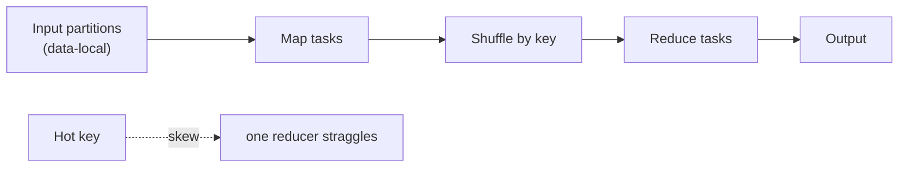

# MapReduce, Lambda & Kappa (deep dive)

> **Level:** 5 (Architecture Patterns) · **Prerequisites:** [Cache Strategies](05-cache-strategies.md)
> **Navigation:** [← Previous: Cache Strategies](05-cache-strategies.md) · [Next → Level 6: Reliability](../06-reliability/README.md)

## Learning objectives
- Explain MapReduce's map/shuffle/reduce and why it co-locates compute with data.
- Compare Lambda (batch + speed) and Kappa (stream-only) and choose between them.

## MapReduce (S-MAPREDUCE)
A **batch** model: map tasks process partitions of input (ideally on the node holding that
data), the framework **shuffles** map outputs by key to reducers, and reduce tasks
aggregate. Latency is high (minutes–hours) but it scales to petabytes by co-locating compute
with data — the antidote to the ""network costs years"" lesson from Level 0.

Failure: a hot key skews the shuffle so one reducer straggles. Mitigate with combiners,
salting the key, or a different aggregation.

## Lambda (S-LAMBDA)
A **batch layer** computes accurate views over all history; a **speed layer** computes
real-time approximate views for recent data; a **serving layer** merges them. Correctness
comes from batch; freshness from speed. Cost: two code paths to keep semantically aligned.

## Kappa
Only **one** stream-processing path; ""history"" is just a replay of the retained stream. If
you need to recompute, replay from an earlier offset. Simpler (one code path) but requires a
retained, replayable stream and idempotent/replayable processing.

## Why this matters
These are the canonical large-scale data-processing models. The choice is freshness vs
simplicity vs accuracy, and it depends entirely on whether your stream is replayable and
your processing is replay-safe.

## Examples
- A revenue dashboard: Kappa with a retained event stream; recompute a month by replaying.
- A nightly report across years of history where replay is impractical: MapReduce batch.
- A dashboard needing both historical accuracy and second-level freshness: Lambda.

## Trade-offs
- **MapReduce**: scales massively, batch-latency; shuffle skew and stragglers.
- **Lambda**: accuracy + freshness; two code paths.
- **Kappa**: one code path; needs replayable stream + replay-safe processing.

## When NOT to apply
- Don't use MapReduce for low-latency queries (it's batch).
- Don't choose Lambda if your stream is replayable (Kappa is simpler).
- Don't run Kappa on a non-retained stream (you can't recompute).

## Common mistakes
- Lambda batch and speed layers that compute different things (silent divergence).
- MapReduce without combiners → huge shuffle.
- Kappa processing that isn't replay-safe → recomputation double-counts.

## Failure modes and operational concerns
- Straggler reducers from skew; rebalance or salt keys.
- Batch/speed layer drift in Lambda; reconcile via recomputation.
- Non-idempotent stream processing breaking Kappa recomputation.

## Review questions
1. Why does MapReduce co-locate compute with data?
2. What causes a straggler reducer, and how do you mitigate it?
3. When is Kappa simpler than Lambda, and what must hold for it?
4. What does the serving layer in Lambda merge?
5. Give a Lambda failure mode and how to detect it.

## Further reading
MapReduce: S-MAPREDUCE · Lambda: S-LAMBDA · streams: Level 2 & 10.

---
[← Previous: Cache Strategies](05-cache-strategies.md) · [Next → Level 6: Reliability](../06-reliability/README.md)
