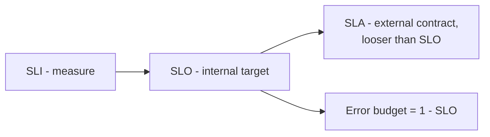
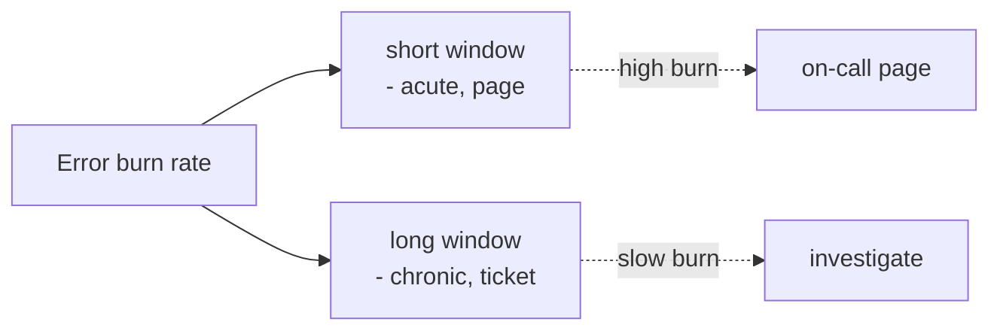

# SLI, SLO, SLA & Error Budgets

> **Level:** 6 (Reliability) · **Prerequisites:** [Level 5](../05-architecture-patterns/README.md)
> **Navigation:** ← Start of Level 6 · [Next → DR, RTO, RPO, Failover](01-dr-rto-rpo.md)

## Learning objectives
- Define SLI, SLO, and SLA and how they relate.
- Use error budgets to balance reliability vs feature velocity.
- Reason about multi-window, multi-burn-rate alerting.

## SLI / SLO / SLA (S-SLO)
- **SLI** — a *Service Level Indicator*: a measurable signal of good service (e.g.,
  "fraction of requests < 300 ms and 2xx").
- **SLO** — a *target* for the SLI over a window (e.g., "99.9% of requests succeed per 28
  days"). Internal; what you *aim* for.
- **SLA** — a *contract* with consequences (often external, financial) — typically set
  *looser* than the SLO so you have headroom.

## Error budgets
For an SLO `S`, the **error budget** is `1 − S` of allowed bad events in the window. A 99.9%
SLO over 30 days = ~43 min of allowed downtime. The budget is a *shared resource*: spend it
on deploys and feature risk; when it's nearly spent, freeze risky changes and stabilize.

## Good SLIs
A good SLI reflects the user's experience, not the operator's. "CPU utilization" is a poor
SLI (users don't care); "fraction of requests succeeding under p99 latency" is good. Tie
SLIs to user-visible journeys.

## Multi-window, multi-burn-rate alerting
Alert on **burn rate** — how fast you're consuming the error budget — over multiple windows.
A fast burn over a short window catches acute outages; a slow burn over a long window
catches chronic erosion. This avoids both paging on noise and missing slow degradations.

## Why this matters
SLIs/SLOs/error budgets turn reliability from a vague ""be reliable"" goal into a measurable,
shared resource that aligns feature and reliability work. Without them, teams either
over-engineer (chasing nines no one needs) or under-invest (users suffer silently).

## Examples
- A checkout SLO of 99.95% over 28 days; when burn-rate spikes, freeze risky deploys.
- A latency SLI "p99 < 300 ms" with a 99% SLO; a slow week erodes the budget → investigate.
- An SLA of 99.9% to customers while the internal SLO is 99.95% — buffer for incidents.

## Trade-offs
- **Tighter SLO** = happier users but less velocity and more cost.
- **Looser SLO** = more velocity but more user-visible unreliability.
- SLA looser than SLO costs some trust capital if incidents approach the SLA.

## When NOT to apply
- Don't chase "five nines" for a low-value feature; align SLOs to user impact.
- Don't pick SLIs operators like over SLIs users feel.
- Don't alert on raw error rate without burn-rate context (noise).

## Common mistakes
- SLOs with no error-budget policy (the budget exists but is never spent/frozen).
- SLIs that don't reflect user experience.
- Alerting on every error instead of burn rate.

## Failure modes and operational concerns
- Budget silently exhausted before a holiday freeze (no policy).
- SLIs that game well but miss real degradation (e.g., success rate while latency soars).
- SLA/SLO mismatch surprising customers when incidents hit the SLA.

## Review questions
1. Define SLI, SLO, SLA and the relationship.
2. What is an error budget and how should it govern deploys?
3. Why is "CPU %" a poor SLI?
4. Explain multi-window burn-rate alerting in one sentence.
5. Why set the SLA looser than the SLO?

## Further reading
SRE SLOs: S-SLO, S-GCPSRE · reliability checklist in `templates/`.

---
← Start of Level 6 · [Next → DR, RTO, RPO, Failover](01-dr-rto-rpo.md)
