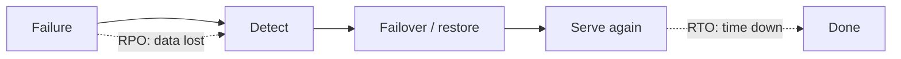
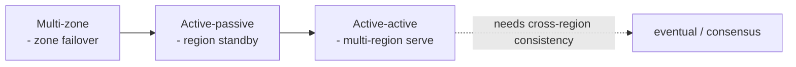

# Disaster Recovery, RTO/RPO, Active-Active/Passive, Failover

> **Level:** 6 (Reliability) · **Prerequisites:** [SLI/SLO/SLA](00-sli-slo-sla-error-budgets.md)
> **Navigation:** [← Previous: SLI/SLO/SLA](00-sli-slo-sla-error-budgets.md) · [Next → Health, Readiness, Liveness, Overload](02-health-overload.md)

## Learning objectives
- Define RTO and RPO and design to meet them.
- Compare active-active, active-passive, multi-zone, multi-region topologies.
- Design and *test* failover; an untested failover is not a failover.

## RTO and RPO
- **RPO (Recovery Point Objective)**: how much data you can lose — bounded by backup
  frequency + log archiving (PITR gives near-zero RPO; nightly-only gives up to 24h).
- **RTO (Recovery Time Objective)**: how long until you're back — bounded by detection +
  restore + failover + warm-up. A cross-region backup reduces RTO after a region loss.

## Topologies
- **Single-zone**: cheap; one zone failure = outage. Not acceptable for serious systems.
- **Multi-zone (active in one zone, replicas in others)**: survives a zone failure with
  failover. Common baseline.
- **Active-passive (multi-region)**: one region serves; a warm/hot standby takes over on
  failure. RTO = detection + promotion.
- **Active-active (multi-region)**: multiple regions serve simultaneously. Best latency
  and no failover delay, but you must handle concurrent writes/consistency across regions
  (often eventual/CRDT or a global consensus layer).

## Failover design and testing
Failover must be **automated and tested**. Common gaps: the standby was never exercised and
fails on promotion; DNS TTLs keep clients on the dead region; a dependency isn't replicated
(failover succeeds for the app but the DB is in the failed region). Run **game days** that
actually promote a standby and cut traffic.

## Why this matters
DR is the difference between an incident and a disaster. Most "DR plans" are documents that
have never been run; the ones that work are the ones rehearsed under realistic failure.

## Examples
- A checkout service: multi-zone active with async replicas; RTO minutes via automated
  promotion; quarterly failover drills.
- A global app: active-active with eventual cross-region replication for read-heavy data and
  a single-region writer for the strongly-consistent core.
- A database: PITR for RPO ~seconds; cross-region snapshot + logs for RTO after region loss.

## Trade-offs
- **Active-active**: best latency/RTO vs cross-region consistency complexity and cost.
- **Active-passive**: simpler consistency vs standby cost and RTO from promotion.
- **Lower RPO** (continuous logs) vs cost; **lower RTO** (closer/automated failover) vs
  complexity.

## When NOT to apply
- Don't build active-active for data needing strong cross-region consistency unless you can
  pay the latency (or use a global-DB that does).
- Don't keep a standby you've never failed over to (false safety).
- Don't set RPO/RTO targets you haven't tested — measure them.

## Common mistakes
- A standby never exercised → fails on the day.
- DR for the app but not its data/dependencies (half a failover).
- Long DNS TTLs preventing traffic from moving during failover.

## Failure modes and operational concerns
- Split-brain during a region partition (two actives).
- Failover flapping (repeated failovers worse than one).
- Standby drift (config/data diverged from primary).

## Review questions
1. Define RTO and RPO and what bounds each.
2. Compare active-active and active-passive on consistency vs RTO.
3. Why is an untested failover not a failover?
4. Give a DR gap where the app fails over but a dependency doesn't.
5. Why might active-active need a global-consensus layer?

## Further reading
SRE: S-GCPSRE · backups/PITR: Level 3 · chaos/game days: next chapters.

---
[← Previous: SLI/SLO/SLA](00-sli-slo-sla-error-budgets.md) · [Next → Health, Readiness, Liveness, Overload](02-health-overload.md)
