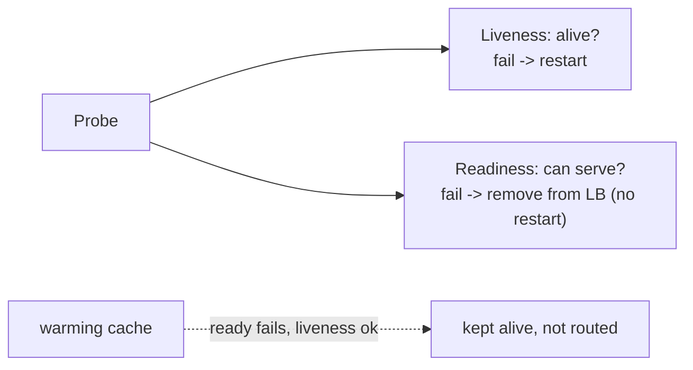
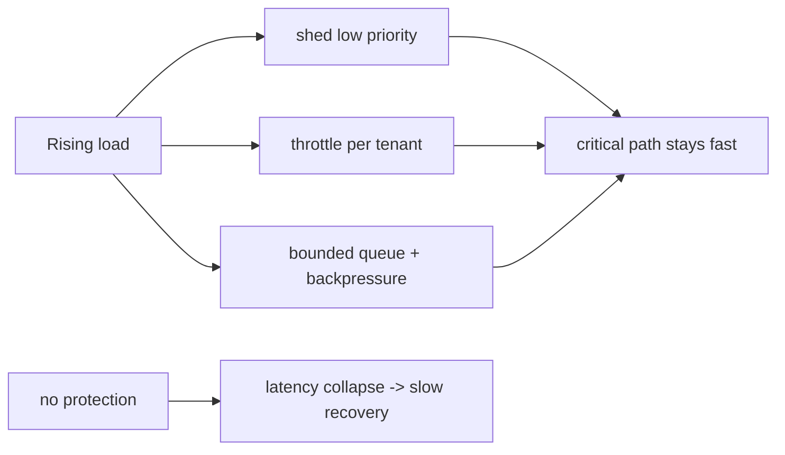

# Health, Readiness, Liveness, Backpressure, Overload Protection

> **Level:** 6 (Reliability) · **Prerequisites:** [DR/RTO/RPO](01-dr-rto-rpo.md)
> **Navigation:** [← Previous: DR/RTO/RPO](01-dr-rto-rpo.md) · [Next → Cascading Failure, Retry Storms, Split-brain](03-cascading-failure.md)

## Learning objectives
- Distinguish liveness from readiness probes and why mixing them causes outages.
- Propagate backpressure and shed load before overload collapses latency.
- Reason about graceful shutdown and dependency isolation under overload.

## Liveness vs readiness (don't mix them)
- **Liveness**: "is the process alive and should it be restarted?" Restart on failure.
- **Readiness**: "can this instance serve traffic?" Remove from the LB if not.
Mixing them is a classic outage: an instance that's healthy but not ready (warming a cache,
a dependency down) reports liveness failure and gets **restarted** — losing warm state and
making things worse. Readiness off → LB stops sending; liveness off → orchestrator restarts.

## Health checks
Health endpoints should be **cheap and fast**, check local readiness, and *not* transitive
dependencies (a probe that pings a downstream for every check cascades failures). A good
readiness check verifies the instance can do its job (e.g., DB connection live, cache warm).

## Backpressure
**Backpressure** is the upstream signal that a downstream can't keep up; producers must slow
down (or buffer, or drop). Without it, unbounded buffering → memory exhaustion; producers
 obliviously piling work on an overloaded downstream → queue blowup. Propagate backpressure
end-to-end: queue→worker→store, and ultimately to the client (HTTP 429, gRPC
RESOURCE_EXHAUSTED).

## Overload protection
Design load shedding and throttling **before** you hit capacity. Once a system is
overloaded, latency collapses (queueing dominates) and it can take *longer* to recover than
if you'd dropped traffic early. The right shape: shed low-priority traffic as you approach
the limit, keep the critical path fast, and recover quickly (no lingering hot state).

## Graceful shutdown
On `SIGTERM`: stop accepting new work, drain in-flight requests up to a deadline, close
resources, exit. This is what makes rolling deploys zero-downtime (Level 0/9). Forgetting it
drops in-flight traffic on every deploy.

## Why this matters
Overload is the most common cause of full outages: one slow dependency, no backpressure,
unbounded retries, and the whole tier collapses. The defense is bounded everything (timeouts,
queues, retries, bulkheads) and shedding early.

## Examples
- A gateway returns 429 to low-priority clients as it approaches 80% CPU; checkout stays
  fast while batch APIs are shed.
- A worker's bounded queue applies backpressure to the producer; the producer slows rather
  than OOMs.
- A service's readiness check fails (cache cold) but liveness passes, so it warms without
  restarts.

## Trade-offs
- **Shedding**: protects the core vs dropping legitimate traffic (priority must be right).
- **Backpressure**: stability vs producers seeing errors/slowdowns.
- **Readiness off**: fast removal vs flapping if the check is too sensitive.

## When NOT to apply
- Don't make liveness check downstream health (restarts cascade).
- Don't shed traffic you can't afford to drop without explicit priority.
- Don't set readiness so sensitive it flaps under minor jitter.

## Common mistakes
- Liveness that pings a downstream → cascading restarts.
- No backpressure → unbounded buffers → OOM.
- Shedding too late (after latency collapse), so recovery is slow.

## Failure modes and operational concerns
- Probe storms (all clients health-checking simultaneously).
- Backpressure not propagated → upstream obliviously overloads downstream.
- Graceful shutdown ignored → dropped requests on every deploy.

## Review questions
1. Why does mixing liveness and readiness cause restarts you don't want?
2. What does backpressure prevent, and where must it propagate?
3. Why shed load *before* you're overloaded, not after?
4. What should a readiness check verify, and what should it avoid?
5. How does graceful shutdown enable zero-downtime deploys?

## Further reading
SRE: S-GCPSRE · resilience patterns: Level 5 · failures: next chapter.

---
[← Previous: DR/RTO/RPO](01-dr-rto-rpo.md) · [Next → Cascading Failure](03-cascading-failure.md)
