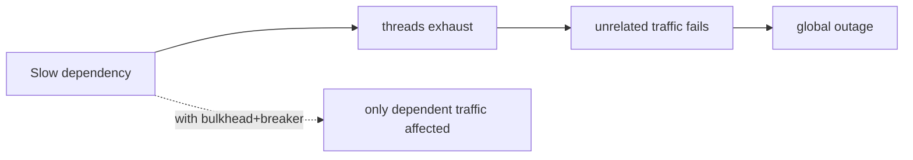

# Cascading Failure, Retry Storms, Thundering Herd, Split-brain

> **Level:** 6 (Reliability) · **Prerequisites:** [Health & Overload](02-health-overload.md)
> **Navigation:** [← Previous: Health & Overload](02-health-overload.md) · [Next → Chaos, Fault Injection, Graceful Shutdown, Brownouts](04-chaos-graceful-shutdown.md)

## Learning objectives
- Explain how a single dependency failure cascades and how to contain it.
- Recognize retry storms, thundering herds, and split-brain and their mitigations.

## Cascading failure
One dependency slows or fails; without isolation, its threads/connections exhaust shared
resources, and *unrelated* traffic also fails — a local failure becomes global. Containment
patterns (Level 5): bulkheads isolate, circuit breakers stop calling, timeouts bound waits,
and load shedding keeps the critical path alive. The failure-injection example models a
breaker containing a failing DB.

## Retry storms
Clients retry a failing service; with many clients and no coordination, retries multiply
load on an already-struggling service, *amplifying* the outage. Mitigations: bounded
retries, exponential backoff **with jitter**, circuit breakers, and returning a clear
"don't retry now" signal (Retry-After, 503) so clients back off.

## Thundering herd
Many waiters wake/refetch simultaneously after a cache expiry or a recovery, hammering the
origin. Mitigations: request coalescing (one fetch, others wait), stale-while-revalidate,
jittered early refresh, and gradual ramp-up after recovery (warm up before full traffic).

## Split-brain
A partition makes two nodes both believe they're the leader/primary, and both accept
writes — divergent state that must be reconciled (often with data loss). Prevention
(Level 4): require a **majority** to act; use leases/fencing tokens; prefer to refuse
writes during a partition (consistency over availability) for data that can't tolerate
divergence.

## Why this matters
These four failure modes are the recurring villains of distributed systems. Each has a
known containment; the failures that make the news are almost always a missing one of these
mitigations (unbounded retries, no bulkhead, no majority requirement).

## Examples
- A slow auth dependency, no bulkhead → all endpoints hang; with a bulkhead+breaker, only
  auth-dependent paths degrade.
- A cache restarts; all clients refetch at once (thundering herd); coalescing + jitter
  smooths it.
- A network split elects two primaries; majority-based quorums prevent the second from
  committing.

## Trade-offs
- **Bulkheads**: isolation vs idle resource overhead.
- **Bounded retries**: resilience vs giving up on genuinely transient failures.
- **Majority-to-act**: no split-brain vs unavailability under partition.

## When NOT to apply
- Don't retry without bounds/jitter (you create the storm).
- Don't retry non-idempotent writes without an idempotency key.
- Don't choose availability-over-consistency for data that can't tolerate divergence.

## Common mistakes
- No bulkhead around an unreliable dependency.
- Retries without jitter (synchronized herds).
- Allowing a minority to act during a partition (split-brain).

## Failure modes and operational concerns
- A contained failure re-cascading if bulkhead capacity is wrong.
- A retry storm extending an outage by hours.
- Split-brain reconciliation silently discarding writes.

## Review questions
1. How does one slow dependency cause a global outage, and what contains it?
2. What is a retry storm and the three mitigations?
3. Explain the thundering herd and one prevention.
4. Why does requiring a majority prevent split-brain?
5. Give a case where retrying is unsafe and the fix.

## Further reading
Circuit breaker/bulkhead: Level 5 · consensus/majority: Level 4 · failure_injection.py.

---
[← Previous: Health & Overload](02-health-overload.md) · [Next → Chaos, Fault Injection, Graceful Shutdown, Brownouts](04-chaos-graceful-shutdown.md)
