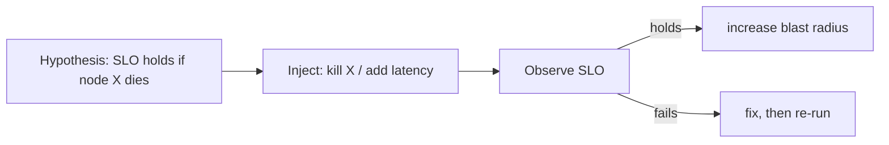

# Chaos Engineering, Fault Injection, Graceful Shutdown, Brownouts

> **Level:** 6 (Reliability) · **Prerequisites:** [Cascading Failure](03-cascading-failure.md)
> **Navigation:** [← Previous: Cascading Failure](03-cascading-failure.md) · [Next → Level 7: Security](../07-security/README.md)

## Learning objectives
- Use chaos engineering to find failures before users do.
- Reason about game days, capacity buffers, and dependency isolation.
- Apply graceful shutdown and brownouts as deliberate degradation.

## Chaos engineering (S-CHAOSENG)
Chaos engineering **proactively** injects failures (kill a node, add latency, drop network)
to verify the system's resilience assumptions hold. The hypothesis: if a node dies, SLO is
maintained; if a dependency gets slow, circuit breakers fire. Run small, scoped experiments
first; expand blast radius as confidence grows. It is *not* breaking things randomly — it's
controlled validation of expected behavior.

## Game days
A **game day** is a planned exercise: a team simulates a major failure and practices the
real response (detection, communication, failover, recovery). It surfaces runbook gaps and
missing automations that drills-only-in-tests miss. Treat findings as bugs to fix.

## Capacity buffers
Operate below capacity so a failure (which redistributes ~33% more load with 3 nodes) and a
spike don't tip into overload. The buffer is a reliability/cost trade; ~70% peak target is a
common heuristic, tuned per workload's criticality.

## Dependency isolation
Isolate unreliable or non-critical dependencies so their failure doesn't take down the
critical path: bulkheads, circuit breakers, and **graceful degradation** (hide the optional
feature rather than fail the page).

## Graceful shutdown & brownouts
- **Graceful shutdown**: on `SIGTERM`, drain in-flight work and exit (Level 0/9).
- **Brownout**: deliberately degrade (slower responses, reduced features) under load rather
  than hard-fail, giving upstream backpressure and keeping the system alive.

## Why this matters
Chaos + game days convert "we think we're resilient" into "we have evidence we're
resilient." The systems that survive real outages are the ones that rehearsed them.

## Examples
- A chaos job kills one KV shard weekly; assert redirects/reads continue from replicas.
- A game day cuts a region; the team practices failover and finds an un-replicated
  dependency — fixed before a real outage.
- A shopping site brownouts the recommendations widget under load rather than timing out
  the product page.

## Trade-offs
- **Chaos**: confidence vs blast-radius risk (start small).
- **Buffers**: reliability vs cost.
- **Brownouts**: liveness vs degraded experience (with alerts so it's not silent).

## When NOT to apply
- Don't run chaos in production without a clear hypothesis and rollback.
- Don't run game days during peak or without rollback plans.
- Don't brownout silently — alert so degraded mode doesn't become the new normal.

## Common mistakes
- Chaos without a hypothesis (just breaking things).
- Buffers too thin (a single failure tips overload).
- Brownouts with no alert, hiding a chronic degradation.

## Failure modes and operational concerns
- A chaos experiment exceeds its blast radius (insufficient isolation).
- Game-day findings never fixed (the drill was the goal, not the fixes).
- Brownouts masking a deeper problem indefinitely.

## Review questions
1. What's the difference between chaos engineering and breaking things randomly?
2. What does a game day surface that a unit test can't?
3. Why operate below capacity; what does the buffer absorb?
4. What is a brownout and what must accompany it?
5. Give a chaos hypothesis and what you'd observe.

## Further reading
Chaos principles: S-CHAOSENG · SRE: S-GCPSRE · failure_injection.py.

---
[← Previous: Cascading Failure](03-cascading-failure.md) · [Next → Level 7: Security](../07-security/README.md)
