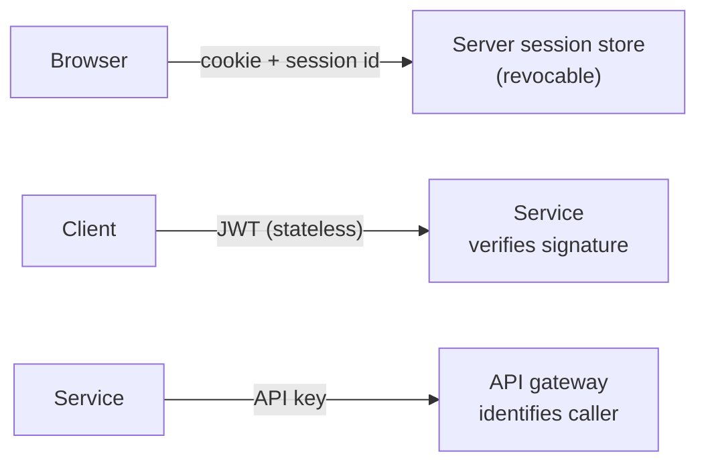

# Authentication, Authorization, Sessions, Cookies, Tokens, API Keys

> **Level:** 7 (Security) · **Prerequisites:** [Level 6](../06-reliability/README.md)
> **Navigation:** ← Start of Level 7 · [Next → OAuth 2.0, OIDC, SAML, JWT](01-oauth-oidc-saml-jwt.md)

## Learning objectives
- Distinguish authentication (who) from authorization (what they may do).
- Compare sessions, cookies, tokens, and API keys and their failure modes.
- Reason about token lifecycle: issuance, rotation, revocation, expiry.

## Authentication vs authorization
- **Authentication (authN)**: verifying identity (you are who you say). Outputs a principal.
- **Authorization (authZ)**: deciding what that principal may do. **Default-deny**: allow
  explicitly; everything else is denied. Mixing the two (""they logged in, so they can do
  everything"") is a top cause of broken access control.

## Sessions vs tokens vs cookies vs API keys
- **Cookie + server session**: server stores session state; a signed cookie holds an ID.
  Revocable server-side; the server is the source of truth. Works well for browsers.
- **Stateless token (JWT)**: a signed token carries claims; the server needs no session
  store. Scales horizontally, but **revocation is hard** (you must track a denylist or use
  short TTLs + refresh).
- **API key**: a long-lived secret identifying a client/service; sent per request. Simple
  for service-to-service; rotate and scope carefully; a leaked key is a credential leak.

## Token lifecycle
- **Issuance**: after authN, mint a short-lived **access token** and a longer-lived
  **refresh token**.
- **Rotation**: refresh tokens rotate on use (one-time) to detect theft.
- **Revocation**: stateless tokens can't be revoked by deletion — use short access TTLs so a
  revoked refresh stops renewal, or maintain a denylist for the access token's remaining
  lifetime.
- **Expiry**: short access + refresh-with-rotation is the common safe pattern.

## Why this matters
Access control failures (authN/Z confusion, non-revocable tokens, default-allow) are among
the most common and most damaging classes of vulnerabilities. The discipline: verify
identity, enforce default-deny authorization, and design revocation from day one.

## Examples
- A web app: cookie + server session (revocable), HttpOnly + Secure + SameSite.
- A mobile API: short-lived JWT access + rotating refresh; revoke by invalidating refresh.
- Service-to-service: mTLS + scoped API keys, rotated automatically.

## Trade-offs
- **Sessions**: revocable and simple; server state, harder to scale statelessly.
- **JWT**: stateless and scalable; revocation is hard (short TTL + refresh + denylist).
- **API keys**: simple; long-lived and risky if leaked (rotate + scope).

## When NOT to apply
- Don't use a long-lived JWT with no revocation path for sensitive access.
- Don't store auth decisions client-side and trust them ("is_admin in the token, no
  server check").
- Don't reuse one API key across many services (blast radius on leak).

## Common mistakes
- Default-allow authorization.
- JWTs that can't be revoked.
- Long-lived, broadly-scoped API keys with no rotation.
- Cookies without HttpOnly/Secure/SameSite.

## Failure modes and operational concerns
- A leaked long-lived token with no revocation → persistent access.
- Token-signing key compromise → forge any token; rotate keys, support kid rollover.
- Session fixation (reusing a session ID after authN).

## Review questions
1. Distinguish authN and authZ and why default-deny matters.
2. Why is JWT revocation hard, and the mitigation pattern?
3. Compare session and JWT on scalability vs revocation.
4. What must every cookie have set, and why each flag?
5. Give a failure mode of a long-lived, broadly-scoped API key.

## Further reading
OAuth2: S-RFC6749 · JWT: S-RFC7519 · OWASP API: S-OWASPAPI · next chapter.

---
← Start of Level 7 · [Next → OAuth 2.0, OIDC, SAML, JWT](01-oauth-oidc-saml-jwt.md)
