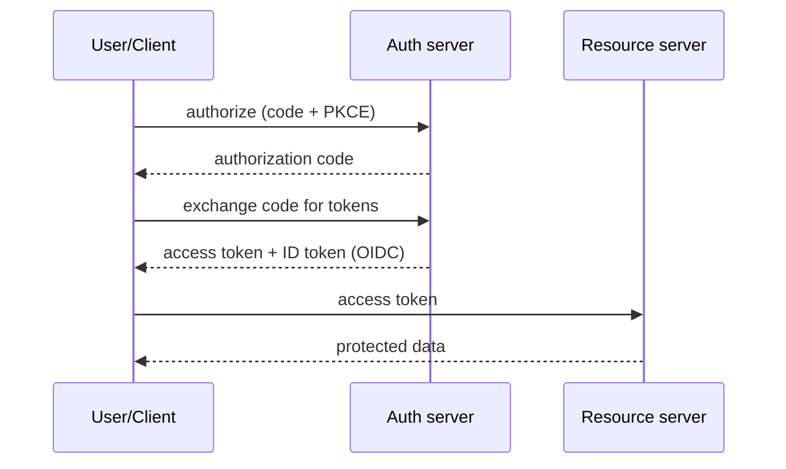

# OAuth 2.0, OpenID Connect, SAML, JWT

> **Level:** 7 (Security) · **Prerequisites:** [AuthN/AuthZ](00-authn-authz.md)
> **Navigation:** [← Previous: AuthN/AuthZ](00-authn-authz.md) · [Next → RBAC, ABAC, PBAC, Zero-Trust, mTLS](02-rbac-abac-pbac-zero-trust.md)

## Learning objectives
- Explain OAuth 2.0 (authorization delegation) vs OpenID Connect (authentication on top).
- Compare JWT (bearer tokens) with SAML (enterprise SSO) and when each fits.
- Reason about token security (signing, validation, lifetime, storage).

## OAuth 2.0 (S-RFC6749)
OAuth 2.0 is an **authorization delegation** framework: a user grants a third-party app
access to act on their behalf *without sharing their password*, via scoped, short-lived
**access tokens**. Flows (authorization code, client credentials, device) suit different
clients. The **authorization code + PKCE** flow is the standard for public clients (SPAs,
mobile).

## OpenID Connect (S-OIDC)
OIDC is an **authentication** layer on OAuth 2.0: it adds an **ID token** (a JWT describing
the authenticated user) alongside the access token. So: OAuth = "may I do X?", OIDC =
"who are you, and may I do X?". Many "OAuth login" buttons are really OIDC.

## JWT (S-RFC7519)
A **JSON Web Token** is a signed (and optionally encrypted) container of claims. **Bearer**
semantics: possession = authorization, so protect the token. Validation: verify signature,
issuer, audience, expiry, and required claims. Common errors: not verifying the
signature, ignoring `aud`, accepting `alg: none`.

## SAML (S-SAML)
SAML is an XML-based SSO protocol widely used in enterprise. Heavier than JWT; integrates
with corporate IdPs and SPs. Use it for enterprise SSO where the ecosystem demands it; use
OIDC/JWT for modern web/mobile.

## Token security
- Sign tokens with a key you control; support **key rotation** (`kid`).
- Validate signature, `iss`, `aud`, `exp`, `nbf`; reject `alg: none`.
- Short access TTL; refresh with rotation; store tokens securely (no localStorage for
  sensitive tokens in browsers; prefer HttpOnly cookies or in-memory).

## Why this matters
These are the protocols behind almost all modern login and delegated access. Getting them
wrong (wrong flow, no PKCE, unvalidated tokens) is a direct path to account takeover.

## Examples
- A mobile app uses authorization-code + PKCE to get an access token; OIDC ID token
  identifies the user.
- A B2B app federates to a customer's SAML IdP for enterprise SSO.
- Service-to-service uses client-credentials OAuth to mint machine tokens with scopes.

## Trade-offs
- **OAuth (delegation) vs OIDC (authentication)**: use OIDC when you need identity, not
  just delegation.
- **JWT (light, web/mobile) vs SAML (heavy, enterprise)**: pick by ecosystem, not fashion.
- **Bearer tokens**: simple but possession = power; consider DPoP/mTLS-bound tokens for
  higher assurance.

## When NOT to apply
- Don't "roll your own" OAuth/OIDC; use a vetted library/IdP.
- Don't use the implicit flow (deprecated; use code + PKCE).
- Don't use JWT for server-side sessions just for "statelessness" if you need easy
  revocation.

## Common mistakes
- Not validating JWT signature/audience/expiry; accepting `alg: none`.
- Using implicit flow or omitting PKCE for public clients.
- Storing bearer tokens in localStorage (XSS-exposed).

## Failure modes and operational concerns
- Signing-key compromise → forge any token (rotate, monitor).
- A misconfigured `aud`/`iss` accepting tokens minted for another service.
- Stale refresh tokens after a credential reset.

## Review questions
1. What does OAuth delegate, and what does OIDC add?
2. Which OAuth flow is correct for a SPA/mobile, and why PKCE?
3. List the JWT validations you must perform.
4. When SAML over JWT, and vice versa?
5. Give a token-validation failure that enables account takeover.

## Further reading
OAuth2: S-RFC6749 · OIDC: S-OIDC · SAML: S-SAML · JWT: S-RFC7519.

---
[← Previous: AuthN/AuthZ](00-authn-authz.md) · [Next → RBAC, ABAC, PBAC, Zero-Trust, mTLS](02-rbac-abac-pbac-zero-trust.md)
