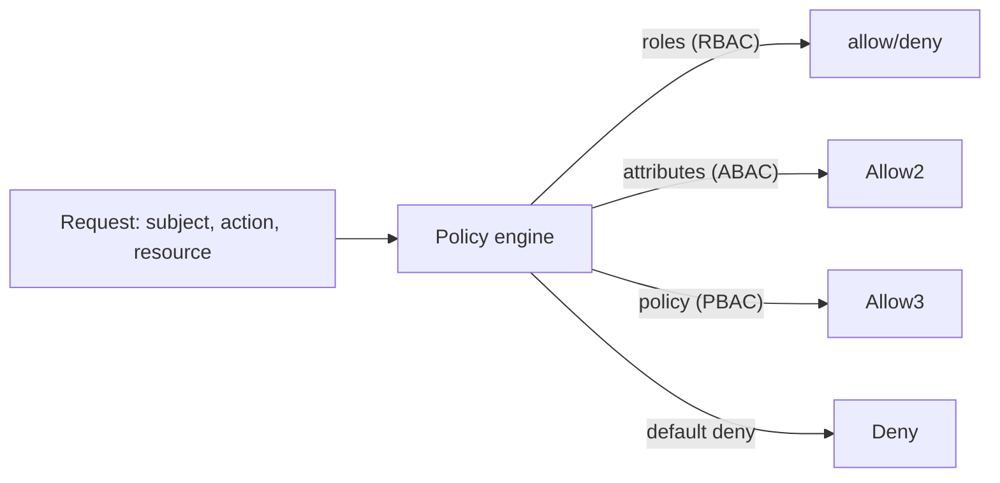

# RBAC, ABAC, PBAC, Zero-Trust, mTLS

> **Level:** 7 (Security) · **Prerequisites:** [OAuth/OIDC/SAML/JWT](01-oauth-oidc-saml-jwt.md)
> **Navigation:** [← Previous: OAuth/OIDC/SAML/JWT](01-oauth-oidc-saml-jwt.md) · [Next → Encryption, KMS, Secrets, Certs](03-encryption-kms-secrets.md)

## Learning objectives
- Compare RBAC, ABAC, and policy-based access control and when each fits.
- Explain zero-trust and why network location is not authorization.
- Use mTLS for service-to-service authentication.

## Access control models
- **RBAC (role-based)**: assign roles with permissions; users get roles. Simple, coarse;
  roles explode for fine-grained needs.
- **ABAC (attribute-based)**: decisions based on attributes of subject, resource, action,
  and environment (e.g., "owner + same region + business hours"). Fine-grained but complex
  to author and audit.
- **PBAC (policy-based)**: externalize decisions to a policy engine (e.g., OPA/Rego,
  Cedar): a policy service answers "may S do A on R?" Decoupled from app code, auditable,
  and versionable.

## Zero-trust
**Zero-trust** assumes no implicit trust based on network location; every request is
authenticated and authorized, even inside the "trusted" network. The model: identity +
device posture + context, evaluated per request, with least privilege and segmentation.
The opposite of a "trusted internal network."

## mTLS
**Mutual TLS** authenticates *both* sides of a connection with certificates. Service-to-
service mTLS proves a service's identity (not just encrypts), which is the backbone of
zero-trust internal comms and service meshes. Operationalize with **automated certificate
rotation** (short-lived certs issued by an internal CA) so cert expiry never causes an
outage.

## Why this matters
Most data exposure is *authorized-access-gone-wrong* (broken access control), not network
intrusion. Strong, externalized, default-deny authorization and zero-trust identity are the
real defenses; firewalls alone are not.

## Examples
- A banking app: RBAC for teller/manager roles + ABAC for "own account only"; an OPA
  policy engine answers per-action.
- A service mesh enforces mTLS between all internal services with auto-rotating certs.
- A zero-trust gateway authenticates every internal API call by workload identity.

## Trade-offs
- **RBAC**: simple vs role explosion for fine-grained needs.
- **ABAC/PBAC**: flexible and auditable vs authoring/complexity and a policy engine to run.
- **mTLS**: strong S2S auth vs cert lifecycle complexity (automate rotation).

## When NOT to apply
- Don't use RBAC where you need row-level/fine-grained control; add ABAC/PBAC.
- Don't assume an internal network is "trusted" without zero-trust controls.
- Don't run mTLS without automated rotation (manual certs expire into outages).

## Common mistakes
- Network-location = trust (the anti-pattern zero-trust rejects).
- Roles accumulating permissions forever ("role sprawl") — least privilege needs pruning.
- Manual certificates that expire and cause outages.

## Failure modes and operational concerns
- A policy engine outage becomes a single point of denial (cache decisions safely).
- Cert rotation failing silently → mass expiry → outage.
- Over-broad roles allowing lateral movement after a compromise.

## Review questions
1. When does RBAC break down, and what replaces it?
2. What does zero-trust assume that "trusted network" models do not?
3. What does mTLS give beyond encryption?
4. Why must certificates rotate automatically?
5. Give a failure mode of a centralized policy engine and a mitigation.

## Further reading
Zero-trust & service mesh: Level 9 · OWASP API: S-OWASPAPI.

---
[← Previous: OAuth/OIDC/SAML/JWT](01-oauth-oidc-saml-jwt.md) · [Next → Encryption, KMS, Secrets, Certs](03-encryption-kms-secrets.md)
