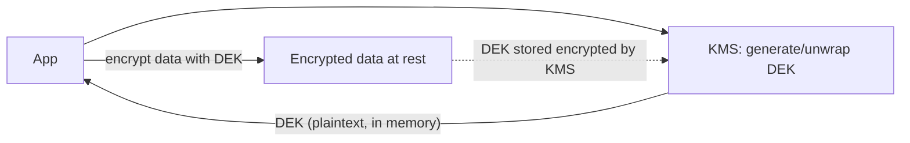

# Encryption in Transit & at Rest, KMS, Secrets, Certificates

> **Level:** 7 (Security) · **Prerequisites:** [RBAC/ABAC/PBAC/Zero-Trust](02-rbac-abac-pbac-zero-trust.md)
> **Navigation:** [← Previous: RBAC/ABAC/PBAC/Zero-Trust](02-rbac-abac-pbac-zero-trust.md) · [Next → WAF, DDoS, Secure API, Tenant Isolation](04-waf-ddos-secure-api.md)

## Learning objectives
- Apply encryption in transit (TLS) and at rest with key management.
- Distinguish KMS, secret managers, and certificate management.
- Reason about key rotation and the cost of losing keys.

## Encryption in transit
**TLS** (S-RFC8446) encrypts and authenticates connections. Use it everywhere; terminate
at the edge and use **mTLS** internally for zero-trust. The failure to avoid: cleartext
internal links, expired certs, or weak ciphers. Automate cert lifecycle.

## Encryption at rest
Encrypt stored data so a stolen disk/backup/snapshot is unreadable. Object storage and DBs
offer transparent encryption keyed by a KMS key. Two models:
- **Envelope encryption**: a KMS-protected **data-encryption key (DEK)** encrypts data; the
  KMS protects the DEK. Lets the cloud KMS hold keys without exposing plaintext to apps.
- **Application-level encryption**: the app encrypts specific fields (e.g., PII) for finer
  control and field-level key separation.

## KMS vs secrets vs certs
- **KMS**: key storage and cryptographic operations (generate, encrypt, decrypt, sign)
  with access policy; never exports keys.
- **Secret manager**: stores secrets (DB passwords, API keys) with retrieval, rotation,
  audit. Use it, not plaintext config or env files.
- **Certificate management**: issue, rotate, and revoke TLS/mTLS certs; automate so expiry
  is never an outage.

## Key rotation
Rotate keys periodically and on personnel changes. Rotate **without downtime** by
supporting two active keys during the rollover (encrypt with new, decrypt with old+new).
The worst operational failure: key loss/revocation that makes data **unrecoverable** — keep
escrow/backups of KMS keys appropriate to your risk model.

## Why this matters
Encryption and key management turn a disk theft or a snapshot leak from a disaster into a
non-event — *if* the keys are safe. Key loss, not key theft, is the silent killer (encrypted
data you can no longer decrypt).

## Examples
- A service stores PII encrypted with a per-tenant DEK via KMS envelope encryption.
- TLS certs issued by an internal CA, rotated every 24h by an automated controller.
- DB password fetched from a secret manager at startup, rotated monthly with dual-active.

## Trade-offs
- **Transparent at-rest**: simple vs coarse key granularity.
- **Application-level**: field-level control vs app complexity and key proliferation.
- **Rotation**: safety vs dual-key operational cost during rollover.

## When NOT to apply
- Don't store secrets in env vars/config files/repo (use a secret manager).
- Don't rely on a single key with no rotation and no recovery path.
- Don't terminate TLS at the edge and assume the internal path is safe without mTLS.

## Common mistakes
- Plaintext secrets in config/repo or env files.
- Manual certs that expire into outages.
- One un-rotated key with no escrow → key loss = data loss.

## Failure modes and operational concerns
- KMS outage blocking decrypts (cache DEKs; design KMS to be highly available).
- Mass cert expiry from failed rotation.
- Key revocation with no recovery path making data unrecoverable.

## Review questions
1. Explain envelope encryption and why it keeps keys out of apps.
2. Why is key *loss* as dangerous as key theft?
3. Distinguish KMS, secret manager, and cert management.
4. How do you rotate keys with zero downtime?
5. Give a KMS-outage failure mode and a mitigation.

## Further reading
TLS 1.3: S-RFC8446 · KMS/cloud: S-WA · secure API: next chapter.

---
[← Previous: RBAC/ABAC/PBAC/Zero-Trust](02-rbac-abac-pbac-zero-trust.md) · [Next → WAF, DDoS, Secure API, Tenant Isolation](04-waf-ddos-secure-api.md)
