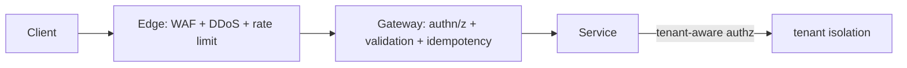

# WAF, DDoS Protection, Secure API Design, Tenant Isolation

> **Level:** 7 (Security) · **Prerequisites:** [Encryption/KMS/Secrets](03-encryption-kms-secrets.md)
> **Navigation:** [← Previous: Encryption/KMS/Secrets](03-encryption-kms-secrets.md) · [Next → Audit, Privacy, Threat Modeling (STRIDE)](05-audit-privacy-threat-modeling.md)

## Learning objectives
- Use a WAF and DDoS protection for public surfaces.
- Design secure APIs (input validation, idempotency, least privilege).
- Enforce multi-tenant isolation so tenants can't access each other's data.

## WAF and DDoS
- **Web Application Firewall (WAF)**: filters malicious HTTP traffic (SQLi, XSS, common
  OWASP patterns) at L7. Useful but signature/evading-aware; tune to avoid blocking legit
  traffic, and keep rules updated.
- **DDoS protection**: absorb volumetric/L7 floods at the edge (CDN, scrubbing, rate
  limits) so your origin isn't overwhelmed. Combine with autoscaling and rate limiting.

## Secure API design
- **Input validation** at the boundary: type, size, format, semantics; reject by default.
- **Idempotency keys** for writes so retries don't double-apply.
- **Least privilege** tokens/scopes per endpoint.
- **Safe errors**: generic messages to clients, detailed logs internally (no stack traces
  or secrets leaked in errors).
- **Rate limiting** per client/tenant (the token-bucket example) to prevent abuse.
- Review against the **OWASP API Security Top 10** (S-OWASPAPI): broken object-level auth,
  excessive data exposure, mass assignment, etc.

## Multi-tenant isolation
- **Enforce isolation server-side**: never trust a client-supplied `tenant_id`; derive it
  from authenticated identity.
- **Row-level security / tenancy in the query**: a `WHERE tenant_id = ?` bound to the
  authenticated principal; better, a DB row-level security policy so a bug can't leak.
- **Resource isolation (bulkheads)**: per-tenant quotas so a noisy whale can't exhaust
  shared capacity.
- **Stronger isolation** (schema/cluster per tenant) for regulated or giant tenants.

## Why this matters
Public APIs are attack surfaces; the OWASP API top 10 and tenant-isolation bugs (cross-
tenant access via a trusted `tenant_id`) are the most common real-world vulnerabilities
behind broken access control.

## Examples
- A multi-tenant SaaS derives `tenant_id` from the token, enforces row-level security in the
  DB, and applies per-tenant rate limits.
- An API gateway validates input, requires idempotency keys on writes, and returns generic
  errors with detailed internal logs.
- A public endpoint sits behind a CDN-based DDoS scrubber and a WAF tuned for OWASP patterns.

## Trade-offs
- **WAF**: defense-in-depth vs false positives blocking legit traffic and bypass risk.
- **Per-tenant isolation strength**: cost vs blast radius (weaker = cheaper, riskier).
- **Strong validation**: security vs friction/performance.

## When NOT to apply
- Don't rely on a WAF as your *only* defense; fix vulnerabilities in the app.
- Don't trust `tenant_id` from the client.
- Don't expose internal error details to clients.

## Common mistakes
- Trusting client-supplied tenant/owner IDs (cross-tenant access).
- Mass assignment letting clients set fields they shouldn't.
- Detailed errors leaking stack traces or secrets.

## Failure modes and operational concerns
- A WAF rule blocking a legitimate, important traffic pattern.
- A noisy whale consuming shared capacity without per-tenant quotas.
- An API exposing too much data (over-fetching) leaking fields.

## Review questions
1. Why must tenant identity come from auth, not a request parameter?
2. Name three OWASP API top-10 risks and a mitigation for each.
3. What does a WAF catch that network firewalls don't?
4. Why return generic errors but log details internally?
5. Give a multi-tenant isolation failure and its fix.

## Further reading
OWASP API: S-OWASPAPI · input validation & rate limiting: Level 2/5.

---
[← Previous: Encryption/KMS/Secrets](03-encryption-kms-secrets.md) · [Next → Audit, Privacy, Threat Modeling (STRIDE)](05-audit-privacy-threat-modeling.md)
