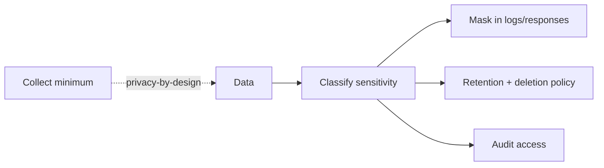

# Audit Logs, Data Masking, Privacy-by-Design, Threat Modeling (STRIDE)

> **Level:** 7 (Security) · **Prerequisites:** [WAF/DDoS/Secure API](04-waf-ddos-secure-api.md)
> **Navigation:** [← Previous: WAF/DDoS/Secure API](04-waf-ddos-secure-api.md) · [Next → Supply-Chain Security](06-supply-chain-security.md)

## Learning objectives
- Produce tamper-evident audit logs for security-relevant events.
- Apply data classification, masking, and privacy-by-design.
- Run threat modeling with STRIDE.

## Audit logs
Audit logs record **who did what, when, from where** for security-relevant actions (logins,
permission changes, data access, config changes). They should be **tamper-evident**
(append-only, shipped to a separate store) and **retained** to meet compliance. They differ
from operational logs: audit logs are about accountability, not debugging.

## Data classification, masking, privacy-by-design
- **Classify** data by sensitivity (public, internal, confidential, regulated PII) and
  apply controls per class.
- **Mask/minimize**: log and return only what's needed; mask PII in logs and error
  messages; avoid storing data you don't need.
- **Privacy-by-design**: collect the minimum, define retention, support deletion (right to
  be forgotten), and default to the least exposure.

## Threat modeling with STRIDE (S-STRIDE)
**STRIDE** is a mnemonic for threat categories: **S**poofing, **T**ampering, **R**epudiation,
**I**nformation disclosure, **D**enial of service, **E**levation of privilege. Model the
data flow, identify trust boundaries, and for each component ask which STRIDE threats
apply and what mitigates them. Threat modeling *before* building is far cheaper than after.

## Why this matters
Auditability and privacy are regulatory and trust requirements, and threat modeling is how
you find design-level vulnerabilities that code review and scanners miss. "We'll add
security later" is how breaches happen.

## Examples
- A config change is logged to an append-only audit store with actor, change, and
  before/after; the ops team can reconstruct who changed what and when.
- A service masks PII in logs and redacts it from non-essential responses; retention rules
  delete raw events after 90 days.
- A STRIDE pass on an upload flow identifies spoofing (unauth upload), tampering (file
  type), and information disclosure (listing others' files) — each mitigated.

## Trade-offs
- **Audit logging**: accountability vs storage and the discipline of not logging secrets.
- **Data minimization**: privacy vs feature richness (you can't analyze data you didn't
  collect).
- **Threat modeling**: finds design flaws vs time investment; do it on critical flows.

## When NOT to apply
- Don't log secrets or full PII in audit/operational logs.
- Don't collect data "in case we need it later" (retention liability).
- Don't threat-model every trivial flow; prioritize the critical and exposed ones.

## Common mistakes
- Logging secrets/PII in audit or operational logs.
- Audit logs that can be modified by the very actors they audit.
- Skipping threat modeling on a publicly exposed flow.

## Failure modes and operational concerns
- Audit log tampering (insider threat) — ship to a separate, append-only store.
- Over-retention creating liability; under-retention failing compliance.
- Threats identified in modeling but never mitigated (modeling theater).

## Review questions
1. What makes an audit log tamper-evident?
2. Why collect the minimum data, and what's the trade-off?
3. List the six STRIDE categories with one example each.
4. Why is threat modeling cheaper before building?
5. Give a privacy failure in logging and the fix.

## Further reading
STRIDE: S-STRIDE · OWASP: S-OWASPAPI · supply chain: next chapter.

---
[← Previous: WAF/DDoS/Secure API](04-waf-ddos-secure-api.md) · [Next → Supply-Chain Security](06-supply-chain-security.md)
