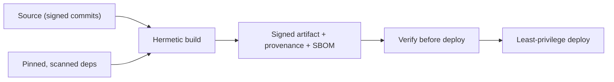

# Supply-Chain Security

> **Level:** 7 (Security) · **Prerequisites:** [Audit/Privacy/STRIDE](05-audit-privacy-threat-modeling.md)
> **Navigation:** [← Previous: Audit/Privacy/STRIDE](05-audit-privacy-threat-modeling.md) · [Next → Level 8: Observability](../08-observability/README.md)

## Learning objectives
- Reason about software supply-chain risk (dependencies, build, artifacts).
- Apply dependency pinning, SBOMs, and artifact signing/verification.
- Use provenance and verified builds to resist tampering.

## The supply chain
Modern software is mostly dependencies and build pipelines — both are attack surfaces.
A compromised dependency, a malicious build step, or a tampered artifact all let an
attacker run code in your environment. Notable real incidents were supply-chain
compromises, not direct intrusions.

## Practices
- **Pin and verify dependencies**: lockfiles, hash verification, no floating tags; scan for
  known vulnerabilities.
- **Minimal, hermetic builds**: build in a controlled environment with the minimum required
  privileges and network; don't fetch arbitrary scripts at build time.
- **Artifact signing & provenance**: sign build artifacts and record their provenance
  (what source, what build, what inputs). Verify signatures before deploy.
- **SBOM (software bill of materials)**: a list of components and dependencies so you can
  respond fast when a vulnerability is disclosed.
- **Least-privilege deploy**: deploys run with minimal permissions; no long-lived secrets in
  pipelines.

## Why this matters
The system you *built* may be secure, but the dependencies and pipeline that *built it*
often aren't. Supply-chain hardening is now a baseline expectation, not an advanced extra.

## Examples
- A CI pipeline produces signed container images with an SBOM and provenance; deploys
  verify the signature and reject unsigned images.
- Dependencies are pinned by hash and scanned nightly; a CVE triggers an automated upgrade
  PR.
- A build runs with no network access and a read-only source checkout; secrets are injected
  only at deploy, scoped per environment.

## Trade-offs
- **Verification overhead**: signing/provenance adds steps but catches tampering.
- **Pinning vs currency**: pinning for safety vs staying current for fixes (automate
  upgrades within safety).
- **Hermetic builds**: reproducibility/safety vs friction in builds that need network.

## When NOT to apply
- Don't pull build-time dependencies from the public internet without verification.
- Don't give CI broad prod credentials; scope per environment.
- Don't deploy unsigned/unverified artifacts to sensitive environments.

## Common mistakes
- Floating dependency versions and unverified downloads.
- CI with standing prod credentials and overly broad permissions.
- No SBOM, so a disclosed CVE takes days to scope.

## Failure modes and operational concerns
- A compromised dependency shipping malicious code into builds.
- A pipeline secret leak giving prod access.
- Unsigned images deployed because verification was skipped "to ship faster."

## Review questions
1. Name three supply-chain attack surfaces.
2. What do pinning, an SBOM, and provenance each give you?
3. Why run builds hermetically with minimal privileges?
4. What does artifact signing prevent, and what must you still verify?
5. Give a CI credential failure and a least-privilege fix.

## Further reading
Cloud/Well-Architected: S-WA · security checklist in `templates/`.

---
[← Previous: Audit/Privacy/STRIDE](05-audit-privacy-threat-modeling.md) · [Next → Level 8: Observability](../08-observability/README.md)
