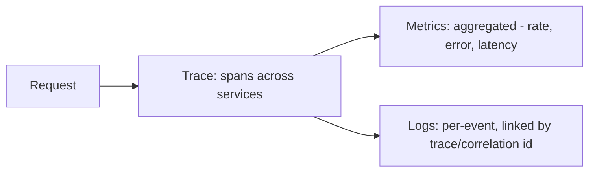

# Logs, Metrics, Traces, Correlation IDs

> **Level:** 8 (Observability) · **Prerequisites:** [Level 7](../07-security/README.md)
> **Navigation:** ← Start of Level 8 · [Next → OpenTelemetry](01-opentelemetry.md)

## Learning objectives
- Distinguish logs, metrics, and traces and what each is for.
- Use correlation IDs to stitch a request across services.
- Reason about cardinality, retention, and cost in observability systems.

## The three signals
- **Logs** — discrete, timestamped events with context; best for debugging "what happened."
  High cardinality and volume; expensive to keep and search.
- **Metrics** — aggregated numeric time series (counters, gauges, histograms); best for
  "is it healthy / trending." Cheap, queryable, alertable; lose individual-event detail.
- **Traces** — a request's path across services as spans; best for "where is time spent in a
  multi-hop call." Span context propagates correlation IDs.

## Correlation IDs
A **correlation ID** (trace ID) is generated at the edge and propagated through every hop
so a single request can be reconstructed across services. Without it, a multi-service
failure is un-debuggable ("it's slow somewhere"). Propagate it in headers and include it in
every log line.

## Cardinality and cost
Metric **cardinality** (number of unique label combinations) is the silent cost killer: a
  metric labeled by `user_id` or `request_url` creates a series per user/URL, blowing up
  storage and query cost. Keep metric labels low-cardinality; put high-cardinality detail in
  logs/traces, not metrics.

## Why this matters
Observability is how you operate a distributed system; you cannot run what you can't see.
The three signals complement, not substitute: metrics tell you *that* something's wrong,
traces tell you *where*, logs tell you *why*.

## Examples
- A slow checkout: metrics show p99 latency rising; traces show the call to the payment
  service is the slow span; logs for that trace show a downstream timeout.
- A metric labeled by `endpoint` (low cardinality) is fine; labeled by `user_id` is not.
- Every log line carries the trace ID, so a support ticket with one ID finds the whole path.

## Trade-offs
- **Metrics**: cheap and alertable vs losing per-event detail.
- **Logs**: rich detail vs volume/storage/search cost.
- **Traces**: cross-service timing vs overhead and sampling cost.

## When NOT to apply
- Don't put high-cardinality labels on metrics (use logs/traces).
- Don't log every request at debug in production (volume/cost).
- Don't sample traces so aggressively you miss the slow ones (tail sampling helps).

## Common mistakes
- Missing correlation IDs (can't stitch a request).
- High-cardinality metrics exploding cost.
- No sampling strategy → trace volume overwhelming or missing incidents.

## Failure modes and operational concerns
- Log volume cost runaway; sample and tier retention.
- A tracing pipeline outage dropping spans (degrade gracefully).
- Metrics losing dimensions that would have localized an incident.

## Review questions
1. What question does each signal answer?
2. Why propagate a correlation ID across services?
3. Why is high-cardinality on metrics a cost problem?
4. Compose the three signals to diagnose a slow multi-hop request.
5. Give a cost failure mode of logging and a mitigation.

## Further reading
OpenTelemetry: next chapter · SRE: S-GCPSRE.

---
← Start of Level 8 · [Next → OpenTelemetry](01-opentelemetry.md)
