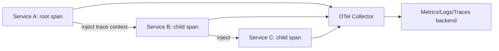

# OpenTelemetry

> **Level:** 8 (Observability) · **Prerequisites:** [Logs/Metrics/Traces](00-logs-metrics-traces.md)
> **Navigation:** [← Previous: Logs/Metrics/Traces](00-logs-metrics-traces.md) · [Next → Golden Signals, RED, USE, Alerting, Dashboards](02-golden-signals-red-use.md)

## Learning objectives
- Explain OpenTelemetry's role as a vendor-neutral instrumentation standard.
- Use context propagation to connect spans across services.
- Reason about sampling (head vs tail) and exporters.

## What OpenTelemetry is
OpenTelemetry (S-OTEL) is a **vendor-neutral specification and SDKs** for emitting logs,
metrics, and traces with consistent context. It frees you from instrumenting per-backend
—you instrument once and export to any collector/backend. It standardizes the parts that used
to lock you into a vendor: instrumentation, context propagation, and resource attributes.

## Context propagation
A trace spans multiple services because each hop propagates **context** (trace ID, span
ID) via headers (W3C Trace Context). The OTel SDKs inject context on send and extract it on
receive, so a trace is one tree across services without custom plumbing.

## Sampling
- **Head sampling**: decide to sample at request start (cheap, can't condition on outcome;
  risks missing the interesting failures).
- **Tail sampling**: keep all spans, then decide at the end (sample slow/erroring traces,
  drop boring ones). Best for capturing incidents but needs collecting spans centrally.

## Collectors and exporters
An **OTel Collector** sits between services and backends: it receives, processes (batch,
attribute, sample), and exports to one or more backends. Centralizing at the collector lets
you change backends and apply sampling uniformly.

## Why this matters
Standardized instrumentation and context propagation are what make distributed tracing
actually work across a polyglot fleet. Without it, every service has different trace IDs
and a multi-service incident is un-debuggable.

## Examples
- A polyglot fleet uses OTel SDKs so all services share one trace context and export to one
  collector, which fans out to the chosen backend.
- Tail sampling keeps all erroring/slow traces and 1% of the rest, capturing incidents
  cheaply.
- A collector enriches spans with deployment/env attributes before export.

## Trade-offs
- **Tail sampling**: captures incidents vs collecting all spans centrally (cost).
- **Collector**: flexibility vs an extra component to run and keep available.
- **Standardization**: portable vs adoption effort across many services.

## When NOT to apply
- Don't head-sample away the slow/erroring traces you most need (use tail sampling).
- Don't run a collector without its own capacity/HA (it's a dependency).
- Don't over-instrument; too many spans add overhead and noise.

## Common mistakes
- Not propagating context (broken traces).
- Head sampling that drops erroring traces.
- High-cardinality span attributes exploding storage.

## Failure modes and operational concerns
- Collector overload dropping spans; size it and degrade gracefully.
- Context propagation gaps at a hop breaking traces.
- Sampling misconfigured so incidents aren't captured.

## Review questions
1. What does OpenTelemetry standardize that vendor SDKs did not?
2. How does a trace stay one tree across services?
3. Compare head vs tail sampling for capturing incidents.
4. What does a collector add, and what's its risk?
5. Give a failure mode of broken context propagation.

## Further reading
OpenTelemetry: S-OTEL · golden signals: next chapter.

---
[← Previous: Logs/Metrics/Traces](00-logs-metrics-traces.md) · [Next → Golden Signals, RED, USE](02-golden-signals-red-use.md)
