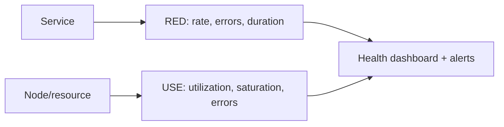

# Golden Signals, RED, USE, Alerting & Dashboards

> **Level:** 8 (Observability) · **Prerequisites:** [OpenTelemetry](01-opentelemetry.md)
> **Navigation:** [← Previous: OpenTelemetry](01-opentelemetry.md) · [Next → RCA, Incident Response](03-rca-incident-response.md)

## Learning objectives
- Apply the four golden signals and the RED/USE methods.
- Design alerts that catch real problems without noise.
- Build dashboards that answer "is it healthy and where."

## The golden signals
Four signals to watch on any service: **latency** (p50/p95/p99), **traffic** (request rate),
**errors** (error rate), **saturation** (how full resources are). They cover health without
flooding you with every metric.

## RED and USE
- **RED** (for request-driven services): **R**ate, **E**rrors, **D**uration (latency).
- **USE** (for resources: CPU, disk, network): **U**tilization, **S**aturation, **E**rrors.
RED fits services; USE fits the resources under them. Use both: RED for the user-facing
service, USE for the node/cluster it runs on.

## Alerting
Alert on **symptoms users see** (SLO burn, error rate, latency), not on causes you assume
(CPU high — maybe fine). Alerts should be **actionable** (a human can do something) and
**specific** (which service, which path). Tie alerts to SLO error-budget burn (Level 6) to
avoid both noise and missing slow degradations. Avoid alert fatigue: every alert you can't
act on trains people to ignore the page.

## Dashboards
A good dashboard answers two questions fast: *is it healthy?* and *where is it broken?*
Lead with golden signals per service; add a service map of dependencies; keep cardinality
low. Dashboards that show 50 graphs answer neither question.

## Why this matters
The difference between a 10-minute incident and a 2-hour one is whether the on-call
engineer can immediately see what's wrong and where. Signals+methods+alerting discipline
make observability operational rather than a wall of graphs.

## Examples
- A service dashboard: rate, error %, p99 latency (RED) + CPU/disk saturation (USE); an
  alert on error-budget burn, not raw CPU.
- An alert fires only when SLO burn exceeds the threshold over both windows (Level 6),
  avoiding single-spike paging.
- A dependency map lets on-call see which downstream is failing.

## Trade-offs
- **Symptom vs cause alerts**: symptoms are user-relevant but slower to localize; causes are
  fast but noisy. Balance; symptom-led with drill-down dashboards.
- **More alerts**: coverage vs fatigue.
- **Dashboards**: completeness vs readability (favor focus).

## When NOT to apply
- Don't alert on raw CPU/disk as if they were user problems (alert on SLOs).
- Don't create alerts no one acts on (delete them).
- Don't build dashboards with so many panels they answer no question.

## Common mistakes
- Alerting on causes, not symptoms (noisy, misleads).
- Alert fatigue from non-actionable alerts.
- Dashboards that are pretty but don't localize an incident.

## Failure modes and operational concerns
- A critical symptom with no alert (monitoring gap).
- Alert storms during an incident (noise hides the real page).
- Dashboards that don't map to the service topology.

## Review questions
1. Name the golden signals and what each tells you.
2. When do you use RED vs USE?
3. Why alert on symptoms/SLO burn rather than raw CPU?
4. What makes an alert actionable?
5. What two questions must a dashboard answer fast?

## Further reading
SRE: S-GCPSRE · SLOs/burn-rate: Level 6.

---
[← Previous: OpenTelemetry](01-opentelemetry.md) · [Next → RCA, Incident Response](03-rca-incident-response.md)
