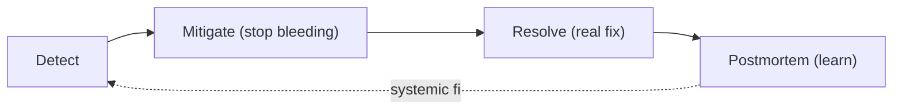

# Root-Cause Analysis & Incident Response

> **Level:** 8 (Observability) · **Prerequisites:** [Golden Signals](02-golden-signals-red-use.md)
> **Navigation:** [← Previous: Golden Signals](02-golden-signals-red-use.md) · [Next → On-Call, Runbooks, Postmortems](04-on-call-runbooks-postmortems.md)

## Learning objectives
- Run a structured incident response (detect → mitigate → resolve → learn).
- Perform root-cause analysis that finds systemic causes, not a scapegoat.
- Reason about correlation vs causation in diagnostics.

## Incident response phases
1. **Detect** — alerts/users tell you something's wrong. Reduce detection time with good
   alerts and user-facing monitoring.
2. **Mitigate** — stop the bleeding first (rollback, shed load, failover, scale) before
   understanding the root. The user's outage clock is running.
3. **Resolve** — apply the actual fix once mitigated.
4. **Learn** — postmortem (next chapter): what happened, why, and how to prevent it.

## Mitigate before understanding
A common mistake is trying to fully diagnose before acting. Mitigation (rollback, shed
traffic, scale out, failover) restores service fast; diagnosis can happen after. Train
operators to mitigate first.

## Root-cause analysis
RCA looks for **systemic** causes, not "who clicked the button": the real cause is often
"there was no guardrail," "the test didn't cover this," or "the dependency had no
bulkhead." Blameless analysis yields fixes; blame hides them. Use **5 Whys** or fishbone
but stop at systemic causes with actionable fixes, not "human error."

## Correlation vs causation
During an incident, many metrics move together. Correlation (X and Y moved together) is
not causation (X caused Y). Use traces and timestamps to establish the actual causal chain;
don't chase coincident metrics.

## Why this matters
Incident response quality directly determines user-visible downtime. The systems that
recover fast are the ones that rehearse response and that fix systemic causes (so the same
incident never recurs).

## Examples
- A deploy spikes errors: rollback immediately (mitigate), then bisect the change (resolve),
  then add a guardrail/test (learn).
- A slow dependency: shed traffic to it and serve from cache (mitigate), then add a circuit
  breaker (resolve), then alert on its latency (learn).
- "CPU was high" is correlation; the trace showing a new query scanning a table is the
  cause.

## Trade-offs
- **Mitigate vs diagnose-first**: mitigate-first reduces user downtime but may erase
  evidence (capture state before mitigating where possible).
- **Blameless depth**: deeper RCAs cost time but prevent recurrence; shallow ones repeat.
- **Evidence capture** (heap dumps, traces) vs restoring service fast.

## When NOT to apply
- Don't wait for full diagnosis before mitigating user impact.
- Don't stop RCA at "human error" (find the systemic cause).
- Don't chase correlated metrics as if they were causes.

## Common mistakes
- Diagnosing while the outage runs instead of mitigating first.
- Blame-oriented RCAs that don't fix the system.
- Confusing correlation with causation.

## Failure modes and operational concerns
- Erasing evidence by mitigating before capturing a snapshot.
- Recurring incidents because RCAs stopped at the proximate cause.
- Long detection time from missing alerts.

## Review questions
1. Why mitigate before fully diagnosing?
2. What's the difference between a proximate cause and a systemic one?
3. Why blameless, and what does it buy you?
4. Give an example of correlation mistaken for causation.
5. Why capture evidence before mitigating when possible?

## Further reading
SRE: S-GCPSRE · postmortems: next chapter.

---
[← Previous: Golden Signals](02-golden-signals-red-use.md) · [Next → On-Call, Runbooks, Postmortems](04-on-call-runbooks-postmortems.md)
