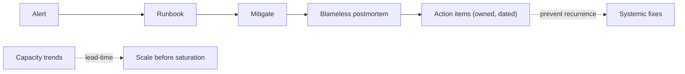

# On-Call, Runbooks, Postmortems, Capacity Monitoring

> **Level:** 8 (Observability) · **Prerequisites:** [RCA & Incident Response](03-rca-incident-response.md)
> **Navigation:** [← Previous: RCA & Incident Response](03-rca-incident-response.md) · [Next → Cost, Synthetic/RUM, Profiling, Continuous Verification](05-cost-synthetic-rum-profiling.md)

## Learning objectives
- Design a humane on-call rotation and clear escalation.
- Write runbooks that actually help at 3am.
- Run blameless postmortems that drive systemic fixes and capacity planning.

## On-call
On-call rotates responsibility for responding to incidents. Humane on-call: manageable
  alert volume (alert fatigue causes burnout and missed pages), clear escalation, follow-
  the-sun for global teams, and **no chronic overload** — a paging team that's always
  firefighting can't improve the system. Page on real user impact, not on noise.

## Runbooks
A **runbook** is a step-by-step guide for handling a known alert. A good runbook: states the
symptom, the likely cause, the diagnostic steps, and the mitigation/escalation path — short
enough to use at 3am. A runbook that says "investigate" is not a runbook. Keep runbooks
co-located with the alert and updated after each incident.

## Postmortems
A **blameless postmortem** documents an incident: timeline, impact, root cause, what went
well/badly, and **action items** with owners and dates. The goal is systemic improvement,
not blame. Track action items to completion; an incident whose action items are never done
will recur. Publish postmortems broadly so the org learns.

## Capacity monitoring
Beyond health, monitor **capacity** trends (utilization, queue depth, storage growth) so
you scale *before* saturation, not after. Capacity alerts should fire with enough lead time
to react (see the storage-growth calculation).

## Why this matters
Operations quality determines whether an architecture *runs* or just *exists*. On-call,
runbooks, postmortems, and capacity monitoring are the practices that turn a flaky system
into a reliable one over time.

## Examples
- A team pages on SLO burn only; noise tickets go to a queue; on-call is sustainable.
- Each alert links to a runbook with the diagnostic and mitigation steps used last time.
- A capacity dashboard predicts disk fill in 3 weeks → an automated ticket to expand.

## Trade-offs
- **Alert volume**: coverage vs fatigue; favor fewer, actionable pages.
- **Runbook depth**: helpful detail vs maintenance burden; keep them living.
- **Postmortem thoroughness**: depth vs time; do blameless but with concrete action items.

## When NOT to apply
- Don't page on non-actionable alerts (they train ignoring pages).
- Don't keep runbooks stale (a wrong runbook misleads at 3am).
- Don't close postmortems without tracking action items to done.

## Common mistakes
- Alert fatigue from paging on noise.
- Runbooks that say "investigate" (useless under stress).
- Postmortems with action items that never complete (recurrence).

## Failure modes and operational concerns
- On-call burnout → attrition and missed pages.
- A stale runbook causing a wrong mitigation.
- Capacity surprises because no one watched the trend.

## Review questions
1. What makes an on-call rotation humane, and why does it matter?
2. What must a useful runbook contain?
3. Why blameless postmortems, and what must follow them?
4. Why monitor capacity trends, not just current health?
5. Give a failure mode of alert fatigue and a fix.

## Further reading
SRE: S-GCPSRE · SLOs: Level 6 · capacity calculations in `calculations/`.

---
[← Previous: RCA & Incident Response](03-rca-incident-response.md) · [Next → Cost, Synthetic/RUM, Profiling, Continuous Verification](05-cost-synthetic-rum-profiling.md)
