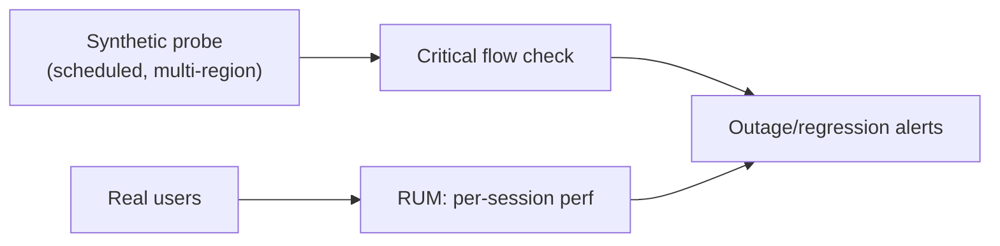

# Cost Observability, Synthetic/RUM, Profiling, Continuous Verification

> **Level:** 8 (Observability) · **Prerequisites:** [On-Call/Runbooks/Postmortems](04-on-call-runbooks-postmortems.md)
> **Navigation:** [← Previous: On-Call/Runbooks/Postmortems](04-on-call-runbooks-postmortems.md) · [Next → Level 9: Cloud-Native](../09-cloud-platform/README.md)

## Learning objectives
- Make cost a first-class metric, not a surprise.
- Use synthetic and real-user monitoring to catch user-impacting issues early.
- Apply profiling and continuous verification to find and prevent regressions.

## Cost observability
Cost is an operational metric: tag/attribute spend by team/service/tenant and track unit
costs (cost per request, per GB, per tenant) over time. Surprises (a 10× egress spike) come
from not watching cost continuously. FinOps: attribute, forecast, and optimize (the biggest
levers are usually the architecture choices from earlier levels — caching, tiering,
co-locating compute with data).

## Synthetic and real-user monitoring
- **Synthetic monitoring**: scheduled probes from various locations that test critical
  flows ("can a user check out?") — catches outages before users report them, and catches
  regional issues.
- **Real-user monitoring (RUM)**: collects performance from actual user sessions —
  captures what users *actually* experience, including long-tail and device diversity that
  synthetic misses.

## Profiling
**Profiling** (CPU, allocation, lock contention) finds where time/memory actually goes in
production, not in a load test. Continuous profiling samples live workloads periodically,
catching regressions that benchmarks miss (e.g., a new code path that's 10× slower on real
data shapes).

## Continuous verification
**Continuous verification** checks invariants in production continuously (e.g., "every
shard has a healthy replica," "no tenant exceeds quota") so a drift becomes an alert before
it becomes an incident. It's the operational cousin of chaos engineering: assert expected
state always holds.

## Why this matters
Cost, user experience, and performance regressions are the slow-burn problems that observability must catch, not just outages. Watching them continuously prevents the "why did our
bill double" and "why are mobile users churning" surprises.

## Examples
- A cost dashboard attributes spend per service; a unit-cost rise triggers investigation
  before the bill lands.
- Synthetic probes check checkout from 5 regions every minute; RUM shows mobile p99 is 2×
  desktop, prompting optimization.
- Continuous profiling finds a hot path on real-world payloads; continuous verification
  asserts all shards have ≥2 healthy replicas.

## Trade-offs
- **Cost instrumentation**: spend visibility vs tagging overhead.
- **Synthetic vs RUM**: synthetic is controlled and early; RUM is real and diverse. Use
  both.
- **Profiling overhead**: sampling keeps it cheap but approximate.

## When NOT to apply
- Don't optimize cost by gut feel; measure unit cost first.
- Don't rely only on synthetic (it misses real-user diversity).
- Don't profile at 100% in production (overhead); sample.

## Common mistakes
- Cost as a surprise (no continuous attribution).
- Only synthetic monitoring (misses real-user tail).
- Profiling only in dev (misses production-only hot paths).

## Failure modes and operational concerns
- Untagged spend you can't attribute to a team/service.
- Synthetic passing while real users fail (different paths/devices).
- Profiling overhead if misconfigured.

## Review questions
1. Why track unit cost continuously, not just total spend?
2. What does synthetic catch that RUM doesn't, and vice versa?
3. Why profile in production, not just in load tests?
4. What does continuous verification assert, and why?
5. Give a cost-surprise failure mode and a mitigation.

## Further reading
SRE: S-GCPSRE · capacity/cost calculations in `calculations/`.

---
[← Previous: On-Call/Runbooks/Postmortems](04-on-call-runbooks-postmortems.md) · [Next → Level 9: Cloud-Native](../09-cloud-platform/README.md)
