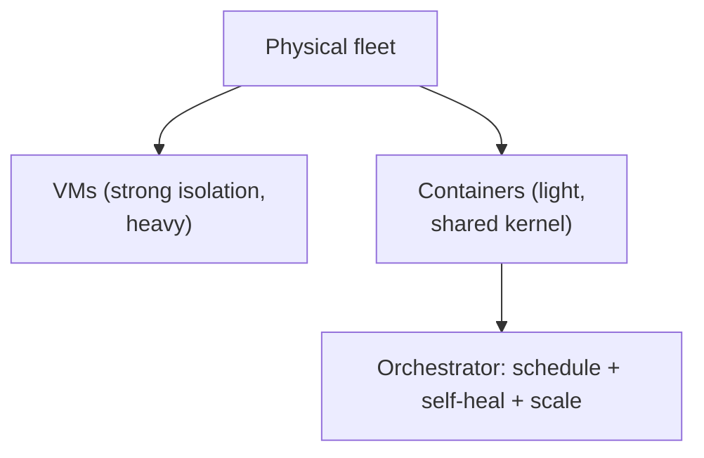

# VMs, Containers & Container Orchestration

> **Level:** 9 (Cloud-Native) · **Prerequisites:** [Level 8](../08-observability/README.md)
> **Navigation:** ← Start of Level 9 · [Next → Kubernetes Architecture](01-k8s-architecture.md)

## Learning objectives
- Compare VMs, containers, and orchestration and the trade each makes.
- Reason about why orchestration (scheduling, self-healing, scaling) is the cloud-native core.
- Choose orchestration granularity for a workload.

## VMs vs containers
- **VMs**: full OS virtualization, strong isolation, heavier, slower to start. Good for
  strong boundaries, legacy apps, and security-sensitive multi-tenancy.
- **Containers**: shared kernel, process-level isolation, lightweight, fast start, high
  density. Good for microservices and elastic scaling; weaker isolation (mitigate with
  gVisor/Kata/seccomp).
- **Orchestration**: a control plane that schedules containers across a fleet, restarts the
  failed, scales them, and connects them — turning a cluster into one logical machine.

## Why this matters
Orchestration is what makes horizontal scaling and resilient operation a *platform*
capability rather than per-app engineering. It turns "run 3 replicas, restart on failure,
roll out gradually" from bespoke code into a declaration. But it also introduces a
distributed control plane you must operate and understand.

## Examples
- A microservice deployed as containers on an orchestrator; the control plane restarts a
  crashed pod and scales it on CPU.
- A legacy single-tenant app with strict isolation stays on VMs.
- A batch job runs as a container scheduled and rescheduled by the orchestrator.

## Trade-offs
- **Containers vs VMs**: density/speed vs isolation strength.
- **Orchestration**: operational simplicity at the app layer vs a complex control plane to
  run and a new failure domain (the orchestrator itself).

## When NOT to apply
- Don't containerize a strong-isolation requirement; use VMs or sandboxed runtimes.
- Don't run an orchestrator for a handful of static services; it's overhead.
- Don't treat the orchestrator as magic — understand its failure modes.

## Common mistakes
- One giant container per host (defeats density) or too many tiny ones (scheduling churn).
- Ignoring the orchestrator as a dependency/SPOF.
- Weak container isolation for untrusted code.

## Failure modes and operational concerns
- Control-plane outage affecting scheduling/scaling.
- A single noisy container dominating a node (no resource limits).
- Container image pull failures stalling rollout.

## Review questions
1. When are VMs preferable to containers?
2. What three things does orchestration give you as platform capabilities?
3. Why is the orchestrator itself a new failure domain?
4. Give a mis-sized-container mistake and its symptom.

## Further reading
Kubernetes: S-K8S · service mesh: next chapters.

---
← Start of Level 9 · [Next → Kubernetes Architecture](01-k8s-architecture.md)
