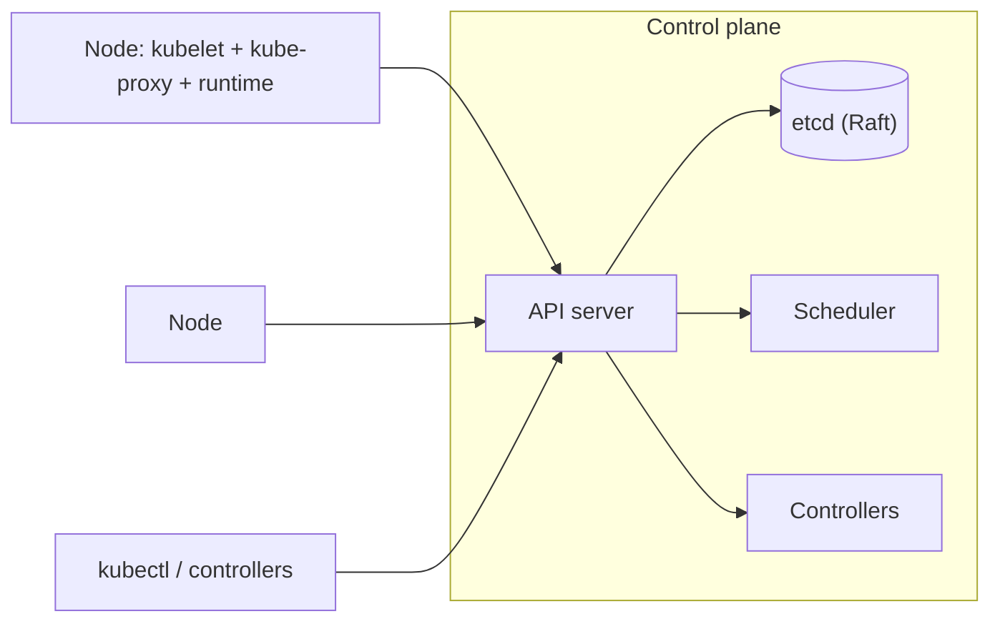

# Kubernetes Architecture

> **Level:** 9 (Cloud-Native) · **Prerequisites:** [Containers & Orchestration](00-containers-orchestration.md)
> **Navigation:** [← Previous: Containers & Orchestration](00-containers-orchestration.md) · [Next → Service Mesh & Ingress](02-service-mesh-ingress.md)

## Learning objectives
- Describe the Kubernetes control plane and node components.
- Reason about the declarative reconcile loop model.
- Connect K8s primitives (Pod, Deployment, Service, Ingress) to earlier concepts.

## The control plane and nodes (S-K8S)
- **Control plane**: API server (the single entry point), etcd (the strongly-consistent
  store, Raft-replicated), scheduler (places pods), controller manager (reconciles desired
  state), (cloud) controllers for cloud integrations.
- **Nodes**: kubelet (reports/ensures pod state), kube-proxy (service networking), the
  container runtime (runs containers).

## The reconcile loop
K8s is **declarative**: you state desired state (""3 replicas of v2""), and controllers
continuously reconcile actual → desired. This is the same idea as the "desired state" in
Level 6 chaos/verification: the system converges to the declared state rather than a script
running once. It's robust to transient divergence and is self-healing by construction.

## Primitives (mapped to earlier concepts)
- **Pod** — the unit of scheduling (one or more co-located containers).
- **Deployment** — desired replica count + rollout strategy (rolling/canary via Level 9
  deploy chapter).
- **Service** — a stable network name over a changing set of pods = service discovery
  (Level 2).
- **Ingress** — L7 routing into the cluster = a reverse proxy/gateway (Level 2).
- **HPA/VPA/Cluster autoscaler** — autoscaling (later this level).

## Why this matters
K8s is the de facto orchestrator; understanding its control plane and the reconcile model
explains how the platform delivers self-healing, scaling, and rolling deploys — and where
its failure modes are (etcd, API server, scheduler).

## Examples
- A Deployment declares 3 replicas; a pod dies; the controller starts a replacement.
- A Service gives a stable DNS name; pods come and go but clients keep connecting.
- A canary via two Deployments + weighted Service routing.

## Trade-offs
- **Declarative reconcile**: self-healing vs slower convergence and harder to reason about
  transient states.
- **etcd**: strongly consistent state store but a capacity/ops burden and a SPOF if not
  HA.

## When NOT to apply
- Don't fight the declarative model with imperative scripts (defeats reconcile).
- Don't overload etcd with high-cardinality objects (it's the brain; keep it lean).
- Don't run stateful workloads without understanding storage/affinity.

## Common mistakes
- Imperative ad-hoc changes that drift from declared state.
- etcd too small or un-optimized → control-plane slowness.
- Treating pods as pets (they're cattle; don't rely on a specific pod).

## Failure modes and operational concerns
- etcd quorum loss → control plane unusable.
- API server overload under a misbehaving controller.
- Pod churn overwhelming the scheduler.

## Review questions
1. Name the control-plane components and what each does.
2. Explain the reconcile loop and why it's self-healing.
3. Map Service and Ingress to earlier-level concepts.
4. Why is etcd both essential and an ops concern?

## Further reading
Kubernetes: S-K8S · service discovery: Level 2 · autoscaling: later this level.

---
[← Previous: Containers & Orchestration](00-containers-orchestration.md) · [Next → Service Mesh & Ingress](02-service-mesh-ingress.md)
