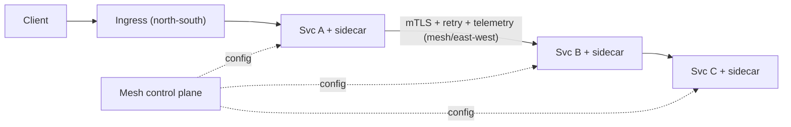

# Service Mesh & Ingress

> **Level:** 9 (Cloud-Native) · **Prerequisites:** [Kubernetes Architecture](01-k8s-architecture.md)
> **Navigation:** [← Previous: Kubernetes Architecture](01-k8s-architecture.md) · [Next → Serverless & FaaS](03-serverless-faas.md)

## Learning objectives
- Explain what a service mesh (sidecars) provides and its cost.
- Distinguish ingress (north-south) from mesh (east-west) traffic management.
- Reason about when a mesh is worth its overhead.

## Service mesh (S-ISTIO)
A **service mesh** (Istio, Linkerd) uses **sidecars** (Level 5) to handle inter-service
traffic uniformly: mTLS, retries, circuit breaking, traffic shaping, and telemetry —
without app code changes. It operationalizes zero-trust and resilience patterns across a
polyglot fleet via a uniform data plane.

## Ingress vs mesh
- **Ingress (north-south)**: external traffic into the cluster — TLS termination, host/path
  routing. The cluster's front door (Level 2 reverse proxy).
- **Mesh (east-west)**: traffic *between* services — mTLS, per-call policy, resilience, and
  cross-service telemetry.

## Why this matters
A mesh lets you apply zero-trust, retries, and observability across many services
consistently, which is otherwise reimplemented per service. The cost: a sidecar per pod
(resource overhead and an extra hop) and a control plane to run.

## Examples
- A mesh enforces mTLS between all internal services and applies a circuit breaker to an
  unreliable dependency uniformly.
- Ingress terminates TLS and routes `/api/*` to services by host/path.
- Telemetry: per-call spans and metrics emerge from the mesh without app instrumentation.

## Trade-offs
- **Mesh**: uniform zero-trust/resilience/observability vs sidecar overhead, an extra hop,
  and control-plane complexity.
- **Ingress**: simple external routing vs limited east-west policy (use the mesh for that).

## When NOT to apply
- Don't add a mesh to a few services with stable, simple needs; the overhead isn't worth it.
- Don't sidecar extremely latency-sensitive or tiny services where the hop/overhead matters.
- Don't run a mesh without operating its control plane (it's a dependency).

## Common mistakes
- A mesh with no traffic policy (just overhead, no benefit).
- Sidecars starved of resources (CPU throttling of the data plane).
- Mesh control-plane outage affecting routing config.

## Failure modes and operational concerns
- Sidecar resource overhead adding up across thousands of pods.
- A mesh upgrade breaking fleet routing (roll carefully).
- Misconfigured mTLS causing mass authN failures.

## Review questions
1. What does a mesh give you without app changes?
2. Distinguish north-south (ingress) from east-west (mesh) traffic.
3. What's the cost of a mesh, and when is it not worth it?
4. Give a failure mode of a mesh upgrade.

## Further reading
Istio: S-ISTIO · sidecar/ambassador: Level 5 · zero-trust: Level 7.

---
[← Previous: Kubernetes Architecture](01-k8s-architecture.md) · [Next → Serverless & FaaS](03-serverless-faas.md)
