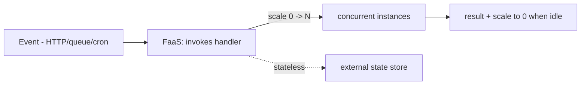

# Serverless & Functions as a Service

> **Level:** 9 (Cloud-Native) · **Prerequisites:** [Service Mesh & Ingress](02-service-mesh-ingress.md)
> **Navigation:** [← Previous: Service Mesh & Ingress](02-service-mesh-ingress.md) · [Next → IaC, Immutable Infra, GitOps](04-iac-immutable-gitops.md)

## Learning objectives
- Explain the serverless/FaaS execution model and its scaling.
- Reason about cold starts, state, and the limits of event-driven FaaS.
- Choose FaaS vs containers vs long-running services.

## The FaaS model
**Functions as a Service** runs single-purpose functions on demand, scales them to zero and
to thousands, and charges per invocation/duration. The platform handles scheduling,
scaling, and invocation; you provide the handler. It's ideal for bursty, event-driven,
short-lived, stateless work.

## Cold starts and state
- **Cold start**: the first invocation after idle pays startup latency (runtime + code
  load). Mitigate with provisioned concurrency or keep-warm for latency-sensitive paths.
- **State**: FaaS is stateless by contract — state lives in an external store (DB, cache,
  object storage). Long-running or stateful work doesn't fit FaaS.

## Limits
Execution time caps, memory limits, no long-lived connections, cold-start latency. FaaS is
not for long-running, streaming, or connection-stateful workloads — use containers there.

## Why this matters
FaaS eliminates operational scaling work for the right workloads (bursty, event-driven,
stateless) and shifts cost to per-invocation. Mis-applied (long-running, stateful,
latency-critical), it's slow and expensive.

## Examples
- An image-thumbnail FaaS triggered by object-storage events; scales with uploads.
- A webhook handler FaaS for bursty third-party calls.
- A latency-sensitive API kept on a long-running container (cold starts unacceptable).

## Trade-offs
- **FaaS**: no scaling ops, pay-per-use vs cold starts, statelessness, and limits.
- **Containers**: full control and warm state vs you operate scaling.

## When NOT to apply
- Don't use FaaS for long-running or stateful work (it doesn't fit).
- Don't use FaaS for latency-critical paths you can't provision-warm.
- Don't put heavy startup work in each invocation (cold starts amplify it).

## Common mistakes
- Cold starts on a latency-critical path.
- Treating FaaS as stateful (instance reuse is not guaranteed).
- Per-invocation heavy init (move to init-once where the platform supports it).

## Failure modes and operational concerns
- Cold-start spikes under bursty first-wave traffic.
- Vendor concurrency/throttle limits rejecting bursts.
- Long-lived connections can't be held (no websockets in pure FaaS).

## Review questions
1. Why is FaaS stateless by contract, and where does state go?
2. What is a cold start and two mitigations?
3. Give a workload that fits FaaS and one that doesn't.
4. Why isn't FaaS good for connection-stateful work?

## Further reading
Containers: previous · eventing: Level 2 · IaC: next.

---
[← Previous: Service Mesh & Ingress](02-service-mesh-ingress.md) · [Next → IaC, Immutable Infra, GitOps](04-iac-immutable-gitops.md)
